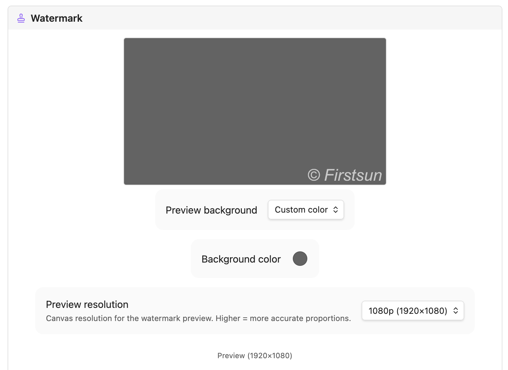

# Watermark S3 Uploader

An Obsidian plugin that intercepts image paste/drop events, optionally converts to WebP, applies a canvas-based watermark, uploads to Cloudflare R2 (or any S3-compatible storage), and inserts the resulting URL as a markdown image link.

## Features

- **Auto-upload on paste/drag** — images are uploaded immediately without manual steps.
- **WebP conversion** — convert images to WebP before upload for smaller file sizes with configurable quality.
- **Image compression** — reduce file size with configurable quality, max dimensions, and file size limits.
- **Text watermark** — overlay custom text with configurable font family, size, color, bold/italic, position, and fine-tuned offsets.
- **Logo watermark** — overlay a local image from your vault as a watermark with configurable size, opacity, position, and offsets.
- **Live watermark preview** — see exactly how the watermark will look with customizable preview background and resolution.
- **S3 / R2 compatibility** — works with Cloudflare R2, AWS S3, MinIO, and any S3-compatible service.
- **Local mode** — optionally copy files to a local vault folder instead of uploading.
- **Video / Audio / PDF support** — optionally upload non-image files as well.
- **Ignore patterns** — skip uploads for specific notes matching glob patterns (e.g. `Private/*`).
- **Connection tester** — verify your S3/R2 credentials directly from the settings tab.

## Installation

### Manual

1. Download the latest release assets: `main.js`, `manifest.json`, `styles.css`.
2. Copy them to `<vault>/.obsidian/plugins/watermark-s3-uploader/`.
3. Enable the plugin in **Settings → Community plugins**.

## Configuration

Go to **Settings → Watermark S3 Uploader** to configure your storage provider.

### Core Settings

| Field | Description |
|---|---|
| Access Key | S3 / R2 access key ID |
| Secret Key | S3 / R2 secret access key (stored securely in local storage) |
| Region | Bucket region (e.g. `auto` for Cloudflare R2) |
| S3 Bucket | The name of your bucket |
| Bucket Folder | Optional prefix inside the bucket. Supports `${year}`, `${month}`, `${day}`, and `${basename}` dynamic variables. |

### Advanced Settings

- **Custom Endpoint**: Required for Cloudflare R2 and non-AWS providers.
- **Force Path-Style URLs**: Use `endpoint/bucket/file` instead of `bucket.endpoint/file`.
- **Custom Image URL**: Override the public URL base (e.g. if using a CDN or custom domain).
- **Query String**: Append versioning or access tokens (e.g. `?v=1`) to inserted links.
- **Bypass Local CORS**: Enable if you encounter CORS issues during upload from within Obsidian.

### Watermark Settings

Configure how your watermarks are rendered using the **Live Preview** in the settings tab.

| Field | Description |
|---|---|
| **Text Watermark** | Toggle text-based overlay. |
| Text | The text to display (e.g. `© yourdomain.com`). |
| Font Family | Specify a font (e.g. `arial`, `georgia`, `monospace`). |
| Font Size | In pixels. Set to `0` for auto-scaling (2% of image width). |
| Style | Toggle **Bold** and *Italic* formatting. |
| Color | CSS color string (e.g. `rgba(255,255,255,0.8)`). |
| **Logo Watermark** | Toggle image-based overlay. |
| Logo Path | Vault-relative path to your logo (e.g. `_assets/logo.png`). |
| Logo Size | Scale as a percentage of the target image width. |
| Logo Opacity | Transparency level (0.0 to 1.0). |
| **Common** | |
| Position | Choose from Bottom Right, Bottom Left, Bottom Center, or Center. |
| Offset X/Y | Fine-tune position by nudging (±% of image dimensions). |
| Preview Res | Set the canvas resolution (720p to 4k) for accurate scaling preview. |

### Cloudflare R2 Quick Setup

1. Create a bucket in the Cloudflare R2 dashboard.
2. Generate an API token with **Object Read & Write** permissions.
3. Set **Custom Endpoint** to `https://<account-id>.r2.cloudflarestorage.com`.
4. Set **Region** to `auto`.
5. Set **Custom Image URL** to your public bucket domain (or R2 dev domain).

## Usage

- **Paste** an image (`Ctrl/Cmd+V`) in any note — the plugin intercepts it, processes, uploads, and inserts ``.
- **Drag and drop** an image onto the editor (ensure "Upload on drag" is enabled).
- **Command Palette** → `Upload image` to manually select and upload a file.
- **Auto-upload on create** — if enabled, any image file added to your vault (e.g. via sync) will be automatically uploaded and removed locally.

## Watermark & Processing

The plugin includes a powerful **Live Preview** canvas in the settings tab.

- **Text Watermark**: Customize text, font, size (0 for auto), colors, and position.
- **Logo Watermark**: Provide a vault-relative path (e.g. `_assets/logo.png`) to use an image as a watermark.
- **Compression**: Set a maximum file size or dimensions to save on storage and bandwidth.
- **WebP**: Toggle conversion to modern WebP format for optimal web performance.

## License

MIT
