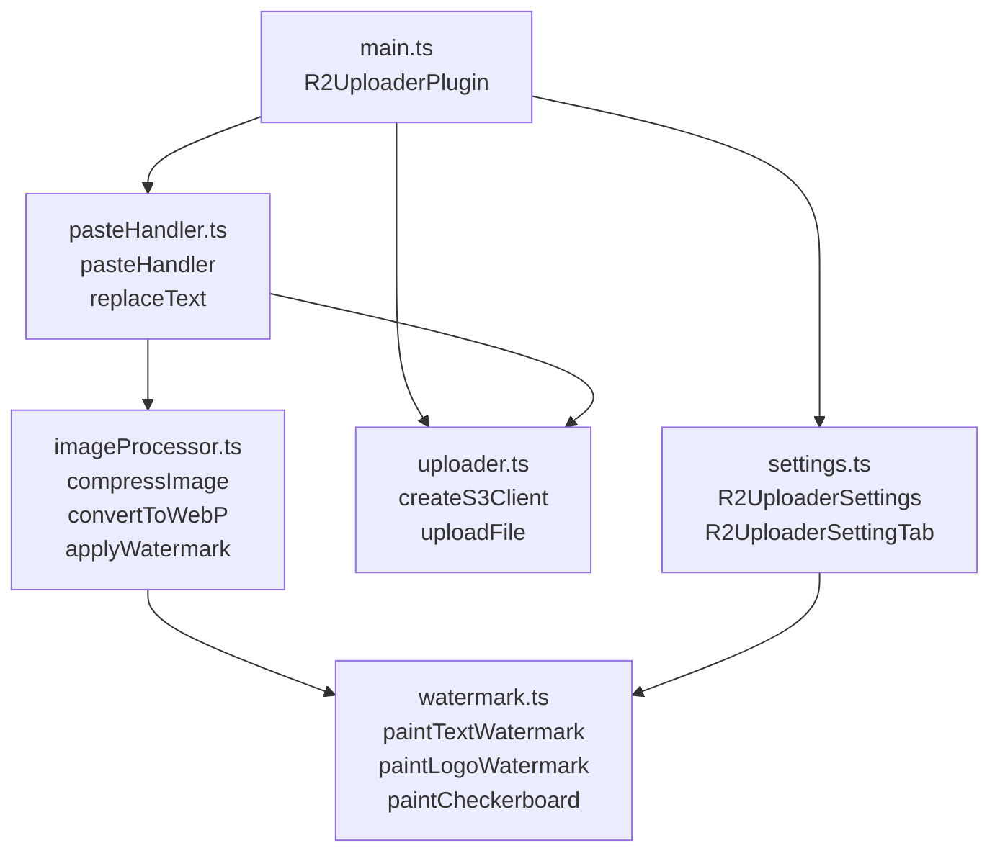
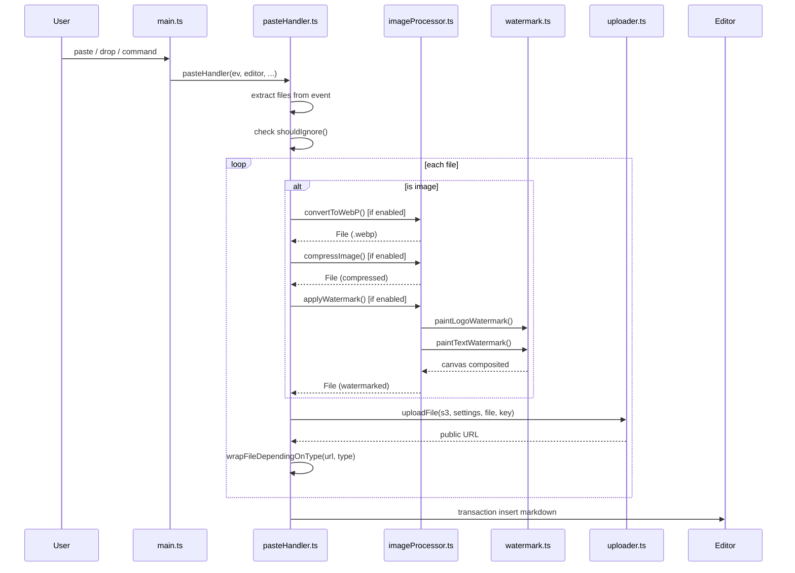
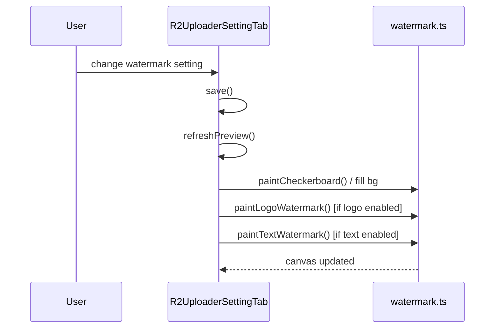

# Architecture

## Module Overview

## Paste / Drop Event Flow

## Settings Tab Preview Flow

## File Responsibilities

| File | Responsibility |
|---|---|
| `main.ts` | Plugin lifecycle (`onload`, `onunload`), command registration, event wiring, `createS3Client` |
| `settings.ts` | `R2UploaderSettings` interface, `DEFAULT_SETTINGS`, `R2UploaderSettingTab` UI, `wrapTextWithPasswordHide` |
| `watermark.ts` | Pure canvas drawing: `buildFont`, `resolvePosition`, `paintTextWatermark`, `paintLogoWatermark`, `paintCheckerboard` |
| `imageProcessor.ts` | Image pipeline: `compressImage`, `convertToWebP`, `applyWatermark` |
| `uploader.ts` | S3 transport: `ObsHttpHandler`, `createS3Client`, `uploadFile`, `generateFileHash`, `wrapFileDependingOnType` |
| `pasteHandler.ts` | Event handling: `pasteHandler`, `replaceText` |
