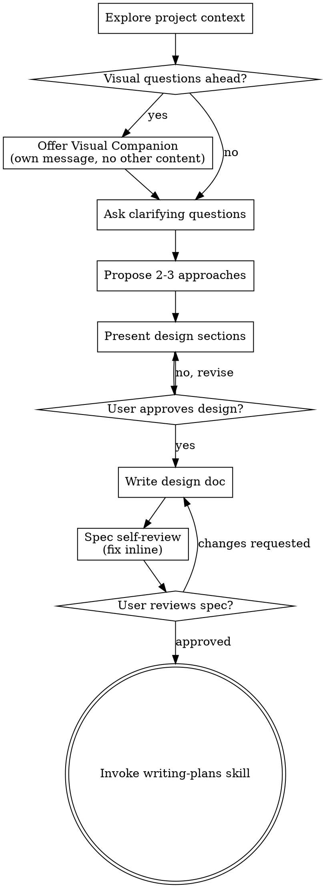
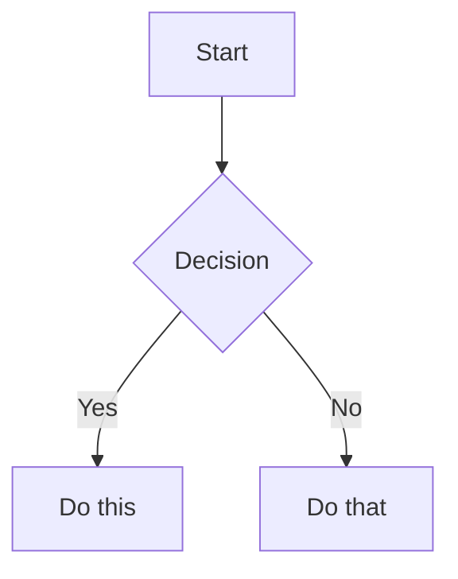
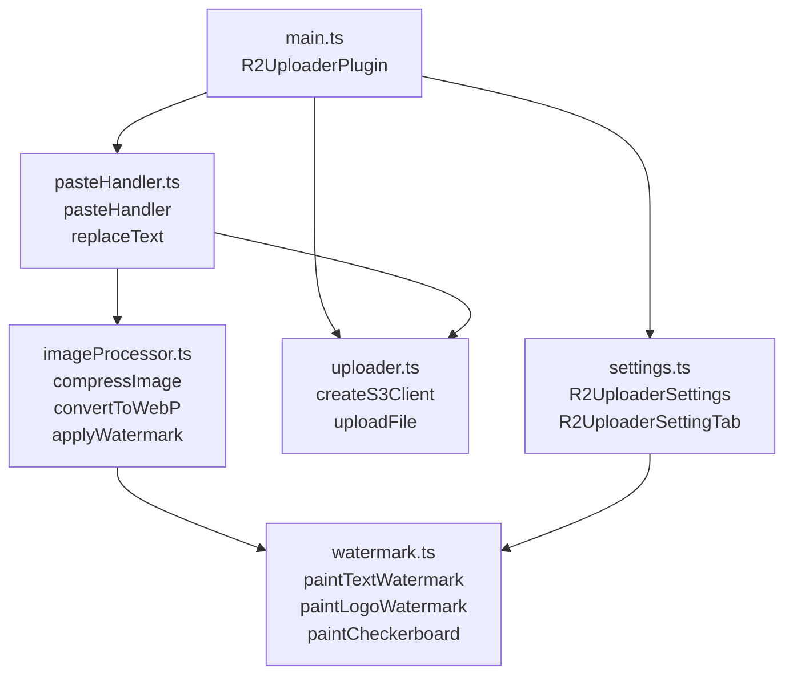
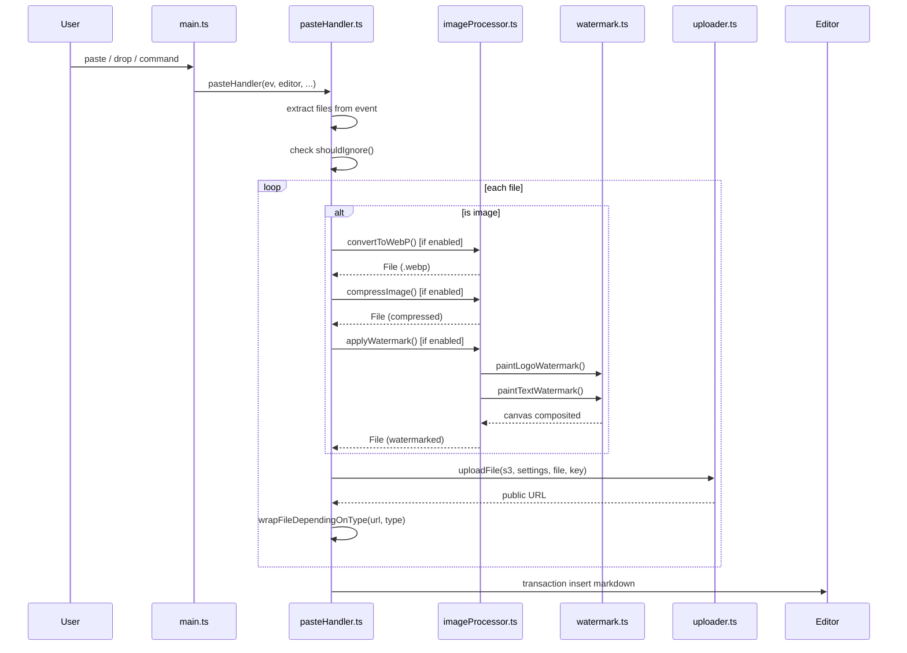
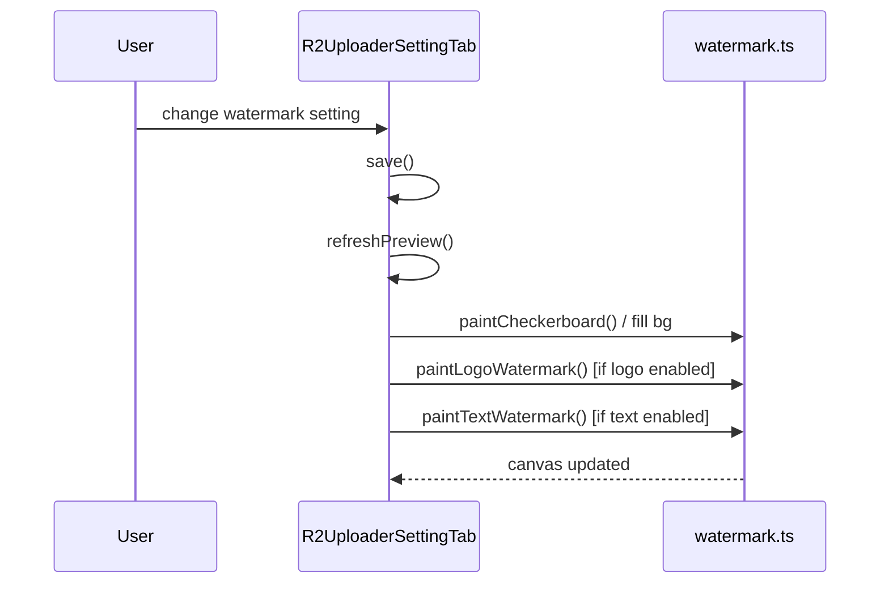

This file is a merged representation of the entire codebase, combined into a single document by Repomix.

# File Summary

## Purpose
This file contains a packed representation of the entire repository's contents.
It is designed to be easily consumable by AI systems for analysis, code review,
or other automated processes.

## File Format
The content is organized as follows:
1. This summary section
2. Repository information
3. Directory structure
4. Repository files (if enabled)
5. Multiple file entries, each consisting of:
  a. A header with the file path (## File: path/to/file)
  b. The full contents of the file in a code block

## Usage Guidelines
- This file should be treated as read-only. Any changes should be made to the
  original repository files, not this packed version.
- When processing this file, use the file path to distinguish
  between different files in the repository.
- Be aware that this file may contain sensitive information. Handle it with
  the same level of security as you would the original repository.

## Notes
- Some files may have been excluded based on .gitignore rules and Repomix's configuration
- Binary files are not included in this packed representation. Please refer to the Repository Structure section for a complete list of file paths, including binary files
- Files matching patterns in .gitignore are excluded
- Files matching default ignore patterns are excluded
- Files are sorted by Git change count (files with more changes are at the bottom)

# Directory Structure
```
.agents/
  skills/
    brainstorming/
      scripts/
        frame-template.html
        helper.js
        server.cjs
        start-server.sh
        stop-server.sh
      SKILL.md
      spec-document-reviewer-prompt.md
      visual-companion.md
    frontend-design/
      LICENSE.txt
      SKILL.md
    obsidian-bases/
      references/
        FUNCTIONS_REFERENCE.md
      SKILL.md
    obsidian-markdown/
      references/
        CALLOUTS.md
        EMBEDS.md
        PROPERTIES.md
      SKILL.md
.github/
  workflows/
    ci.yml
.husky/
  pre-commit
docs/
  architecture.md
src/
  declare.d.ts
  imageProcessor.ts
  main.ts
  pasteHandler.ts
  settings.ts
  uploader.ts
  watermark.ts
tests/
  __mocks__/
    obsidian.ts
  uploader.test.ts
  watermark.test.ts
.editorconfig
.gitignore
.npmrc
.releaserc.json
.repomixignore
AGENTS.md
esbuild.config.mjs
eslint.config.mts
LICENSE
manifest.json
package.json
README.md
repomix.config.json
skills-lock.json
sonar-project.properties
styles.css
tsconfig.json
version-bump.mjs
versions.json
vitest.config.ts
```

# Files

## File: .repomixignore
`````
# Add patterns to ignore here, one per line
# Example:
# *.log
# tmp/
.agent
.claude
.gemini
`````

## File: repomix.config.json
`````json
{
  "$schema": "https://repomix.com/schemas/latest/schema.json",
  "input": {
    "maxFileSize": 52428800
  },
  "output": {
    "filePath": "repomix-output.md",
    "style": "markdown",
    "parsableStyle": false,
    "fileSummary": true,
    "directoryStructure": true,
    "files": true,
    "removeComments": false,
    "removeEmptyLines": false,
    "compress": false,
    "topFilesLength": 5,
    "showLineNumbers": false,
    "truncateBase64": false,
    "copyToClipboard": false,
    "includeFullDirectoryStructure": false,
    "tokenCountTree": false,
    "git": {
      "sortByChanges": true,
      "sortByChangesMaxCommits": 100,
      "includeDiffs": false,
      "includeLogs": false,
      "includeLogsCount": 50
    }
  },
  "include": [],
  "ignore": {
    "useGitignore": true,
    "useDotIgnore": true,
    "useDefaultPatterns": true,
    "customPatterns": []
  },
  "security": {
    "enableSecurityCheck": true
  },
  "tokenCount": {
    "encoding": "o200k_base"
  }
}
`````

## File: .agents/skills/brainstorming/scripts/frame-template.html
`````html
<!DOCTYPE html>
<html>
<head>
  <meta charset="utf-8">
  <title>Superpowers Brainstorming</title>
  <style>
    /*
     * BRAINSTORM COMPANION FRAME TEMPLATE
     *
     * This template provides a consistent frame with:
     * - OS-aware light/dark theming
     * - Fixed header and selection indicator bar
     * - Scrollable main content area
     * - CSS helpers for common UI patterns
     *
     * Content is injected via placeholder comment in #claude-content.
     */

    * { box-sizing: border-box; margin: 0; padding: 0; }
    html, body { height: 100%; overflow: hidden; }

    /* ===== THEME VARIABLES ===== */
    :root {
      --bg-primary: #f5f5f7;
      --bg-secondary: #ffffff;
      --bg-tertiary: #e5e5e7;
      --border: #d1d1d6;
      --text-primary: #1d1d1f;
      --text-secondary: #86868b;
      --text-tertiary: #aeaeb2;
      --accent: #0071e3;
      --accent-hover: #0077ed;
      --success: #34c759;
      --warning: #ff9f0a;
      --error: #ff3b30;
      --selected-bg: #e8f4fd;
      --selected-border: #0071e3;
    }

    @media (prefers-color-scheme: dark) {
      :root {
        --bg-primary: #1d1d1f;
        --bg-secondary: #2d2d2f;
        --bg-tertiary: #3d3d3f;
        --border: #424245;
        --text-primary: #f5f5f7;
        --text-secondary: #86868b;
        --text-tertiary: #636366;
        --accent: #0a84ff;
        --accent-hover: #409cff;
        --selected-bg: rgba(10, 132, 255, 0.15);
        --selected-border: #0a84ff;
      }
    }

    body {
      font-family: system-ui, -apple-system, BlinkMacSystemFont, sans-serif;
      background: var(--bg-primary);
      color: var(--text-primary);
      display: flex;
      flex-direction: column;
      line-height: 1.5;
    }

    /* ===== FRAME STRUCTURE ===== */
    .header {
      background: var(--bg-secondary);
      padding: 0.5rem 1.5rem;
      display: flex;
      justify-content: space-between;
      align-items: center;
      border-bottom: 1px solid var(--border);
      flex-shrink: 0;
    }
    .header h1 { font-size: 0.85rem; font-weight: 500; color: var(--text-secondary); }
    .header .status { font-size: 0.7rem; color: var(--success); display: flex; align-items: center; gap: 0.4rem; }
    .header .status::before { content: ''; width: 6px; height: 6px; background: var(--success); border-radius: 50%; }

    .main { flex: 1; overflow-y: auto; }
    #claude-content { padding: 2rem; min-height: 100%; }

    .indicator-bar {
      background: var(--bg-secondary);
      border-top: 1px solid var(--border);
      padding: 0.5rem 1.5rem;
      flex-shrink: 0;
      text-align: center;
    }
    .indicator-bar span {
      font-size: 0.75rem;
      color: var(--text-secondary);
    }
    .indicator-bar .selected-text {
      color: var(--accent);
      font-weight: 500;
    }

    /* ===== TYPOGRAPHY ===== */
    h2 { font-size: 1.5rem; font-weight: 600; margin-bottom: 0.5rem; }
    h3 { font-size: 1.1rem; font-weight: 600; margin-bottom: 0.25rem; }
    .subtitle { color: var(--text-secondary); margin-bottom: 1.5rem; }
    .section { margin-bottom: 2rem; }
    .label { font-size: 0.7rem; color: var(--text-secondary); text-transform: uppercase; letter-spacing: 0.05em; margin-bottom: 0.5rem; }

    /* ===== OPTIONS (for A/B/C choices) ===== */
    .options { display: flex; flex-direction: column; gap: 0.75rem; }
    .option {
      background: var(--bg-secondary);
      border: 2px solid var(--border);
      border-radius: 12px;
      padding: 1rem 1.25rem;
      cursor: pointer;
      transition: all 0.15s ease;
      display: flex;
      align-items: flex-start;
      gap: 1rem;
    }
    .option:hover { border-color: var(--accent); }
    .option.selected { background: var(--selected-bg); border-color: var(--selected-border); }
    .option .letter {
      background: var(--bg-tertiary);
      color: var(--text-secondary);
      width: 1.75rem; height: 1.75rem;
      border-radius: 6px;
      display: flex; align-items: center; justify-content: center;
      font-weight: 600; font-size: 0.85rem; flex-shrink: 0;
    }
    .option.selected .letter { background: var(--accent); color: white; }
    .option .content { flex: 1; }
    .option .content h3 { font-size: 0.95rem; margin-bottom: 0.15rem; }
    .option .content p { color: var(--text-secondary); font-size: 0.85rem; margin: 0; }

    /* ===== CARDS (for showing designs/mockups) ===== */
    .cards { display: grid; grid-template-columns: repeat(auto-fit, minmax(280px, 1fr)); gap: 1rem; }
    .card {
      background: var(--bg-secondary);
      border: 1px solid var(--border);
      border-radius: 12px;
      overflow: hidden;
      cursor: pointer;
      transition: all 0.15s ease;
    }
    .card:hover { border-color: var(--accent); transform: translateY(-2px); box-shadow: 0 4px 12px rgba(0,0,0,0.1); }
    .card.selected { border-color: var(--selected-border); border-width: 2px; }
    .card-image { background: var(--bg-tertiary); aspect-ratio: 16/10; display: flex; align-items: center; justify-content: center; }
    .card-body { padding: 1rem; }
    .card-body h3 { margin-bottom: 0.25rem; }
    .card-body p { color: var(--text-secondary); font-size: 0.85rem; }

    /* ===== MOCKUP CONTAINER ===== */
    .mockup {
      background: var(--bg-secondary);
      border: 1px solid var(--border);
      border-radius: 12px;
      overflow: hidden;
      margin-bottom: 1.5rem;
    }
    .mockup-header {
      background: var(--bg-tertiary);
      padding: 0.5rem 1rem;
      font-size: 0.75rem;
      color: var(--text-secondary);
      border-bottom: 1px solid var(--border);
    }
    .mockup-body { padding: 1.5rem; }

    /* ===== SPLIT VIEW (side-by-side comparison) ===== */
    .split { display: grid; grid-template-columns: 1fr 1fr; gap: 1.5rem; }
    @media (max-width: 700px) { .split { grid-template-columns: 1fr; } }

    /* ===== PROS/CONS ===== */
    .pros-cons { display: grid; grid-template-columns: 1fr 1fr; gap: 1rem; margin: 1rem 0; }
    .pros, .cons { background: var(--bg-secondary); border-radius: 8px; padding: 1rem; }
    .pros h4 { color: var(--success); font-size: 0.85rem; margin-bottom: 0.5rem; }
    .cons h4 { color: var(--error); font-size: 0.85rem; margin-bottom: 0.5rem; }
    .pros ul, .cons ul { margin-left: 1.25rem; font-size: 0.85rem; color: var(--text-secondary); }
    .pros li, .cons li { margin-bottom: 0.25rem; }

    /* ===== PLACEHOLDER (for mockup areas) ===== */
    .placeholder {
      background: var(--bg-tertiary);
      border: 2px dashed var(--border);
      border-radius: 8px;
      padding: 2rem;
      text-align: center;
      color: var(--text-tertiary);
    }

    /* ===== INLINE MOCKUP ELEMENTS ===== */
    .mock-nav { background: var(--accent); color: white; padding: 0.75rem 1rem; display: flex; gap: 1.5rem; font-size: 0.9rem; }
    .mock-sidebar { background: var(--bg-tertiary); padding: 1rem; min-width: 180px; }
    .mock-content { padding: 1.5rem; flex: 1; }
    .mock-button { background: var(--accent); color: white; border: none; padding: 0.5rem 1rem; border-radius: 6px; font-size: 0.85rem; }
    .mock-input { background: var(--bg-primary); border: 1px solid var(--border); border-radius: 6px; padding: 0.5rem; width: 100%; }
  </style>
</head>
<body>
  <div class="header">
    <h1><a href="https://github.com/obra/superpowers" style="color: inherit; text-decoration: none;">Superpowers Brainstorming</a></h1>
    <div class="status">Connected</div>
  </div>

  <div class="main">
    <div id="claude-content">
      <!-- CONTENT -->
    </div>
  </div>

  <div class="indicator-bar">
    <span id="indicator-text">Click an option above, then return to the terminal</span>
  </div>

</body>
</html>
`````

## File: .agents/skills/brainstorming/scripts/helper.js
`````javascript
(function() {
  const WS_URL = 'ws://' + window.location.host;
  let ws = null;
  let eventQueue = [];

  function connect() {
    ws = new WebSocket(WS_URL);

    ws.onopen = () => {
      eventQueue.forEach(e => ws.send(JSON.stringify(e)));
      eventQueue = [];
    };

    ws.onmessage = (msg) => {
      const data = JSON.parse(msg.data);
      if (data.type === 'reload') {
        window.location.reload();
      }
    };

    ws.onclose = () => {
      setTimeout(connect, 1000);
    };
  }

  function sendEvent(event) {
    event.timestamp = Date.now();
    if (ws && ws.readyState === WebSocket.OPEN) {
      ws.send(JSON.stringify(event));
    } else {
      eventQueue.push(event);
    }
  }

  // Capture clicks on choice elements
  document.addEventListener('click', (e) => {
    const target = e.target.closest('[data-choice]');
    if (!target) return;

    sendEvent({
      type: 'click',
      text: target.textContent.trim(),
      choice: target.dataset.choice,
      id: target.id || null
    });

    // Update indicator bar (defer so toggleSelect runs first)
    setTimeout(() => {
      const indicator = document.getElementById('indicator-text');
      if (!indicator) return;
      const container = target.closest('.options') || target.closest('.cards');
      const selected = container ? container.querySelectorAll('.selected') : [];
      if (selected.length === 0) {
        indicator.textContent = 'Click an option above, then return to the terminal';
      } else if (selected.length === 1) {
        const label = selected[0].querySelector('h3, .content h3, .card-body h3')?.textContent?.trim() || selected[0].dataset.choice;
        indicator.innerHTML = '<span class="selected-text">' + label + ' selected</span> — return to terminal to continue';
      } else {
        indicator.innerHTML = '<span class="selected-text">' + selected.length + ' selected</span> — return to terminal to continue';
      }
    }, 0);
  });

  // Frame UI: selection tracking
  window.selectedChoice = null;

  window.toggleSelect = function(el) {
    const container = el.closest('.options') || el.closest('.cards');
    const multi = container && container.dataset.multiselect !== undefined;
    if (container && !multi) {
      container.querySelectorAll('.option, .card').forEach(o => o.classList.remove('selected'));
    }
    if (multi) {
      el.classList.toggle('selected');
    } else {
      el.classList.add('selected');
    }
    window.selectedChoice = el.dataset.choice;
  };

  // Expose API for explicit use
  window.brainstorm = {
    send: sendEvent,
    choice: (value, metadata = {}) => sendEvent({ type: 'choice', value, ...metadata })
  };

  connect();
})();
`````

## File: .agents/skills/brainstorming/scripts/server.cjs
`````javascript
const crypto = require('crypto');
const http = require('http');
const fs = require('fs');
const path = require('path');

// ========== WebSocket Protocol (RFC 6455) ==========

const OPCODES = { TEXT: 0x01, CLOSE: 0x08, PING: 0x09, PONG: 0x0A };
const WS_MAGIC = '258EAFA5-E914-47DA-95CA-C5AB0DC85B11';

function computeAcceptKey(clientKey) {
  return crypto.createHash('sha1').update(clientKey + WS_MAGIC).digest('base64');
}

function encodeFrame(opcode, payload) {
  const fin = 0x80;
  const len = payload.length;
  let header;

  if (len < 126) {
    header = Buffer.alloc(2);
    header[0] = fin | opcode;
    header[1] = len;
  } else if (len < 65536) {
    header = Buffer.alloc(4);
    header[0] = fin | opcode;
    header[1] = 126;
    header.writeUInt16BE(len, 2);
  } else {
    header = Buffer.alloc(10);
    header[0] = fin | opcode;
    header[1] = 127;
    header.writeBigUInt64BE(BigInt(len), 2);
  }

  return Buffer.concat([header, payload]);
}

function decodeFrame(buffer) {
  if (buffer.length < 2) return null;

  const secondByte = buffer[1];
  const opcode = buffer[0] & 0x0F;
  const masked = (secondByte & 0x80) !== 0;
  let payloadLen = secondByte & 0x7F;
  let offset = 2;

  if (!masked) throw new Error('Client frames must be masked');

  if (payloadLen === 126) {
    if (buffer.length < 4) return null;
    payloadLen = buffer.readUInt16BE(2);
    offset = 4;
  } else if (payloadLen === 127) {
    if (buffer.length < 10) return null;
    payloadLen = Number(buffer.readBigUInt64BE(2));
    offset = 10;
  }

  const maskOffset = offset;
  const dataOffset = offset + 4;
  const totalLen = dataOffset + payloadLen;
  if (buffer.length < totalLen) return null;

  const mask = buffer.slice(maskOffset, dataOffset);
  const data = Buffer.alloc(payloadLen);
  for (let i = 0; i < payloadLen; i++) {
    data[i] = buffer[dataOffset + i] ^ mask[i % 4];
  }

  return { opcode, payload: data, bytesConsumed: totalLen };
}

// ========== Configuration ==========

const PORT = process.env.BRAINSTORM_PORT || (49152 + Math.floor(Math.random() * 16383));
const HOST = process.env.BRAINSTORM_HOST || '127.0.0.1';
const URL_HOST = process.env.BRAINSTORM_URL_HOST || (HOST === '127.0.0.1' ? 'localhost' : HOST);
const SESSION_DIR = process.env.BRAINSTORM_DIR || '/tmp/brainstorm';
const CONTENT_DIR = path.join(SESSION_DIR, 'content');
const STATE_DIR = path.join(SESSION_DIR, 'state');
let ownerPid = process.env.BRAINSTORM_OWNER_PID ? Number(process.env.BRAINSTORM_OWNER_PID) : null;

const MIME_TYPES = {
  '.html': 'text/html', '.css': 'text/css', '.js': 'application/javascript',
  '.json': 'application/json', '.png': 'image/png', '.jpg': 'image/jpeg',
  '.jpeg': 'image/jpeg', '.gif': 'image/gif', '.svg': 'image/svg+xml'
};

// ========== Templates and Constants ==========

const WAITING_PAGE = `<!DOCTYPE html>
<html>
<head><meta charset="utf-8"><title>Brainstorm Companion</title>
<style>body { font-family: system-ui, sans-serif; padding: 2rem; max-width: 800px; margin: 0 auto; }
h1 { color: #333; } p { color: #666; }</style>
</head>
<body><h1>Brainstorm Companion</h1>
<p>Waiting for the agent to push a screen...</p></body></html>`;

const frameTemplate = fs.readFileSync(path.join(__dirname, 'frame-template.html'), 'utf-8');
const helperScript = fs.readFileSync(path.join(__dirname, 'helper.js'), 'utf-8');
const helperInjection = '<script>\n' + helperScript + '\n</script>';

// ========== Helper Functions ==========

function isFullDocument(html) {
  const trimmed = html.trimStart().toLowerCase();
  return trimmed.startsWith('<!doctype') || trimmed.startsWith('<html');
}

function wrapInFrame(content) {
  return frameTemplate.replace('<!-- CONTENT -->', content);
}

function getNewestScreen() {
  const files = fs.readdirSync(CONTENT_DIR)
    .filter(f => f.endsWith('.html'))
    .map(f => {
      const fp = path.join(CONTENT_DIR, f);
      return { path: fp, mtime: fs.statSync(fp).mtime.getTime() };
    })
    .sort((a, b) => b.mtime - a.mtime);
  return files.length > 0 ? files[0].path : null;
}

// ========== HTTP Request Handler ==========

function handleRequest(req, res) {
  touchActivity();
  if (req.method === 'GET' && req.url === '/') {
    const screenFile = getNewestScreen();
    let html = screenFile
      ? (raw => isFullDocument(raw) ? raw : wrapInFrame(raw))(fs.readFileSync(screenFile, 'utf-8'))
      : WAITING_PAGE;

    if (html.includes('</body>')) {
      html = html.replace('</body>', helperInjection + '\n</body>');
    } else {
      html += helperInjection;
    }

    res.writeHead(200, { 'Content-Type': 'text/html; charset=utf-8' });
    res.end(html);
  } else if (req.method === 'GET' && req.url.startsWith('/files/')) {
    const fileName = req.url.slice(7);
    const filePath = path.join(CONTENT_DIR, path.basename(fileName));
    if (!fs.existsSync(filePath)) {
      res.writeHead(404);
      res.end('Not found');
      return;
    }
    const ext = path.extname(filePath).toLowerCase();
    const contentType = MIME_TYPES[ext] || 'application/octet-stream';
    res.writeHead(200, { 'Content-Type': contentType });
    res.end(fs.readFileSync(filePath));
  } else {
    res.writeHead(404);
    res.end('Not found');
  }
}

// ========== WebSocket Connection Handling ==========

const clients = new Set();

function handleUpgrade(req, socket) {
  const key = req.headers['sec-websocket-key'];
  if (!key) { socket.destroy(); return; }

  const accept = computeAcceptKey(key);
  socket.write(
    'HTTP/1.1 101 Switching Protocols\r\n' +
    'Upgrade: websocket\r\n' +
    'Connection: Upgrade\r\n' +
    'Sec-WebSocket-Accept: ' + accept + '\r\n\r\n'
  );

  let buffer = Buffer.alloc(0);
  clients.add(socket);

  socket.on('data', (chunk) => {
    buffer = Buffer.concat([buffer, chunk]);
    while (buffer.length > 0) {
      let result;
      try {
        result = decodeFrame(buffer);
      } catch (e) {
        socket.end(encodeFrame(OPCODES.CLOSE, Buffer.alloc(0)));
        clients.delete(socket);
        return;
      }
      if (!result) break;
      buffer = buffer.slice(result.bytesConsumed);

      switch (result.opcode) {
        case OPCODES.TEXT:
          handleMessage(result.payload.toString());
          break;
        case OPCODES.CLOSE:
          socket.end(encodeFrame(OPCODES.CLOSE, Buffer.alloc(0)));
          clients.delete(socket);
          return;
        case OPCODES.PING:
          socket.write(encodeFrame(OPCODES.PONG, result.payload));
          break;
        case OPCODES.PONG:
          break;
        default: {
          const closeBuf = Buffer.alloc(2);
          closeBuf.writeUInt16BE(1003);
          socket.end(encodeFrame(OPCODES.CLOSE, closeBuf));
          clients.delete(socket);
          return;
        }
      }
    }
  });

  socket.on('close', () => clients.delete(socket));
  socket.on('error', () => clients.delete(socket));
}

function handleMessage(text) {
  let event;
  try {
    event = JSON.parse(text);
  } catch (e) {
    console.error('Failed to parse WebSocket message:', e.message);
    return;
  }
  touchActivity();
  console.log(JSON.stringify({ source: 'user-event', ...event }));
  if (event.choice) {
    const eventsFile = path.join(STATE_DIR, 'events');
    fs.appendFileSync(eventsFile, JSON.stringify(event) + '\n');
  }
}

function broadcast(msg) {
  const frame = encodeFrame(OPCODES.TEXT, Buffer.from(JSON.stringify(msg)));
  for (const socket of clients) {
    try { socket.write(frame); } catch (e) { clients.delete(socket); }
  }
}

// ========== Activity Tracking ==========

const IDLE_TIMEOUT_MS = 30 * 60 * 1000; // 30 minutes
let lastActivity = Date.now();

function touchActivity() {
  lastActivity = Date.now();
}

// ========== File Watching ==========

const debounceTimers = new Map();

// ========== Server Startup ==========

function startServer() {
  if (!fs.existsSync(CONTENT_DIR)) fs.mkdirSync(CONTENT_DIR, { recursive: true });
  if (!fs.existsSync(STATE_DIR)) fs.mkdirSync(STATE_DIR, { recursive: true });

  // Track known files to distinguish new screens from updates.
  // macOS fs.watch reports 'rename' for both new files and overwrites,
  // so we can't rely on eventType alone.
  const knownFiles = new Set(
    fs.readdirSync(CONTENT_DIR).filter(f => f.endsWith('.html'))
  );

  const server = http.createServer(handleRequest);
  server.on('upgrade', handleUpgrade);

  const watcher = fs.watch(CONTENT_DIR, (eventType, filename) => {
    if (!filename || !filename.endsWith('.html')) return;

    if (debounceTimers.has(filename)) clearTimeout(debounceTimers.get(filename));
    debounceTimers.set(filename, setTimeout(() => {
      debounceTimers.delete(filename);
      const filePath = path.join(CONTENT_DIR, filename);

      if (!fs.existsSync(filePath)) return; // file was deleted
      touchActivity();

      if (!knownFiles.has(filename)) {
        knownFiles.add(filename);
        const eventsFile = path.join(STATE_DIR, 'events');
        if (fs.existsSync(eventsFile)) fs.unlinkSync(eventsFile);
        console.log(JSON.stringify({ type: 'screen-added', file: filePath }));
      } else {
        console.log(JSON.stringify({ type: 'screen-updated', file: filePath }));
      }

      broadcast({ type: 'reload' });
    }, 100));
  });
  watcher.on('error', (err) => console.error('fs.watch error:', err.message));

  function shutdown(reason) {
    console.log(JSON.stringify({ type: 'server-stopped', reason }));
    const infoFile = path.join(STATE_DIR, 'server-info');
    if (fs.existsSync(infoFile)) fs.unlinkSync(infoFile);
    fs.writeFileSync(
      path.join(STATE_DIR, 'server-stopped'),
      JSON.stringify({ reason, timestamp: Date.now() }) + '\n'
    );
    watcher.close();
    clearInterval(lifecycleCheck);
    server.close(() => process.exit(0));
  }

  function ownerAlive() {
    if (!ownerPid) return true;
    try { process.kill(ownerPid, 0); return true; } catch (e) { return e.code === 'EPERM'; }
  }

  // Check every 60s: exit if owner process died or idle for 30 minutes
  const lifecycleCheck = setInterval(() => {
    if (!ownerAlive()) shutdown('owner process exited');
    else if (Date.now() - lastActivity > IDLE_TIMEOUT_MS) shutdown('idle timeout');
  }, 60 * 1000);
  lifecycleCheck.unref();

  // Validate owner PID at startup. If it's already dead, the PID resolution
  // was wrong (common on WSL, Tailscale SSH, and cross-user scenarios).
  // Disable monitoring and rely on the idle timeout instead.
  if (ownerPid) {
    try { process.kill(ownerPid, 0); }
    catch (e) {
      if (e.code !== 'EPERM') {
        console.log(JSON.stringify({ type: 'owner-pid-invalid', pid: ownerPid, reason: 'dead at startup' }));
        ownerPid = null;
      }
    }
  }

  server.listen(PORT, HOST, () => {
    const info = JSON.stringify({
      type: 'server-started', port: Number(PORT), host: HOST,
      url_host: URL_HOST, url: 'http://' + URL_HOST + ':' + PORT,
      screen_dir: CONTENT_DIR, state_dir: STATE_DIR
    });
    console.log(info);
    fs.writeFileSync(path.join(STATE_DIR, 'server-info'), info + '\n');
  });
}

if (require.main === module) {
  startServer();
}

module.exports = { computeAcceptKey, encodeFrame, decodeFrame, OPCODES };
`````

## File: .agents/skills/brainstorming/scripts/start-server.sh
`````bash
#!/usr/bin/env bash
# Start the brainstorm server and output connection info
# Usage: start-server.sh [--project-dir <path>] [--host <bind-host>] [--url-host <display-host>] [--foreground] [--background]
#
# Starts server on a random high port, outputs JSON with URL.
# Each session gets its own directory to avoid conflicts.
#
# Options:
#   --project-dir <path>  Store session files under <path>/.superpowers/brainstorm/
#                         instead of /tmp. Files persist after server stops.
#   --host <bind-host>    Host/interface to bind (default: 127.0.0.1).
#                         Use 0.0.0.0 in remote/containerized environments.
#   --url-host <host>     Hostname shown in returned URL JSON.
#   --foreground          Run server in the current terminal (no backgrounding).
#   --background          Force background mode (overrides Codex auto-foreground).

SCRIPT_DIR="$(cd "$(dirname "$0")" && pwd)"

# Parse arguments
PROJECT_DIR=""
FOREGROUND="false"
FORCE_BACKGROUND="false"
BIND_HOST="127.0.0.1"
URL_HOST=""
while [[ $# -gt 0 ]]; do
  case "$1" in
    --project-dir)
      PROJECT_DIR="$2"
      shift 2
      ;;
    --host)
      BIND_HOST="$2"
      shift 2
      ;;
    --url-host)
      URL_HOST="$2"
      shift 2
      ;;
    --foreground|--no-daemon)
      FOREGROUND="true"
      shift
      ;;
    --background|--daemon)
      FORCE_BACKGROUND="true"
      shift
      ;;
    *)
      echo "{\"error\": \"Unknown argument: $1\"}"
      exit 1
      ;;
  esac
done

if [[ -z "$URL_HOST" ]]; then
  if [[ "$BIND_HOST" == "127.0.0.1" || "$BIND_HOST" == "localhost" ]]; then
    URL_HOST="localhost"
  else
    URL_HOST="$BIND_HOST"
  fi
fi

# Some environments reap detached/background processes. Auto-foreground when detected.
if [[ -n "${CODEX_CI:-}" && "$FOREGROUND" != "true" && "$FORCE_BACKGROUND" != "true" ]]; then
  FOREGROUND="true"
fi

# Windows/Git Bash reaps nohup background processes. Auto-foreground when detected.
if [[ "$FOREGROUND" != "true" && "$FORCE_BACKGROUND" != "true" ]]; then
  case "${OSTYPE:-}" in
    msys*|cygwin*|mingw*) FOREGROUND="true" ;;
  esac
  if [[ -n "${MSYSTEM:-}" ]]; then
    FOREGROUND="true"
  fi
fi

# Generate unique session directory
SESSION_ID="$$-$(date +%s)"

if [[ -n "$PROJECT_DIR" ]]; then
  SESSION_DIR="${PROJECT_DIR}/.superpowers/brainstorm/${SESSION_ID}"
else
  SESSION_DIR="/tmp/brainstorm-${SESSION_ID}"
fi

STATE_DIR="${SESSION_DIR}/state"
PID_FILE="${STATE_DIR}/server.pid"
LOG_FILE="${STATE_DIR}/server.log"

# Create fresh session directory with content and state peers
mkdir -p "${SESSION_DIR}/content" "$STATE_DIR"

# Kill any existing server
if [[ -f "$PID_FILE" ]]; then
  old_pid=$(cat "$PID_FILE")
  kill "$old_pid" 2>/dev/null
  rm -f "$PID_FILE"
fi

cd "$SCRIPT_DIR"

# Resolve the harness PID (grandparent of this script).
# $PPID is the ephemeral shell the harness spawned to run us — it dies
# when this script exits. The harness itself is $PPID's parent.
OWNER_PID="$(ps -o ppid= -p "$PPID" 2>/dev/null | tr -d ' ')"
if [[ -z "$OWNER_PID" || "$OWNER_PID" == "1" ]]; then
  OWNER_PID="$PPID"
fi

# Foreground mode for environments that reap detached/background processes.
if [[ "$FOREGROUND" == "true" ]]; then
  echo "$$" > "$PID_FILE"
  env BRAINSTORM_DIR="$SESSION_DIR" BRAINSTORM_HOST="$BIND_HOST" BRAINSTORM_URL_HOST="$URL_HOST" BRAINSTORM_OWNER_PID="$OWNER_PID" node server.cjs
  exit $?
fi

# Start server, capturing output to log file
# Use nohup to survive shell exit; disown to remove from job table
nohup env BRAINSTORM_DIR="$SESSION_DIR" BRAINSTORM_HOST="$BIND_HOST" BRAINSTORM_URL_HOST="$URL_HOST" BRAINSTORM_OWNER_PID="$OWNER_PID" node server.cjs > "$LOG_FILE" 2>&1 &
SERVER_PID=$!
disown "$SERVER_PID" 2>/dev/null
echo "$SERVER_PID" > "$PID_FILE"

# Wait for server-started message (check log file)
for i in {1..50}; do
  if grep -q "server-started" "$LOG_FILE" 2>/dev/null; then
    # Verify server is still alive after a short window (catches process reapers)
    alive="true"
    for _ in {1..20}; do
      if ! kill -0 "$SERVER_PID" 2>/dev/null; then
        alive="false"
        break
      fi
      sleep 0.1
    done
    if [[ "$alive" != "true" ]]; then
      echo "{\"error\": \"Server started but was killed. Retry in a persistent terminal with: $SCRIPT_DIR/start-server.sh${PROJECT_DIR:+ --project-dir $PROJECT_DIR} --host $BIND_HOST --url-host $URL_HOST --foreground\"}"
      exit 1
    fi
    grep "server-started" "$LOG_FILE" | head -1
    exit 0
  fi
  sleep 0.1
done

# Timeout - server didn't start
echo '{"error": "Server failed to start within 5 seconds"}'
exit 1
`````

## File: .agents/skills/brainstorming/scripts/stop-server.sh
`````bash
#!/usr/bin/env bash
# Stop the brainstorm server and clean up
# Usage: stop-server.sh <session_dir>
#
# Kills the server process. Only deletes session directory if it's
# under /tmp (ephemeral). Persistent directories (.superpowers/) are
# kept so mockups can be reviewed later.

SESSION_DIR="$1"

if [[ -z "$SESSION_DIR" ]]; then
  echo '{"error": "Usage: stop-server.sh <session_dir>"}'
  exit 1
fi

STATE_DIR="${SESSION_DIR}/state"
PID_FILE="${STATE_DIR}/server.pid"

if [[ -f "$PID_FILE" ]]; then
  pid=$(cat "$PID_FILE")

  # Try to stop gracefully, fallback to force if still alive
  kill "$pid" 2>/dev/null || true

  # Wait for graceful shutdown (up to ~2s)
  for i in {1..20}; do
    if ! kill -0 "$pid" 2>/dev/null; then
      break
    fi
    sleep 0.1
  done

  # If still running, escalate to SIGKILL
  if kill -0 "$pid" 2>/dev/null; then
    kill -9 "$pid" 2>/dev/null || true

    # Give SIGKILL a moment to take effect
    sleep 0.1
  fi

  if kill -0 "$pid" 2>/dev/null; then
    echo '{"status": "failed", "error": "process still running"}'
    exit 1
  fi

  rm -f "$PID_FILE" "${STATE_DIR}/server.log"

  # Only delete ephemeral /tmp directories
  if [[ "$SESSION_DIR" == /tmp/* ]]; then
    rm -rf "$SESSION_DIR"
  fi

  echo '{"status": "stopped"}'
else
  echo '{"status": "not_running"}'
fi
`````

## File: .agents/skills/brainstorming/SKILL.md
`````markdown
---
name: brainstorming
description: "You MUST use this before any creative work - creating features, building components, adding functionality, or modifying behavior. Explores user intent, requirements and design before implementation."
---

# Brainstorming Ideas Into Designs

Help turn ideas into fully formed designs and specs through natural collaborative dialogue.

Start by understanding the current project context, then ask questions one at a time to refine the idea. Once you understand what you're building, present the design and get user approval.

<HARD-GATE>
Do NOT invoke any implementation skill, write any code, scaffold any project, or take any implementation action until you have presented a design and the user has approved it. This applies to EVERY project regardless of perceived simplicity.
</HARD-GATE>

## Anti-Pattern: "This Is Too Simple To Need A Design"

Every project goes through this process. A todo list, a single-function utility, a config change — all of them. "Simple" projects are where unexamined assumptions cause the most wasted work. The design can be short (a few sentences for truly simple projects), but you MUST present it and get approval.

## Checklist

You MUST create a task for each of these items and complete them in order:

1. **Explore project context** — check files, docs, recent commits
2. **Offer visual companion** (if topic will involve visual questions) — this is its own message, not combined with a clarifying question. See the Visual Companion section below.
3. **Ask clarifying questions** — one at a time, understand purpose/constraints/success criteria
4. **Propose 2-3 approaches** — with trade-offs and your recommendation
5. **Present design** — in sections scaled to their complexity, get user approval after each section
6. **Write design doc** — save to `docs/superpowers/specs/YYYY-MM-DD-<topic>-design.md` and commit
7. **Spec self-review** — quick inline check for placeholders, contradictions, ambiguity, scope (see below)
8. **User reviews written spec** — ask user to review the spec file before proceeding
9. **Transition to implementation** — invoke writing-plans skill to create implementation plan

## Process Flow



**The terminal state is invoking writing-plans.** Do NOT invoke frontend-design, mcp-builder, or any other implementation skill. The ONLY skill you invoke after brainstorming is writing-plans.

## The Process

**Understanding the idea:**

- Check out the current project state first (files, docs, recent commits)
- Before asking detailed questions, assess scope: if the request describes multiple independent subsystems (e.g., "build a platform with chat, file storage, billing, and analytics"), flag this immediately. Don't spend questions refining details of a project that needs to be decomposed first.
- If the project is too large for a single spec, help the user decompose into sub-projects: what are the independent pieces, how do they relate, what order should they be built? Then brainstorm the first sub-project through the normal design flow. Each sub-project gets its own spec → plan → implementation cycle.
- For appropriately-scoped projects, ask questions one at a time to refine the idea
- Prefer multiple choice questions when possible, but open-ended is fine too
- Only one question per message - if a topic needs more exploration, break it into multiple questions
- Focus on understanding: purpose, constraints, success criteria

**Exploring approaches:**

- Propose 2-3 different approaches with trade-offs
- Present options conversationally with your recommendation and reasoning
- Lead with your recommended option and explain why

**Presenting the design:**

- Once you believe you understand what you're building, present the design
- Scale each section to its complexity: a few sentences if straightforward, up to 200-300 words if nuanced
- Ask after each section whether it looks right so far
- Cover: architecture, components, data flow, error handling, testing
- Be ready to go back and clarify if something doesn't make sense

**Design for isolation and clarity:**

- Break the system into smaller units that each have one clear purpose, communicate through well-defined interfaces, and can be understood and tested independently
- For each unit, you should be able to answer: what does it do, how do you use it, and what does it depend on?
- Can someone understand what a unit does without reading its internals? Can you change the internals without breaking consumers? If not, the boundaries need work.
- Smaller, well-bounded units are also easier for you to work with - you reason better about code you can hold in context at once, and your edits are more reliable when files are focused. When a file grows large, that's often a signal that it's doing too much.

**Working in existing codebases:**

- Explore the current structure before proposing changes. Follow existing patterns.
- Where existing code has problems that affect the work (e.g., a file that's grown too large, unclear boundaries, tangled responsibilities), include targeted improvements as part of the design - the way a good developer improves code they're working in.
- Don't propose unrelated refactoring. Stay focused on what serves the current goal.

## After the Design

**Documentation:**

- Write the validated design (spec) to `docs/superpowers/specs/YYYY-MM-DD-<topic>-design.md`
  - (User preferences for spec location override this default)
- Use elements-of-style:writing-clearly-and-concisely skill if available
- Commit the design document to git

**Spec Self-Review:**
After writing the spec document, look at it with fresh eyes:

1. **Placeholder scan:** Any "TBD", "TODO", incomplete sections, or vague requirements? Fix them.
2. **Internal consistency:** Do any sections contradict each other? Does the architecture match the feature descriptions?
3. **Scope check:** Is this focused enough for a single implementation plan, or does it need decomposition?
4. **Ambiguity check:** Could any requirement be interpreted two different ways? If so, pick one and make it explicit.

Fix any issues inline. No need to re-review — just fix and move on.

**User Review Gate:**
After the spec review loop passes, ask the user to review the written spec before proceeding:

> "Spec written and committed to `<path>`. Please review it and let me know if you want to make any changes before we start writing out the implementation plan."

Wait for the user's response. If they request changes, make them and re-run the spec review loop. Only proceed once the user approves.

**Implementation:**

- Invoke the writing-plans skill to create a detailed implementation plan
- Do NOT invoke any other skill. writing-plans is the next step.

## Key Principles

- **One question at a time** - Don't overwhelm with multiple questions
- **Multiple choice preferred** - Easier to answer than open-ended when possible
- **YAGNI ruthlessly** - Remove unnecessary features from all designs
- **Explore alternatives** - Always propose 2-3 approaches before settling
- **Incremental validation** - Present design, get approval before moving on
- **Be flexible** - Go back and clarify when something doesn't make sense

## Visual Companion

A browser-based companion for showing mockups, diagrams, and visual options during brainstorming. Available as a tool — not a mode. Accepting the companion means it's available for questions that benefit from visual treatment; it does NOT mean every question goes through the browser.

**Offering the companion:** When you anticipate that upcoming questions will involve visual content (mockups, layouts, diagrams), offer it once for consent:
> "Some of what we're working on might be easier to explain if I can show it to you in a web browser. I can put together mockups, diagrams, comparisons, and other visuals as we go. This feature is still new and can be token-intensive. Want to try it? (Requires opening a local URL)"

**This offer MUST be its own message.** Do not combine it with clarifying questions, context summaries, or any other content. The message should contain ONLY the offer above and nothing else. Wait for the user's response before continuing. If they decline, proceed with text-only brainstorming.

**Per-question decision:** Even after the user accepts, decide FOR EACH QUESTION whether to use the browser or the terminal. The test: **would the user understand this better by seeing it than reading it?**

- **Use the browser** for content that IS visual — mockups, wireframes, layout comparisons, architecture diagrams, side-by-side visual designs
- **Use the terminal** for content that is text — requirements questions, conceptual choices, tradeoff lists, A/B/C/D text options, scope decisions

A question about a UI topic is not automatically a visual question. "What does personality mean in this context?" is a conceptual question — use the terminal. "Which wizard layout works better?" is a visual question — use the browser.

If they agree to the companion, read the detailed guide before proceeding:
`skills/brainstorming/visual-companion.md`
`````

## File: .agents/skills/brainstorming/spec-document-reviewer-prompt.md
`````markdown
# Spec Document Reviewer Prompt Template

Use this template when dispatching a spec document reviewer subagent.

**Purpose:** Verify the spec is complete, consistent, and ready for implementation planning.

**Dispatch after:** Spec document is written to docs/superpowers/specs/

```
Task tool (general-purpose):
  description: "Review spec document"
  prompt: |
    You are a spec document reviewer. Verify this spec is complete and ready for planning.

    **Spec to review:** [SPEC_FILE_PATH]

    ## What to Check

    | Category | What to Look For |
    |----------|------------------|
    | Completeness | TODOs, placeholders, "TBD", incomplete sections |
    | Consistency | Internal contradictions, conflicting requirements |
    | Clarity | Requirements ambiguous enough to cause someone to build the wrong thing |
    | Scope | Focused enough for a single plan — not covering multiple independent subsystems |
    | YAGNI | Unrequested features, over-engineering |

    ## Calibration

    **Only flag issues that would cause real problems during implementation planning.**
    A missing section, a contradiction, or a requirement so ambiguous it could be
    interpreted two different ways — those are issues. Minor wording improvements,
    stylistic preferences, and "sections less detailed than others" are not.

    Approve unless there are serious gaps that would lead to a flawed plan.

    ## Output Format

    ## Spec Review

    **Status:** Approved | Issues Found

    **Issues (if any):**
    - [Section X]: [specific issue] - [why it matters for planning]

    **Recommendations (advisory, do not block approval):**
    - [suggestions for improvement]
```

**Reviewer returns:** Status, Issues (if any), Recommendations
`````

## File: .agents/skills/brainstorming/visual-companion.md
`````markdown
# Visual Companion Guide

Browser-based visual brainstorming companion for showing mockups, diagrams, and options.

## When to Use

Decide per-question, not per-session. The test: **would the user understand this better by seeing it than reading it?**

**Use the browser** when the content itself is visual:

- **UI mockups** — wireframes, layouts, navigation structures, component designs
- **Architecture diagrams** — system components, data flow, relationship maps
- **Side-by-side visual comparisons** — comparing two layouts, two color schemes, two design directions
- **Design polish** — when the question is about look and feel, spacing, visual hierarchy
- **Spatial relationships** — state machines, flowcharts, entity relationships rendered as diagrams

**Use the terminal** when the content is text or tabular:

- **Requirements and scope questions** — "what does X mean?", "which features are in scope?"
- **Conceptual A/B/C choices** — picking between approaches described in words
- **Tradeoff lists** — pros/cons, comparison tables
- **Technical decisions** — API design, data modeling, architectural approach selection
- **Clarifying questions** — anything where the answer is words, not a visual preference

A question *about* a UI topic is not automatically a visual question. "What kind of wizard do you want?" is conceptual — use the terminal. "Which of these wizard layouts feels right?" is visual — use the browser.

## How It Works

The server watches a directory for HTML files and serves the newest one to the browser. You write HTML content to `screen_dir`, the user sees it in their browser and can click to select options. Selections are recorded to `state_dir/events` that you read on your next turn.

**Content fragments vs full documents:** If your HTML file starts with `<!DOCTYPE` or `<html`, the server serves it as-is (just injects the helper script). Otherwise, the server automatically wraps your content in the frame template — adding the header, CSS theme, selection indicator, and all interactive infrastructure. **Write content fragments by default.** Only write full documents when you need complete control over the page.

## Starting a Session

```bash
# Start server with persistence (mockups saved to project)
scripts/start-server.sh --project-dir /path/to/project

# Returns: {"type":"server-started","port":52341,"url":"http://localhost:52341",
#           "screen_dir":"/path/to/project/.superpowers/brainstorm/12345-1706000000/content",
#           "state_dir":"/path/to/project/.superpowers/brainstorm/12345-1706000000/state"}
```

Save `screen_dir` and `state_dir` from the response. Tell user to open the URL.

**Finding connection info:** The server writes its startup JSON to `$STATE_DIR/server-info`. If you launched the server in the background and didn't capture stdout, read that file to get the URL and port. When using `--project-dir`, check `<project>/.superpowers/brainstorm/` for the session directory.

**Note:** Pass the project root as `--project-dir` so mockups persist in `.superpowers/brainstorm/` and survive server restarts. Without it, files go to `/tmp` and get cleaned up. Remind the user to add `.superpowers/` to `.gitignore` if it's not already there.

**Launching the server by platform:**

**Claude Code (macOS / Linux):**
```bash
# Default mode works — the script backgrounds the server itself
scripts/start-server.sh --project-dir /path/to/project
```

**Claude Code (Windows):**
```bash
# Windows auto-detects and uses foreground mode, which blocks the tool call.
# Use run_in_background: true on the Bash tool call so the server survives
# across conversation turns.
scripts/start-server.sh --project-dir /path/to/project
```
When calling this via the Bash tool, set `run_in_background: true`. Then read `$STATE_DIR/server-info` on the next turn to get the URL and port.

**Codex:**
```bash
# Codex reaps background processes. The script auto-detects CODEX_CI and
# switches to foreground mode. Run it normally — no extra flags needed.
scripts/start-server.sh --project-dir /path/to/project
```

**Gemini CLI:**
```bash
# Use --foreground and set is_background: true on your shell tool call
# so the process survives across turns
scripts/start-server.sh --project-dir /path/to/project --foreground
```

**Other environments:** The server must keep running in the background across conversation turns. If your environment reaps detached processes, use `--foreground` and launch the command with your platform's background execution mechanism.

If the URL is unreachable from your browser (common in remote/containerized setups), bind a non-loopback host:

```bash
scripts/start-server.sh \
  --project-dir /path/to/project \
  --host 0.0.0.0 \
  --url-host localhost
```

Use `--url-host` to control what hostname is printed in the returned URL JSON.

## The Loop

1. **Check server is alive**, then **write HTML** to a new file in `screen_dir`:
   - Before each write, check that `$STATE_DIR/server-info` exists. If it doesn't (or `$STATE_DIR/server-stopped` exists), the server has shut down — restart it with `start-server.sh` before continuing. The server auto-exits after 30 minutes of inactivity.
   - Use semantic filenames: `platform.html`, `visual-style.html`, `layout.html`
   - **Never reuse filenames** — each screen gets a fresh file
   - Use Write tool — **never use cat/heredoc** (dumps noise into terminal)
   - Server automatically serves the newest file

2. **Tell user what to expect and end your turn:**
   - Remind them of the URL (every step, not just first)
   - Give a brief text summary of what's on screen (e.g., "Showing 3 layout options for the homepage")
   - Ask them to respond in the terminal: "Take a look and let me know what you think. Click to select an option if you'd like."

3. **On your next turn** — after the user responds in the terminal:
   - Read `$STATE_DIR/events` if it exists — this contains the user's browser interactions (clicks, selections) as JSON lines
   - Merge with the user's terminal text to get the full picture
   - The terminal message is the primary feedback; `state_dir/events` provides structured interaction data

4. **Iterate or advance** — if feedback changes current screen, write a new file (e.g., `layout-v2.html`). Only move to the next question when the current step is validated.

5. **Unload when returning to terminal** — when the next step doesn't need the browser (e.g., a clarifying question, a tradeoff discussion), push a waiting screen to clear the stale content:

   ```html
   <!-- filename: waiting.html (or waiting-2.html, etc.) -->
   <div style="display:flex;align-items:center;justify-content:center;min-height:60vh">
     <p class="subtitle">Continuing in terminal...</p>
   </div>
   ```

   This prevents the user from staring at a resolved choice while the conversation has moved on. When the next visual question comes up, push a new content file as usual.

6. Repeat until done.

## Writing Content Fragments

Write just the content that goes inside the page. The server wraps it in the frame template automatically (header, theme CSS, selection indicator, and all interactive infrastructure).

**Minimal example:**

```html
<h2>Which layout works better?</h2>
<p class="subtitle">Consider readability and visual hierarchy</p>

<div class="options">
  <div class="option" data-choice="a" onclick="toggleSelect(this)">
    <div class="letter">A</div>
    <div class="content">
      <h3>Single Column</h3>
      <p>Clean, focused reading experience</p>
    </div>
  </div>
  <div class="option" data-choice="b" onclick="toggleSelect(this)">
    <div class="letter">B</div>
    <div class="content">
      <h3>Two Column</h3>
      <p>Sidebar navigation with main content</p>
    </div>
  </div>
</div>
```

That's it. No `<html>`, no CSS, no `<script>` tags needed. The server provides all of that.

## CSS Classes Available

The frame template provides these CSS classes for your content:

### Options (A/B/C choices)

```html
<div class="options">
  <div class="option" data-choice="a" onclick="toggleSelect(this)">
    <div class="letter">A</div>
    <div class="content">
      <h3>Title</h3>
      <p>Description</p>
    </div>
  </div>
</div>
```

**Multi-select:** Add `data-multiselect` to the container to let users select multiple options. Each click toggles the item. The indicator bar shows the count.

```html
<div class="options" data-multiselect>
  <!-- same option markup — users can select/deselect multiple -->
</div>
```

### Cards (visual designs)

```html
<div class="cards">
  <div class="card" data-choice="design1" onclick="toggleSelect(this)">
    <div class="card-image"><!-- mockup content --></div>
    <div class="card-body">
      <h3>Name</h3>
      <p>Description</p>
    </div>
  </div>
</div>
```

### Mockup container

```html
<div class="mockup">
  <div class="mockup-header">Preview: Dashboard Layout</div>
  <div class="mockup-body"><!-- your mockup HTML --></div>
</div>
```

### Split view (side-by-side)

```html
<div class="split">
  <div class="mockup"><!-- left --></div>
  <div class="mockup"><!-- right --></div>
</div>
```

### Pros/Cons

```html
<div class="pros-cons">
  <div class="pros"><h4>Pros</h4><ul><li>Benefit</li></ul></div>
  <div class="cons"><h4>Cons</h4><ul><li>Drawback</li></ul></div>
</div>
```

### Mock elements (wireframe building blocks)

```html
<div class="mock-nav">Logo | Home | About | Contact</div>
<div style="display: flex;">
  <div class="mock-sidebar">Navigation</div>
  <div class="mock-content">Main content area</div>
</div>
<button class="mock-button">Action Button</button>
<input class="mock-input" placeholder="Input field">
<div class="placeholder">Placeholder area</div>
```

### Typography and sections

- `h2` — page title
- `h3` — section heading
- `.subtitle` — secondary text below title
- `.section` — content block with bottom margin
- `.label` — small uppercase label text

## Browser Events Format

When the user clicks options in the browser, their interactions are recorded to `$STATE_DIR/events` (one JSON object per line). The file is cleared automatically when you push a new screen.

```jsonl
{"type":"click","choice":"a","text":"Option A - Simple Layout","timestamp":1706000101}
{"type":"click","choice":"c","text":"Option C - Complex Grid","timestamp":1706000108}
{"type":"click","choice":"b","text":"Option B - Hybrid","timestamp":1706000115}
```

The full event stream shows the user's exploration path — they may click multiple options before settling. The last `choice` event is typically the final selection, but the pattern of clicks can reveal hesitation or preferences worth asking about.

If `$STATE_DIR/events` doesn't exist, the user didn't interact with the browser — use only their terminal text.

## Design Tips

- **Scale fidelity to the question** — wireframes for layout, polish for polish questions
- **Explain the question on each page** — "Which layout feels more professional?" not just "Pick one"
- **Iterate before advancing** — if feedback changes current screen, write a new version
- **2-4 options max** per screen
- **Use real content when it matters** — for a photography portfolio, use actual images (Unsplash). Placeholder content obscures design issues.
- **Keep mockups simple** — focus on layout and structure, not pixel-perfect design

## File Naming

- Use semantic names: `platform.html`, `visual-style.html`, `layout.html`
- Never reuse filenames — each screen must be a new file
- For iterations: append version suffix like `layout-v2.html`, `layout-v3.html`
- Server serves newest file by modification time

## Cleaning Up

```bash
scripts/stop-server.sh $SESSION_DIR
```

If the session used `--project-dir`, mockup files persist in `.superpowers/brainstorm/` for later reference. Only `/tmp` sessions get deleted on stop.

## Reference

- Frame template (CSS reference): `scripts/frame-template.html`
- Helper script (client-side): `scripts/helper.js`
`````

## File: .agents/skills/frontend-design/LICENSE.txt
`````
Apache License
                           Version 2.0, January 2004
                        http://www.apache.org/licenses/

   TERMS AND CONDITIONS FOR USE, REPRODUCTION, AND DISTRIBUTION

   1. Definitions.

      "License" shall mean the terms and conditions for use, reproduction,
      and distribution as defined by Sections 1 through 9 of this document.

      "Licensor" shall mean the copyright owner or entity authorized by
      the copyright owner that is granting the License.

      "Legal Entity" shall mean the union of the acting entity and all
      other entities that control, are controlled by, or are under common
      control with that entity. For the purposes of this definition,
      "control" means (i) the power, direct or indirect, to cause the
      direction or management of such entity, whether by contract or
      otherwise, or (ii) ownership of fifty percent (50%) or more of the
      outstanding shares, or (iii) beneficial ownership of such entity.

      "You" (or "Your") shall mean an individual or Legal Entity
      exercising permissions granted by this License.

      "Source" form shall mean the preferred form for making modifications,
      including but not limited to software source code, documentation
      source, and configuration files.

      "Object" form shall mean any form resulting from mechanical
      transformation or translation of a Source form, including but
      not limited to compiled object code, generated documentation,
      and conversions to other media types.

      "Work" shall mean the work of authorship, whether in Source or
      Object form, made available under the License, as indicated by a
      copyright notice that is included in or attached to the work
      (an example is provided in the Appendix below).

      "Derivative Works" shall mean any work, whether in Source or Object
      form, that is based on (or derived from) the Work and for which the
      editorial revisions, annotations, elaborations, or other modifications
      represent, as a whole, an original work of authorship. For the purposes
      of this License, Derivative Works shall not include works that remain
      separable from, or merely link (or bind by name) to the interfaces of,
      the Work and Derivative Works thereof.

      "Contribution" shall mean any work of authorship, including
      the original version of the Work and any modifications or additions
      to that Work or Derivative Works thereof, that is intentionally
      submitted to Licensor for inclusion in the Work by the copyright owner
      or by an individual or Legal Entity authorized to submit on behalf of
      the copyright owner. For the purposes of this definition, "submitted"
      means any form of electronic, verbal, or written communication sent
      to the Licensor or its representatives, including but not limited to
      communication on electronic mailing lists, source code control systems,
      and issue tracking systems that are managed by, or on behalf of, the
      Licensor for the purpose of discussing and improving the Work, but
      excluding communication that is conspicuously marked or otherwise
      designated in writing by the copyright owner as "Not a Contribution."

      "Contributor" shall mean Licensor and any individual or Legal Entity
      on behalf of whom a Contribution has been received by Licensor and
      subsequently incorporated within the Work.

   2. Grant of Copyright License. Subject to the terms and conditions of
      this License, each Contributor hereby grants to You a perpetual,
      worldwide, non-exclusive, no-charge, royalty-free, irrevocable
      copyright license to reproduce, prepare Derivative Works of,
      publicly display, publicly perform, sublicense, and distribute the
      Work and such Derivative Works in Source or Object form.

   3. Grant of Patent License. Subject to the terms and conditions of
      this License, each Contributor hereby grants to You a perpetual,
      worldwide, non-exclusive, no-charge, royalty-free, irrevocable
      (except as stated in this section) patent license to make, have made,
      use, offer to sell, sell, import, and otherwise transfer the Work,
      where such license applies only to those patent claims licensable
      by such Contributor that are necessarily infringed by their
      Contribution(s) alone or by combination of their Contribution(s)
      with the Work to which such Contribution(s) was submitted. If You
      institute patent litigation against any entity (including a
      cross-claim or counterclaim in a lawsuit) alleging that the Work
      or a Contribution incorporated within the Work constitutes direct
      or contributory patent infringement, then any patent licenses
      granted to You under this License for that Work shall terminate
      as of the date such litigation is filed.

   4. Redistribution. You may reproduce and distribute copies of the
      Work or Derivative Works thereof in any medium, with or without
      modifications, and in Source or Object form, provided that You
      meet the following conditions:

      (a) You must give any other recipients of the Work or
          Derivative Works a copy of this License; and

      (b) You must cause any modified files to carry prominent notices
          stating that You changed the files; and

      (c) You must retain, in the Source form of any Derivative Works
          that You distribute, all copyright, patent, trademark, and
          attribution notices from the Source form of the Work,
          excluding those notices that do not pertain to any part of
          the Derivative Works; and

      (d) If the Work includes a "NOTICE" text file as part of its
          distribution, then any Derivative Works that You distribute must
          include a readable copy of the attribution notices contained
          within such NOTICE file, excluding those notices that do not
          pertain to any part of the Derivative Works, in at least one
          of the following places: within a NOTICE text file distributed
          as part of the Derivative Works; within the Source form or
          documentation, if provided along with the Derivative Works; or,
          within a display generated by the Derivative Works, if and
          wherever such third-party notices normally appear. The contents
          of the NOTICE file are for informational purposes only and
          do not modify the License. You may add Your own attribution
          notices within Derivative Works that You distribute, alongside
          or as an addendum to the NOTICE text from the Work, provided
          that such additional attribution notices cannot be construed
          as modifying the License.

      You may add Your own copyright statement to Your modifications and
      may provide additional or different license terms and conditions
      for use, reproduction, or distribution of Your modifications, or
      for any such Derivative Works as a whole, provided Your use,
      reproduction, and distribution of the Work otherwise complies with
      the conditions stated in this License.

   5. Submission of Contributions. Unless You explicitly state otherwise,
      any Contribution intentionally submitted for inclusion in the Work
      by You to the Licensor shall be under the terms and conditions of
      this License, without any additional terms or conditions.
      Notwithstanding the above, nothing herein shall supersede or modify
      the terms of any separate license agreement you may have executed
      with Licensor regarding such Contributions.

   6. Trademarks. This License does not grant permission to use the trade
      names, trademarks, service marks, or product names of the Licensor,
      except as required for reasonable and customary use in describing the
      origin of the Work and reproducing the content of the NOTICE file.

   7. Disclaimer of Warranty. Unless required by applicable law or
      agreed to in writing, Licensor provides the Work (and each
      Contributor provides its Contributions) on an "AS IS" BASIS,
      WITHOUT WARRANTIES OR CONDITIONS OF ANY KIND, either express or
      implied, including, without limitation, any warranties or conditions
      of TITLE, NON-INFRINGEMENT, MERCHANTABILITY, or FITNESS FOR A
      PARTICULAR PURPOSE. You are solely responsible for determining the
      appropriateness of using or redistributing the Work and assume any
      risks associated with Your exercise of permissions under this License.

   8. Limitation of Liability. In no event and under no legal theory,
      whether in tort (including negligence), contract, or otherwise,
      unless required by applicable law (such as deliberate and grossly
      negligent acts) or agreed to in writing, shall any Contributor be
      liable to You for damages, including any direct, indirect, special,
      incidental, or consequential damages of any character arising as a
      result of this License or out of the use or inability to use the
      Work (including but not limited to damages for loss of goodwill,
      work stoppage, computer failure or malfunction, or any and all
      other commercial damages or losses), even if such Contributor
      has been advised of the possibility of such damages.

   9. Accepting Warranty or Additional Liability. While redistributing
      the Work or Derivative Works thereof, You may choose to offer,
      and charge a fee for, acceptance of support, warranty, indemnity,
      or other liability obligations and/or rights consistent with this
      License. However, in accepting such obligations, You may act only
      on Your own behalf and on Your sole responsibility, not on behalf
      of any other Contributor, and only if You agree to indemnify,
      defend, and hold each Contributor harmless for any liability
      incurred by, or claims asserted against, such Contributor by reason
      of your accepting any such warranty or additional liability.

   END OF TERMS AND CONDITIONS
`````

## File: .agents/skills/frontend-design/SKILL.md
`````markdown
---
name: frontend-design
description: Create distinctive, production-grade frontend interfaces with high design quality. Use this skill when the user asks to build web components, pages, artifacts, posters, or applications (examples include websites, landing pages, dashboards, React components, HTML/CSS layouts, or when styling/beautifying any web UI). Generates creative, polished code and UI design that avoids generic AI aesthetics.
license: Complete terms in LICENSE.txt
---

This skill guides creation of distinctive, production-grade frontend interfaces that avoid generic "AI slop" aesthetics. Implement real working code with exceptional attention to aesthetic details and creative choices.

The user provides frontend requirements: a component, page, application, or interface to build. They may include context about the purpose, audience, or technical constraints.

## Design Thinking

Before coding, understand the context and commit to a BOLD aesthetic direction:
- **Purpose**: What problem does this interface solve? Who uses it?
- **Tone**: Pick an extreme: brutally minimal, maximalist chaos, retro-futuristic, organic/natural, luxury/refined, playful/toy-like, editorial/magazine, brutalist/raw, art deco/geometric, soft/pastel, industrial/utilitarian, etc. There are so many flavors to choose from. Use these for inspiration but design one that is true to the aesthetic direction.
- **Constraints**: Technical requirements (framework, performance, accessibility).
- **Differentiation**: What makes this UNFORGETTABLE? What's the one thing someone will remember?

**CRITICAL**: Choose a clear conceptual direction and execute it with precision. Bold maximalism and refined minimalism both work - the key is intentionality, not intensity.

Then implement working code (HTML/CSS/JS, React, Vue, etc.) that is:
- Production-grade and functional
- Visually striking and memorable
- Cohesive with a clear aesthetic point-of-view
- Meticulously refined in every detail

## Frontend Aesthetics Guidelines

Focus on:
- **Typography**: Choose fonts that are beautiful, unique, and interesting. Avoid generic fonts like Arial and Inter; opt instead for distinctive choices that elevate the frontend's aesthetics; unexpected, characterful font choices. Pair a distinctive display font with a refined body font.
- **Color & Theme**: Commit to a cohesive aesthetic. Use CSS variables for consistency. Dominant colors with sharp accents outperform timid, evenly-distributed palettes.
- **Motion**: Use animations for effects and micro-interactions. Prioritize CSS-only solutions for HTML. Use Motion library for React when available. Focus on high-impact moments: one well-orchestrated page load with staggered reveals (animation-delay) creates more delight than scattered micro-interactions. Use scroll-triggering and hover states that surprise.
- **Spatial Composition**: Unexpected layouts. Asymmetry. Overlap. Diagonal flow. Grid-breaking elements. Generous negative space OR controlled density.
- **Backgrounds & Visual Details**: Create atmosphere and depth rather than defaulting to solid colors. Add contextual effects and textures that match the overall aesthetic. Apply creative forms like gradient meshes, noise textures, geometric patterns, layered transparencies, dramatic shadows, decorative borders, custom cursors, and grain overlays.

NEVER use generic AI-generated aesthetics like overused font families (Inter, Roboto, Arial, system fonts), cliched color schemes (particularly purple gradients on white backgrounds), predictable layouts and component patterns, and cookie-cutter design that lacks context-specific character.

Interpret creatively and make unexpected choices that feel genuinely designed for the context. No design should be the same. Vary between light and dark themes, different fonts, different aesthetics. NEVER converge on common choices (Space Grotesk, for example) across generations.

**IMPORTANT**: Match implementation complexity to the aesthetic vision. Maximalist designs need elaborate code with extensive animations and effects. Minimalist or refined designs need restraint, precision, and careful attention to spacing, typography, and subtle details. Elegance comes from executing the vision well.

Remember: Claude is capable of extraordinary creative work. Don't hold back, show what can truly be created when thinking outside the box and committing fully to a distinctive vision.
`````

## File: .agents/skills/obsidian-bases/references/FUNCTIONS_REFERENCE.md
`````markdown
# Functions Reference

## Global Functions

| Function | Signature | Description |
|----------|-----------|-------------|
| `date()` | `date(string): date` | Parse string to date. Format: `YYYY-MM-DD HH:mm:ss` |
| `duration()` | `duration(string): duration` | Parse duration string |
| `now()` | `now(): date` | Current date and time |
| `today()` | `today(): date` | Current date (time = 00:00:00) |
| `if()` | `if(condition, trueResult, falseResult?)` | Conditional |
| `min()` | `min(n1, n2, ...): number` | Smallest number |
| `max()` | `max(n1, n2, ...): number` | Largest number |
| `number()` | `number(any): number` | Convert to number |
| `link()` | `link(path, display?): Link` | Create a link |
| `list()` | `list(element): List` | Wrap in list if not already |
| `file()` | `file(path): file` | Get file object |
| `image()` | `image(path): image` | Create image for rendering |
| `icon()` | `icon(name): icon` | Lucide icon by name |
| `html()` | `html(string): html` | Render as HTML |
| `escapeHTML()` | `escapeHTML(string): string` | Escape HTML characters |

## Any Type Functions

| Function | Signature | Description |
|----------|-----------|-------------|
| `isTruthy()` | `any.isTruthy(): boolean` | Coerce to boolean |
| `isType()` | `any.isType(type): boolean` | Check type |
| `toString()` | `any.toString(): string` | Convert to string |

## Date Functions & Fields

**Fields:** `date.year`, `date.month`, `date.day`, `date.hour`, `date.minute`, `date.second`, `date.millisecond`

| Function | Signature | Description |
|----------|-----------|-------------|
| `date()` | `date.date(): date` | Remove time portion |
| `format()` | `date.format(string): string` | Format with Moment.js pattern |
| `time()` | `date.time(): string` | Get time as string |
| `relative()` | `date.relative(): string` | Human-readable relative time |
| `isEmpty()` | `date.isEmpty(): boolean` | Always false for dates |

## Duration Type

When subtracting two dates, the result is a **Duration** type (not a number). Duration has its own properties and methods.

**Duration Fields:**
| Field | Type | Description |
|-------|------|-------------|
| `duration.days` | Number | Total days in duration |
| `duration.hours` | Number | Total hours in duration |
| `duration.minutes` | Number | Total minutes in duration |
| `duration.seconds` | Number | Total seconds in duration |
| `duration.milliseconds` | Number | Total milliseconds in duration |

**IMPORTANT:** Duration does NOT support `.round()`, `.floor()`, `.ceil()` directly. You must access a numeric field first (like `.days`), then apply number functions.

```yaml
# CORRECT: Calculate days between dates
"(date(due_date) - today()).days"                    # Returns number of days
"(now() - file.ctime).days"                          # Days since created

# CORRECT: Round the numeric result if needed
"(date(due_date) - today()).days.round(0)"           # Rounded days
"(now() - file.ctime).hours.round(0)"                # Rounded hours

# WRONG - will cause error:
# "((date(due) - today()) / 86400000).round(0)"      # Duration doesn't support division then round
```

## Date Arithmetic

```yaml
# Duration units: y/year/years, M/month/months, d/day/days,
#                 w/week/weeks, h/hour/hours, m/minute/minutes, s/second/seconds

# Add/subtract durations
"date + \"1M\""           # Add 1 month
"date - \"2h\""           # Subtract 2 hours
"now() + \"1 day\""       # Tomorrow
"today() + \"7d\""        # A week from today

# Subtract dates returns Duration type
"now() - file.ctime"                    # Returns Duration
"(now() - file.ctime).days"             # Get days as number
"(now() - file.ctime).hours"            # Get hours as number

# Complex duration arithmetic
"now() + (duration('1d') * 2)"
```

## String Functions

**Field:** `string.length`

| Function | Signature | Description |
|----------|-----------|-------------|
| `contains()` | `string.contains(value): boolean` | Check substring |
| `containsAll()` | `string.containsAll(...values): boolean` | All substrings present |
| `containsAny()` | `string.containsAny(...values): boolean` | Any substring present |
| `startsWith()` | `string.startsWith(query): boolean` | Starts with query |
| `endsWith()` | `string.endsWith(query): boolean` | Ends with query |
| `isEmpty()` | `string.isEmpty(): boolean` | Empty or not present |
| `lower()` | `string.lower(): string` | To lowercase |
| `title()` | `string.title(): string` | To Title Case |
| `trim()` | `string.trim(): string` | Remove whitespace |
| `replace()` | `string.replace(pattern, replacement): string` | Replace pattern |
| `repeat()` | `string.repeat(count): string` | Repeat string |
| `reverse()` | `string.reverse(): string` | Reverse string |
| `slice()` | `string.slice(start, end?): string` | Substring |
| `split()` | `string.split(separator, n?): list` | Split to list |

## Number Functions

| Function | Signature | Description |
|----------|-----------|-------------|
| `abs()` | `number.abs(): number` | Absolute value |
| `ceil()` | `number.ceil(): number` | Round up |
| `floor()` | `number.floor(): number` | Round down |
| `round()` | `number.round(digits?): number` | Round to digits |
| `toFixed()` | `number.toFixed(precision): string` | Fixed-point notation |
| `isEmpty()` | `number.isEmpty(): boolean` | Not present |

## List Functions

**Field:** `list.length`

| Function | Signature | Description |
|----------|-----------|-------------|
| `contains()` | `list.contains(value): boolean` | Element exists |
| `containsAll()` | `list.containsAll(...values): boolean` | All elements exist |
| `containsAny()` | `list.containsAny(...values): boolean` | Any element exists |
| `filter()` | `list.filter(expression): list` | Filter by condition (uses `value`, `index`) |
| `map()` | `list.map(expression): list` | Transform elements (uses `value`, `index`) |
| `reduce()` | `list.reduce(expression, initial): any` | Reduce to single value (uses `value`, `index`, `acc`) |
| `flat()` | `list.flat(): list` | Flatten nested lists |
| `join()` | `list.join(separator): string` | Join to string |
| `reverse()` | `list.reverse(): list` | Reverse order |
| `slice()` | `list.slice(start, end?): list` | Sublist |
| `sort()` | `list.sort(): list` | Sort ascending |
| `unique()` | `list.unique(): list` | Remove duplicates |
| `isEmpty()` | `list.isEmpty(): boolean` | No elements |

## File Functions

| Function | Signature | Description |
|----------|-----------|-------------|
| `asLink()` | `file.asLink(display?): Link` | Convert to link |
| `hasLink()` | `file.hasLink(otherFile): boolean` | Has link to file |
| `hasTag()` | `file.hasTag(...tags): boolean` | Has any of the tags |
| `hasProperty()` | `file.hasProperty(name): boolean` | Has property |
| `inFolder()` | `file.inFolder(folder): boolean` | In folder or subfolder |

## Link Functions

| Function | Signature | Description |
|----------|-----------|-------------|
| `asFile()` | `link.asFile(): file` | Get file object |
| `linksTo()` | `link.linksTo(file): boolean` | Links to file |

## Object Functions

| Function | Signature | Description |
|----------|-----------|-------------|
| `isEmpty()` | `object.isEmpty(): boolean` | No properties |
| `keys()` | `object.keys(): list` | List of keys |
| `values()` | `object.values(): list` | List of values |

## Regular Expression Functions

| Function | Signature | Description |
|----------|-----------|-------------|
| `matches()` | `regexp.matches(string): boolean` | Test if matches |
`````

## File: .agents/skills/obsidian-bases/SKILL.md
`````markdown
---
name: obsidian-bases
description: Create and edit Obsidian Bases (.base files) with views, filters, formulas, and summaries. Use when working with .base files, creating database-like views of notes, or when the user mentions Bases, table views, card views, filters, or formulas in Obsidian.
---

# Obsidian Bases Skill

## Workflow

1. **Create the file**: Create a `.base` file in the vault with valid YAML content
2. **Define scope**: Add `filters` to select which notes appear (by tag, folder, property, or date)
3. **Add formulas** (optional): Define computed properties in the `formulas` section
4. **Configure views**: Add one or more views (`table`, `cards`, `list`, or `map`) with `order` specifying which properties to display
5. **Validate**: Verify the file is valid YAML with no syntax errors. Check that all referenced properties and formulas exist. Common issues: unquoted strings containing special YAML characters, mismatched quotes in formula expressions, referencing `formula.X` without defining `X` in `formulas`
6. **Test in Obsidian**: Open the `.base` file in Obsidian to confirm the view renders correctly. If it shows a YAML error, check quoting rules below

## Schema

Base files use the `.base` extension and contain valid YAML.

```yaml
# Global filters apply to ALL views in the base
filters:
  # Can be a single filter string
  # OR a recursive filter object with and/or/not
  and: []
  or: []
  not: []

# Define formula properties that can be used across all views
formulas:
  formula_name: 'expression'

# Configure display names and settings for properties
properties:
  property_name:
    displayName: "Display Name"
  formula.formula_name:
    displayName: "Formula Display Name"
  file.ext:
    displayName: "Extension"

# Define custom summary formulas
summaries:
  custom_summary_name: 'values.mean().round(3)'

# Define one or more views
views:
  - type: table | cards | list | map
    name: "View Name"
    limit: 10                    # Optional: limit results
    groupBy:                     # Optional: group results
      property: property_name
      direction: ASC | DESC
    filters:                     # View-specific filters
      and: []
    order:                       # Properties to display in order
      - file.name
      - property_name
      - formula.formula_name
    summaries:                   # Map properties to summary formulas
      property_name: Average
```

## Filter Syntax

Filters narrow down results. They can be applied globally or per-view.

### Filter Structure

```yaml
# Single filter
filters: 'status == "done"'

# AND - all conditions must be true
filters:
  and:
    - 'status == "done"'
    - 'priority > 3'

# OR - any condition can be true
filters:
  or:
    - 'file.hasTag("book")'
    - 'file.hasTag("article")'

# NOT - exclude matching items
filters:
  not:
    - 'file.hasTag("archived")'

# Nested filters
filters:
  or:
    - file.hasTag("tag")
    - and:
        - file.hasTag("book")
        - file.hasLink("Textbook")
    - not:
        - file.hasTag("book")
        - file.inFolder("Required Reading")
```

### Filter Operators

| Operator | Description |
|----------|-------------|
| `==` | equals |
| `!=` | not equal |
| `>` | greater than |
| `<` | less than |
| `>=` | greater than or equal |
| `<=` | less than or equal |
| `&&` | logical and |
| `\|\|` | logical or |
| <code>!</code> | logical not |

## Properties

### Three Types of Properties

1. **Note properties** - From frontmatter: `note.author` or just `author`
2. **File properties** - File metadata: `file.name`, `file.mtime`, etc.
3. **Formula properties** - Computed values: `formula.my_formula`

### File Properties Reference

| Property | Type | Description |
|----------|------|-------------|
| `file.name` | String | File name |
| `file.basename` | String | File name without extension |
| `file.path` | String | Full path to file |
| `file.folder` | String | Parent folder path |
| `file.ext` | String | File extension |
| `file.size` | Number | File size in bytes |
| `file.ctime` | Date | Created time |
| `file.mtime` | Date | Modified time |
| `file.tags` | List | All tags in file |
| `file.links` | List | Internal links in file |
| `file.backlinks` | List | Files linking to this file |
| `file.embeds` | List | Embeds in the note |
| `file.properties` | Object | All frontmatter properties |

### The `this` Keyword

- In main content area: refers to the base file itself
- When embedded: refers to the embedding file
- In sidebar: refers to the active file in main content

## Formula Syntax

Formulas compute values from properties. Defined in the `formulas` section.

```yaml
formulas:
  # Simple arithmetic
  total: "price * quantity"

  # Conditional logic
  status_icon: 'if(done, "✅", "⏳")'

  # String formatting
  formatted_price: 'if(price, price.toFixed(2) + " dollars")'

  # Date formatting
  created: 'file.ctime.format("YYYY-MM-DD")'

  # Calculate days since created (use .days for Duration)
  days_old: '(now() - file.ctime).days'

  # Calculate days until due date
  days_until_due: 'if(due_date, (date(due_date) - today()).days, "")'
```

## Key Functions

Most commonly used functions. For the complete reference of all types (Date, String, Number, List, File, Link, Object, RegExp), see [FUNCTIONS_REFERENCE.md](references/FUNCTIONS_REFERENCE.md).

| Function | Signature | Description |
|----------|-----------|-------------|
| `date()` | `date(string): date` | Parse string to date (`YYYY-MM-DD HH:mm:ss`) |
| `now()` | `now(): date` | Current date and time |
| `today()` | `today(): date` | Current date (time = 00:00:00) |
| `if()` | `if(condition, trueResult, falseResult?)` | Conditional |
| `duration()` | `duration(string): duration` | Parse duration string |
| `file()` | `file(path): file` | Get file object |
| `link()` | `link(path, display?): Link` | Create a link |

### Duration Type

When subtracting two dates, the result is a **Duration** type (not a number).

**Duration Fields:** `duration.days`, `duration.hours`, `duration.minutes`, `duration.seconds`, `duration.milliseconds`

**IMPORTANT:** Duration does NOT support `.round()`, `.floor()`, `.ceil()` directly. Access a numeric field first (like `.days`), then apply number functions.

```yaml
# CORRECT: Calculate days between dates
"(date(due_date) - today()).days"                    # Returns number of days
"(now() - file.ctime).days"                          # Days since created
"(date(due_date) - today()).days.round(0)"           # Rounded days

# WRONG - will cause error:
# "((date(due) - today()) / 86400000).round(0)"      # Duration doesn't support division then round
```

### Date Arithmetic

```yaml
# Duration units: y/year/years, M/month/months, d/day/days,
#                 w/week/weeks, h/hour/hours, m/minute/minutes, s/second/seconds
"now() + \"1 day\""       # Tomorrow
"today() + \"7d\""        # A week from today
"now() - file.ctime"      # Returns Duration
"(now() - file.ctime).days"  # Get days as number
```

## View Types

### Table View

```yaml
views:
  - type: table
    name: "My Table"
    order:
      - file.name
      - status
      - due_date
    summaries:
      price: Sum
      count: Average
```

### Cards View

```yaml
views:
  - type: cards
    name: "Gallery"
    order:
      - file.name
      - cover_image
      - description
```

### List View

```yaml
views:
  - type: list
    name: "Simple List"
    order:
      - file.name
      - status
```

### Map View

Requires latitude/longitude properties and the Maps community plugin.

```yaml
views:
  - type: map
    name: "Locations"
    # Map-specific settings for lat/lng properties
```

## Default Summary Formulas

| Name | Input Type | Description |
|------|------------|-------------|
| `Average` | Number | Mathematical mean |
| `Min` | Number | Smallest number |
| `Max` | Number | Largest number |
| `Sum` | Number | Sum of all numbers |
| `Range` | Number | Max - Min |
| `Median` | Number | Mathematical median |
| `Stddev` | Number | Standard deviation |
| `Earliest` | Date | Earliest date |
| `Latest` | Date | Latest date |
| `Range` | Date | Latest - Earliest |
| `Checked` | Boolean | Count of true values |
| `Unchecked` | Boolean | Count of false values |
| `Empty` | Any | Count of empty values |
| `Filled` | Any | Count of non-empty values |
| `Unique` | Any | Count of unique values |

## Complete Examples

### Task Tracker Base

```yaml
filters:
  and:
    - file.hasTag("task")
    - 'file.ext == "md"'

formulas:
  days_until_due: 'if(due, (date(due) - today()).days, "")'
  is_overdue: 'if(due, date(due) < today() && status != "done", false)'
  priority_label: 'if(priority == 1, "🔴 High", if(priority == 2, "🟡 Medium", "🟢 Low"))'

properties:
  status:
    displayName: Status
  formula.days_until_due:
    displayName: "Days Until Due"
  formula.priority_label:
    displayName: Priority

views:
  - type: table
    name: "Active Tasks"
    filters:
      and:
        - 'status != "done"'
    order:
      - file.name
      - status
      - formula.priority_label
      - due
      - formula.days_until_due
    groupBy:
      property: status
      direction: ASC
    summaries:
      formula.days_until_due: Average

  - type: table
    name: "Completed"
    filters:
      and:
        - 'status == "done"'
    order:
      - file.name
      - completed_date
```

### Reading List Base

```yaml
filters:
  or:
    - file.hasTag("book")
    - file.hasTag("article")

formulas:
  reading_time: 'if(pages, (pages * 2).toString() + " min", "")'
  status_icon: 'if(status == "reading", "📖", if(status == "done", "✅", "📚"))'
  year_read: 'if(finished_date, date(finished_date).year, "")'

properties:
  author:
    displayName: Author
  formula.status_icon:
    displayName: ""
  formula.reading_time:
    displayName: "Est. Time"

views:
  - type: cards
    name: "Library"
    order:
      - cover
      - file.name
      - author
      - formula.status_icon
    filters:
      not:
        - 'status == "dropped"'

  - type: table
    name: "Reading List"
    filters:
      and:
        - 'status == "to-read"'
    order:
      - file.name
      - author
      - pages
      - formula.reading_time
```

### Daily Notes Index

```yaml
filters:
  and:
    - file.inFolder("Daily Notes")
    - '/^\d{4}-\d{2}-\d{2}$/.matches(file.basename)'

formulas:
  word_estimate: '(file.size / 5).round(0)'
  day_of_week: 'date(file.basename).format("dddd")'

properties:
  formula.day_of_week:
    displayName: "Day"
  formula.word_estimate:
    displayName: "~Words"

views:
  - type: table
    name: "Recent Notes"
    limit: 30
    order:
      - file.name
      - formula.day_of_week
      - formula.word_estimate
      - file.mtime
```

## Embedding Bases

Embed in Markdown files:

```markdown
![[MyBase.base]]

<!-- Specific view -->
![[MyBase.base#View Name]]
```

## YAML Quoting Rules

- Use single quotes for formulas containing double quotes: `'if(done, "Yes", "No")'`
- Use double quotes for simple strings: `"My View Name"`
- Escape nested quotes properly in complex expressions

## Troubleshooting

### YAML Syntax Errors

**Unquoted special characters**: Strings containing `:`, `{`, `}`, `[`, `]`, `,`, `&`, `*`, `#`, `?`, `|`, `-`, `<`, `>`, `=`, `!`, `%`, `@`, `` ` `` must be quoted.

```yaml
# WRONG - colon in unquoted string
displayName: Status: Active

# CORRECT
displayName: "Status: Active"
```

**Mismatched quotes in formulas**: When a formula contains double quotes, wrap the entire formula in single quotes.

```yaml
# WRONG - double quotes inside double quotes
formulas:
  label: "if(done, "Yes", "No")"

# CORRECT - single quotes wrapping double quotes
formulas:
  label: 'if(done, "Yes", "No")'
```

### Common Formula Errors

**Duration math without field access**: Subtracting dates returns a Duration, not a number. Always access `.days`, `.hours`, etc.

```yaml
# WRONG - Duration is not a number
"(now() - file.ctime).round(0)"

# CORRECT - access .days first, then round
"(now() - file.ctime).days.round(0)"
```

**Missing null checks**: Properties may not exist on all notes. Use `if()` to guard.

```yaml
# WRONG - crashes if due_date is empty
"(date(due_date) - today()).days"

# CORRECT - guard with if()
'if(due_date, (date(due_date) - today()).days, "")'
```

**Referencing undefined formulas**: Ensure every `formula.X` in `order` or `properties` has a matching entry in `formulas`.

```yaml
# This will fail silently if 'total' is not defined in formulas
order:
  - formula.total

# Fix: define it
formulas:
  total: "price * quantity"
```

## References

- [Bases Syntax](https://help.obsidian.md/bases/syntax)
- [Functions](https://help.obsidian.md/bases/functions)
- [Views](https://help.obsidian.md/bases/views)
- [Formulas](https://help.obsidian.md/formulas)
- [Complete Functions Reference](references/FUNCTIONS_REFERENCE.md)
`````

## File: .agents/skills/obsidian-markdown/references/CALLOUTS.md
`````markdown
# Callouts Reference

## Basic Callout

```markdown
> [!note]
> This is a note callout.

> [!info] Custom Title
> This callout has a custom title.

> [!tip] Title Only
```

## Foldable Callouts

```markdown
> [!faq]- Collapsed by default
> This content is hidden until expanded.

> [!faq]+ Expanded by default
> This content is visible but can be collapsed.
```

## Nested Callouts

```markdown
> [!question] Outer callout
> > [!note] Inner callout
> > Nested content
```

## Supported Callout Types

| Type | Aliases | Color / Icon |
|------|---------|-------------|
| `note` | - | Blue, pencil |
| `abstract` | `summary`, `tldr` | Teal, clipboard |
| `info` | - | Blue, info |
| `todo` | - | Blue, checkbox |
| `tip` | `hint`, `important` | Cyan, flame |
| `success` | `check`, `done` | Green, checkmark |
| `question` | `help`, `faq` | Yellow, question mark |
| `warning` | `caution`, `attention` | Orange, warning |
| `failure` | `fail`, `missing` | Red, X |
| `danger` | `error` | Red, zap |
| `bug` | - | Red, bug |
| `example` | - | Purple, list |
| `quote` | `cite` | Gray, quote |

## Custom Callouts (CSS)

```css
.callout[data-callout="custom-type"] {
  --callout-color: 255, 0, 0;
  --callout-icon: lucide-alert-circle;
}
```
`````

## File: .agents/skills/obsidian-markdown/references/EMBEDS.md
`````markdown
# Embeds Reference

## Embed Notes

```markdown
![[Note Name]]
![[Note Name#Heading]]
![[Note Name#^block-id]]
```

## Embed Images

```markdown
![[image.png]]
![[image.png|640x480]]    Width x Height
![[image.png|300]]        Width only (maintains aspect ratio)
```

## External Images

```markdown


```

## Embed Audio

```markdown
![[audio.mp3]]
![[audio.ogg]]
```

## Embed PDF

```markdown
![[document.pdf]]
![[document.pdf#page=3]]
![[document.pdf#height=400]]
```

## Embed Lists

```markdown
![[Note#^list-id]]
```

Where the list has a block ID:

```markdown
- Item 1
- Item 2
- Item 3

^list-id
```

## Embed Search Results

````markdown
```query
tag:#project status:done
```
````
`````

## File: .agents/skills/obsidian-markdown/references/PROPERTIES.md
`````markdown
# Properties (Frontmatter) Reference

Properties use YAML frontmatter at the start of a note:

```yaml
---
title: My Note Title
date: 2024-01-15
tags:
  - project
  - important
aliases:
  - My Note
  - Alternative Name
cssclasses:
  - custom-class
status: in-progress
rating: 4.5
completed: false
due: 2024-02-01T14:30:00
---
```

## Property Types

| Type | Example |
|------|---------|
| Text | `title: My Title` |
| Number | `rating: 4.5` |
| Checkbox | `completed: true` |
| Date | `date: 2024-01-15` |
| Date & Time | `due: 2024-01-15T14:30:00` |
| List | `tags: [one, two]` or YAML list |
| Links | `related: "[[Other Note]]"` |

## Default Properties

- `tags` - Note tags (searchable, shown in graph view)
- `aliases` - Alternative names for the note (used in link suggestions)
- `cssclasses` - CSS classes applied to the note in reading/editing view

## Tags

```markdown
#tag
#nested/tag
#tag-with-dashes
#tag_with_underscores
```

Tags can contain: letters (any language), numbers (not first character), underscores `_`, hyphens `-`, forward slashes `/` (for nesting).

In frontmatter:

```yaml
---
tags:
  - tag1
  - nested/tag2
---
```
`````

## File: .agents/skills/obsidian-markdown/SKILL.md
`````markdown
---
name: obsidian-markdown
description: Create and edit Obsidian Flavored Markdown with wikilinks, embeds, callouts, properties, and other Obsidian-specific syntax. Use when working with .md files in Obsidian, or when the user mentions wikilinks, callouts, frontmatter, tags, embeds, or Obsidian notes.
---

# Obsidian Flavored Markdown Skill

Create and edit valid Obsidian Flavored Markdown. Obsidian extends CommonMark and GFM with wikilinks, embeds, callouts, properties, comments, and other syntax. This skill covers only Obsidian-specific extensions -- standard Markdown (headings, bold, italic, lists, quotes, code blocks, tables) is assumed knowledge.

## Workflow: Creating an Obsidian Note

1. **Add frontmatter** with properties (title, tags, aliases) at the top of the file. See [PROPERTIES.md](references/PROPERTIES.md) for all property types.
2. **Write content** using standard Markdown for structure, plus Obsidian-specific syntax below.
3. **Link related notes** using wikilinks (`[[Note]]`) for internal vault connections, or standard Markdown links for external URLs.
4. **Embed content** from other notes, images, or PDFs using the `![[embed]]` syntax. See [EMBEDS.md](references/EMBEDS.md) for all embed types.
5. **Add callouts** for highlighted information using `> [!type]` syntax. See [CALLOUTS.md](references/CALLOUTS.md) for all callout types.
6. **Verify** the note renders correctly in Obsidian's reading view.

> When choosing between wikilinks and Markdown links: use `[[wikilinks]]` for notes within the vault (Obsidian tracks renames automatically) and `[text](url)` for external URLs only.

## Internal Links (Wikilinks)

```markdown
[[Note Name]]                          Link to note
[[Note Name|Display Text]]             Custom display text
[[Note Name#Heading]]                  Link to heading
[[Note Name#^block-id]]                Link to block
[[#Heading in same note]]              Same-note heading link
```

Define a block ID by appending `^block-id` to any paragraph:

```markdown
This paragraph can be linked to. ^my-block-id
```

For lists and quotes, place the block ID on a separate line after the block:

```markdown
> A quote block

^quote-id
```

## Embeds

Prefix any wikilink with `!` to embed its content inline:

```markdown
![[Note Name]]                         Embed full note
![[Note Name#Heading]]                 Embed section
![[image.png]]                         Embed image
![[image.png|300]]                     Embed image with width
![[document.pdf#page=3]]               Embed PDF page
```

See [EMBEDS.md](references/EMBEDS.md) for audio, video, search embeds, and external images.

## Callouts

```markdown
> [!note]
> Basic callout.

> [!warning] Custom Title
> Callout with a custom title.

> [!faq]- Collapsed by default
> Foldable callout (- collapsed, + expanded).
```

Common types: `note`, `tip`, `warning`, `info`, `example`, `quote`, `bug`, `danger`, `success`, `failure`, `question`, `abstract`, `todo`.

See [CALLOUTS.md](references/CALLOUTS.md) for the full list with aliases, nesting, and custom CSS callouts.

## Properties (Frontmatter)

```yaml
---
title: My Note
date: 2024-01-15
tags:
  - project
  - active
aliases:
  - Alternative Name
cssclasses:
  - custom-class
---
```

Default properties: `tags` (searchable labels), `aliases` (alternative note names for link suggestions), `cssclasses` (CSS classes for styling).

See [PROPERTIES.md](references/PROPERTIES.md) for all property types, tag syntax rules, and advanced usage.

## Tags

```markdown
#tag                    Inline tag
#nested/tag             Nested tag with hierarchy
```

Tags can contain letters, numbers (not first character), underscores, hyphens, and forward slashes. Tags can also be defined in frontmatter under the `tags` property.

## Comments

```markdown
This is visible %%but this is hidden%% text.

%%
This entire block is hidden in reading view.
%%
```

## Obsidian-Specific Formatting

```markdown
==Highlighted text==                   Highlight syntax
```

## Math (LaTeX)

```markdown
Inline: $e^{i\pi} + 1 = 0$

Block:
$$
\frac{a}{b} = c
$$
```

## Diagrams (Mermaid)

````markdown

````

To link Mermaid nodes to Obsidian notes, add `class NodeName internal-link;`.

## Footnotes

```markdown
Text with a footnote[^1].

[^1]: Footnote content.

Inline footnote.^[This is inline.]
```

## Complete Example

````markdown
---
title: Project Alpha
date: 2024-01-15
tags:
  - project
  - active
status: in-progress
---

# Project Alpha

This project aims to [[improve workflow]] using modern techniques.

> [!important] Key Deadline
> The first milestone is due on ==January 30th==.

## Tasks

- [x] Initial planning
- [ ] Development phase
  - [ ] Backend implementation
  - [ ] Frontend design

## Notes

The algorithm uses $O(n \log n)$ sorting. See [[Algorithm Notes#Sorting]] for details.

![[Architecture Diagram.png|600]]

Reviewed in [[Meeting Notes 2024-01-10#Decisions]].
````

## References

- [Obsidian Flavored Markdown](https://help.obsidian.md/obsidian-flavored-markdown)
- [Internal links](https://help.obsidian.md/links)
- [Embed files](https://help.obsidian.md/embeds)
- [Callouts](https://help.obsidian.md/callouts)
- [Properties](https://help.obsidian.md/properties)
`````

## File: .husky/pre-commit
`````
# TypeScript type check
npx tsc --noEmit --skipLibCheck
`````

## File: docs/architecture.md
`````markdown
# Architecture

## Module Overview



## Paste / Drop Event Flow



## Settings Tab Preview Flow



## File Responsibilities

| File | Responsibility |
|---|---|
| `main.ts` | Plugin lifecycle (`onload`, `onunload`), command registration, event wiring, `createS3Client` |
| `settings.ts` | `R2UploaderSettings` interface, `DEFAULT_SETTINGS`, `R2UploaderSettingTab` UI, `wrapTextWithPasswordHide` |
| `watermark.ts` | Pure canvas drawing: `buildFont`, `resolvePosition`, `paintTextWatermark`, `paintLogoWatermark`, `paintCheckerboard` |
| `imageProcessor.ts` | Image pipeline: `compressImage`, `convertToWebP`, `applyWatermark` |
| `uploader.ts` | S3 transport: `ObsHttpHandler`, `createS3Client`, `uploadFile`, `generateFileHash`, `wrapFileDependingOnType` |
| `pasteHandler.ts` | Event handling: `pasteHandler`, `replaceText` |
`````

## File: src/declare.d.ts
`````typescript
declare module '@smithy/fetch-http-handler/dist-es/request-timeout';
`````

## File: tests/__mocks__/obsidian.ts
`````typescript
// Minimal stub so uploader.ts can be imported in the test environment
export const requestUrl = () => Promise.resolve({ headers: {}, status: 200, arrayBuffer: new ArrayBuffer(0) });
export type RequestUrlParam = unknown;
export class Notice { constructor(_msg: string) {} }
export class Plugin {}
export class PluginSettingTab {}
export class Setting {}
export class TextComponent {}
export const setIcon = () => {};
export class TFile {}
export class MarkdownView {}
export class Editor {}
`````

## File: .editorconfig
`````
# top-most EditorConfig file
root = true

[*]
charset = utf-8
end_of_line = lf
insert_final_newline = true
indent_style = tab
indent_size = 4
tab_width = 4
`````

## File: .npmrc
`````
tag-version-prefix=""
`````

## File: .releaserc.json
`````json
{
  "branches": ["main", "master"],
  "tagFormat": "${version}",
  "plugins": [
    [
      "@semantic-release/commit-analyzer",
      {
        "preset": "conventionalcommits",
        "releaseRules": [
          { "type": "feat", "release": "minor" },
          { "type": "fix", "release": "patch" },
          { "type": "perf", "release": "patch" },
          { "type": "revert", "release": "patch" },
          { "type": "docs", "release": false },
          { "type": "style", "release": false },
          { "type": "refactor", "release": "patch" },
          { "type": "test", "release": false },
          { "type": "build", "release": false },
          { "type": "ci", "release": false },
          { "type": "chore", "release": false },
          { "breaking": true, "release": "major" }
        ]
      }
    ],
    [
      "@semantic-release/release-notes-generator",
      {
        "preset": "conventionalcommits",
        "presetConfig": {
          "types": [
            { "type": "feat", "section": "Features" },
            { "type": "fix", "section": "Bug Fixes" },
            { "type": "perf", "section": "Performance Improvements" },
            { "type": "revert", "section": "Reverts" },
            { "type": "docs", "section": "Documentation", "hidden": false },
            { "type": "style", "section": "Styles", "hidden": true },
            { "type": "refactor", "section": "Code Refactoring" },
            { "type": "test", "section": "Tests", "hidden": true },
            { "type": "build", "section": "Build System", "hidden": true },
            { "type": "ci", "section": "Continuous Integration", "hidden": true },
            { "type": "chore", "section": "Chores", "hidden": true }
          ]
        }
      }
    ],
    [
      "@semantic-release/changelog",
      {
        "changelogFile": "CHANGELOG.md"
      }
    ],
    [
      "@semantic-release/npm",
      {
        "npmPublish": false
      }
    ],
    [
      "@semantic-release/exec",
      {
        "prepareCmd": "node -e \"const fs=require('fs'); const m=JSON.parse(fs.readFileSync('manifest.json')); m.version='${nextRelease.version}'; fs.writeFileSync('manifest.json', JSON.stringify(m,null,'\\t')); const v=JSON.parse(fs.readFileSync('versions.json')); v['${nextRelease.version}']=m.minAppVersion; fs.writeFileSync('versions.json', JSON.stringify(v,null,'\\t'));\"",
        "publishCmd": "zip -j watermark-s3-uploader-${nextRelease.version}.zip main.js manifest.json styles.css"
      }
    ],
    [
      "@semantic-release/git",
      {
        "assets": ["manifest.json", "versions.json", "CHANGELOG.md", "package.json"],
        "message": "chore(release): ${nextRelease.version} [skip ci]\n\n${nextRelease.notes}"
      }
    ],
    [
      "@semantic-release/github",
      {
        "assets": [
          { "path": "main.js" },
          { "path": "manifest.json" },
          { "path": "styles.css" },
          { "path": "watermark-s3-uploader-*.zip", "label": "Plugin Package (Zip)" }
        ]
      }
    ]
  ]
}
`````

## File: AGENTS.md
`````markdown
# Obsidian community plugin

## Project overview

- Target: Obsidian Community Plugin (TypeScript → bundled JavaScript).
- Entry point: `main.ts` compiled to `main.js` and loaded by Obsidian.
- Required release artifacts: `main.js`, `manifest.json`, and optional `styles.css`.

## Environment & tooling

- Node.js: use current LTS (Node 18+ recommended).
- **Package manager: npm** (required for this sample - `package.json` defines npm scripts and dependencies).
- **Bundler: esbuild** (required for this sample - `esbuild.config.mjs` and build scripts depend on it). Alternative bundlers like Rollup or webpack are acceptable for other projects if they bundle all external dependencies into `main.js`.
- Types: `obsidian` type definitions.

**Note**: This sample project has specific technical dependencies on npm and esbuild. If you're creating a plugin from scratch, you can choose different tools, but you'll need to replace the build configuration accordingly.

### Install

```bash
npm install
```

### Dev (watch)

```bash
npm run dev
```

### Production build

```bash
npm run build
```

## Linting

- To use eslint install eslint from terminal: `npm install -g eslint`
- To use eslint to analyze this project use this command: `eslint main.ts`
- eslint will then create a report with suggestions for code improvement by file and line number.
- If your source code is in a folder, such as `src`, you can use eslint with this command to analyze all files in that folder: `eslint ./src/`

## File & folder conventions

- **Organize code into multiple files**: Split functionality across separate modules rather than putting everything in `main.ts`.
- Source lives in `src/`. Keep `main.ts` small and focused on plugin lifecycle (loading, unloading, registering commands).
- **Example file structure**:
  ```
  src/
    main.ts           # Plugin entry point, lifecycle management
    settings.ts       # Settings interface and defaults
    commands/         # Command implementations
      command1.ts
      command2.ts
    ui/              # UI components, modals, views
      modal.ts
      view.ts
    utils/           # Utility functions, helpers
      helpers.ts
      constants.ts
    types.ts         # TypeScript interfaces and types
  ```
- **Do not commit build artifacts**: Never commit `node_modules/`, `main.js`, or other generated files to version control.
- Keep the plugin small. Avoid large dependencies. Prefer browser-compatible packages.
- Generated output should be placed at the plugin root or `dist/` depending on your build setup. Release artifacts must end up at the top level of the plugin folder in the vault (`main.js`, `manifest.json`, `styles.css`).

## Manifest rules (`manifest.json`)

- Must include (non-exhaustive):  
  - `id` (plugin ID; for local dev it should match the folder name)  
  - `name`  
  - `version` (Semantic Versioning `x.y.z`)  
  - `minAppVersion`  
  - `description`  
  - `isDesktopOnly` (boolean)  
  - Optional: `author`, `authorUrl`, `fundingUrl` (string or map)
- Never change `id` after release. Treat it as stable API.
- Keep `minAppVersion` accurate when using newer APIs.
- Canonical requirements are coded here: https://github.com/obsidianmd/obsidian-releases/blob/master/.github/workflows/validate-plugin-entry.yml

## Testing

- Manual install for testing: copy `main.js`, `manifest.json`, `styles.css` (if any) to:
  ```
  <Vault>/.obsidian/plugins/<plugin-id>/
  ```
- Reload Obsidian and enable the plugin in **Settings → Community plugins**.

## Commands & settings

- Any user-facing commands should be added via `this.addCommand(...)`.
- If the plugin has configuration, provide a settings tab and sensible defaults.
- Persist settings using `this.loadData()` / `this.saveData()`.
- Use stable command IDs; avoid renaming once released.

## Versioning & releases

- Bump `version` in `manifest.json` (SemVer) and update `versions.json` to map plugin version → minimum app version.
- Create a GitHub release whose tag exactly matches `manifest.json`'s `version`. Do not use a leading `v`.
- Attach `manifest.json`, `main.js`, and `styles.css` (if present) to the release as individual assets.
- After the initial release, follow the process to add/update your plugin in the community catalog as required.

## Security, privacy, and compliance

Follow Obsidian's **Developer Policies** and **Plugin Guidelines**. In particular:

- Default to local/offline operation. Only make network requests when essential to the feature.
- No hidden telemetry. If you collect optional analytics or call third-party services, require explicit opt-in and document clearly in `README.md` and in settings.
- Never execute remote code, fetch and eval scripts, or auto-update plugin code outside of normal releases.
- Minimize scope: read/write only what's necessary inside the vault. Do not access files outside the vault.
- Clearly disclose any external services used, data sent, and risks.
- Respect user privacy. Do not collect vault contents, filenames, or personal information unless absolutely necessary and explicitly consented.
- Avoid deceptive patterns, ads, or spammy notifications.
- Register and clean up all DOM, app, and interval listeners using the provided `register*` helpers so the plugin unloads safely.

## UX & copy guidelines (for UI text, commands, settings)

- Prefer sentence case for headings, buttons, and titles.
- Use clear, action-oriented imperatives in step-by-step copy.
- Use **bold** to indicate literal UI labels. Prefer "select" for interactions.
- Use arrow notation for navigation: **Settings → Community plugins**.
- Keep in-app strings short, consistent, and free of jargon.

## Performance

- Keep startup light. Defer heavy work until needed.
- Avoid long-running tasks during `onload`; use lazy initialization.
- Batch disk access and avoid excessive vault scans.
- Debounce/throttle expensive operations in response to file system events.

## Coding conventions

- TypeScript with `"strict": true` preferred.
- **Keep `main.ts` minimal**: Focus only on plugin lifecycle (onload, onunload, addCommand calls). Delegate all feature logic to separate modules.
- **Split large files**: If any file exceeds ~200-300 lines, consider breaking it into smaller, focused modules.
- **Use clear module boundaries**: Each file should have a single, well-defined responsibility.
- Bundle everything into `main.js` (no unbundled runtime deps).
- Avoid Node/Electron APIs if you want mobile compatibility; set `isDesktopOnly` accordingly.
- Prefer `async/await` over promise chains; handle errors gracefully.

## Mobile

- Where feasible, test on iOS and Android.
- Don't assume desktop-only behavior unless `isDesktopOnly` is `true`.
- Avoid large in-memory structures; be mindful of memory and storage constraints.

## Agent do/don't

**Do**
- Add commands with stable IDs (don't rename once released).
- Provide defaults and validation in settings.
- Write idempotent code paths so reload/unload doesn't leak listeners or intervals.
- Use `this.register*` helpers for everything that needs cleanup.

**Don't**
- Introduce network calls without an obvious user-facing reason and documentation.
- Ship features that require cloud services without clear disclosure and explicit opt-in.
- Store or transmit vault contents unless essential and consented.

## Common tasks

### Organize code across multiple files

**main.ts** (minimal, lifecycle only):
```ts
import { Plugin } from "obsidian";
import { MySettings, DEFAULT_SETTINGS } from "./settings";
import { registerCommands } from "./commands";

export default class MyPlugin extends Plugin {
  settings: MySettings;

  async onload() {
    this.settings = Object.assign({}, DEFAULT_SETTINGS, await this.loadData());
    registerCommands(this);
  }
}
```

**settings.ts**:
```ts
export interface MySettings {
  enabled: boolean;
  apiKey: string;
}

export const DEFAULT_SETTINGS: MySettings = {
  enabled: true,
  apiKey: "",
};
```

**commands/index.ts**:
```ts
import { Plugin } from "obsidian";
import { doSomething } from "./my-command";

export function registerCommands(plugin: Plugin) {
  plugin.addCommand({
    id: "do-something",
    name: "Do something",
    callback: () => doSomething(plugin),
  });
}
```

### Add a command

```ts
this.addCommand({
  id: "your-command-id",
  name: "Do the thing",
  callback: () => this.doTheThing(),
});
```

### Persist settings

```ts
interface MySettings { enabled: boolean }
const DEFAULT_SETTINGS: MySettings = { enabled: true };

async onload() {
  this.settings = Object.assign({}, DEFAULT_SETTINGS, await this.loadData());
  await this.saveData(this.settings);
}
```

### Register listeners safely

```ts
this.registerEvent(this.app.workspace.on("file-open", f => { /* ... */ }));
this.registerDomEvent(window, "resize", () => { /* ... */ });
this.registerInterval(window.setInterval(() => { /* ... */ }, 1000));
```

## Troubleshooting

- Plugin doesn't load after build: ensure `main.js` and `manifest.json` are at the top level of the plugin folder under `<Vault>/.obsidian/plugins/<plugin-id>/`. 
- Build issues: if `main.js` is missing, run `npm run build` or `npm run dev` to compile your TypeScript source code.
- Commands not appearing: verify `addCommand` runs after `onload` and IDs are unique.
- Settings not persisting: ensure `loadData`/`saveData` are awaited and you re-render the UI after changes.
- Mobile-only issues: confirm you're not using desktop-only APIs; check `isDesktopOnly` and adjust.

## References

- Obsidian sample plugin: https://github.com/obsidianmd/obsidian-sample-plugin
- API documentation: https://docs.obsidian.md
- Developer policies: https://docs.obsidian.md/Developer+policies
- Plugin guidelines: https://docs.obsidian.md/Plugins/Releasing/Plugin+guidelines
- Style guide: https://help.obsidian.md/style-guide
`````

## File: skills-lock.json
`````json
{
  "version": 1,
  "skills": {
    "brainstorming": {
      "source": "obra/superpowers",
      "sourceType": "github",
      "computedHash": "8df9b47092524833138b58682d03f2e153a242e550d1693657afdbee0cc9cdb0"
    },
    "frontend-design": {
      "source": "anthropics/skills",
      "sourceType": "github",
      "computedHash": "063a0e6448123cd359ad0044cc46b0e490cc7964d45ef4bb9fd842bd2ffbca67"
    },
    "obsidian-bases": {
      "source": "kepano/obsidian-skills",
      "sourceType": "github",
      "computedHash": "ed0a53502693e56c67575a9958daca9a3a1ac7ba483367f400b4cad9488bfb3c"
    },
    "obsidian-markdown": {
      "source": "kepano/obsidian-skills",
      "sourceType": "github",
      "computedHash": "cacc9058a35ad3fd4985b4c31121bff8202f1337c39808c1326ded6a19a7915f"
    }
  }
}
`````

## File: sonar-project.properties
`````
sonar.projectKey=firstsun-dev_watermark-s3-uploader
sonar.organization=firstsun-dev

# This is the name and version displayed in the SonarCloud UI.
sonar.projectName=watermark-s3-uploader
sonar.projectVersion=1.1.0

# Path is relative to the sonar-project.properties file. Replace "\" by "/" on Windows.
sonar.sources=src
sonar.tests=tests
sonar.exclusions=node_modules/**, dist/**, main.js, styles.css, manifest.json

# Encoding of the source code. Default is default system encoding
sonar.sourceEncoding=UTF-8

# Test coverage
sonar.javascript.lcov.reportPaths=coverage/lcov.info
`````

## File: src/imageProcessor.ts
`````typescript
import { Notice } from "obsidian";
import { filesize } from "filesize";
import imageCompression from "browser-image-compression";
import { R2UploaderSettings } from "./settings";
import { paintTextWatermark, paintLogoWatermark } from "./watermark";

export async function compressImage(
	file: File,
	settings: R2UploaderSettings,
	log: (...args: unknown[]) => void,
): Promise<File> {
	const originalSize = filesize(file.size);
	log(`compressImage: start — ${file.name} (${originalSize}, type=${file.type})`);
	const compressedFile = await imageCompression(file, {
		useWebWorker: false,
		maxWidthOrHeight: settings.maxImageWidthOrHeight,
		maxSizeMB: settings.maxImageCompressionSize,
		initialQuality: settings.imageCompressionQuality,
	});
	log(`compressImage: done — ${originalSize} → ${filesize(compressedFile.size)}`);
	new Notice(`Image compressed from ${originalSize} to ${filesize(compressedFile.size)}`);
	return compressedFile;
}

export async function convertToWebP(
	file: File,
	settings: R2UploaderSettings,
	log: (...args: unknown[]) => void,
): Promise<File> {
	log(`convertToWebP: start — ${file.name} (${filesize(file.size)})`);
	return new Promise((resolve, reject) => {
		const img = new Image();
		const objectUrl = URL.createObjectURL(file);
		img.onload = () => {
			log(`convertToWebP: ${img.naturalWidth}x${img.naturalHeight}`);
			const canvas = activeDocument.createElement("canvas");
			canvas.width = img.naturalWidth;
			canvas.height = img.naturalHeight;
			const ctx = canvas.getContext("2d");
			if (!ctx) { URL.revokeObjectURL(objectUrl); reject(new Error("Canvas unavailable")); return; }
			ctx.drawImage(img, 0, 0);
			canvas.toBlob((blob) => {
				URL.revokeObjectURL(objectUrl);
				if (!blob) { reject(new Error("WebP conversion failed")); return; }
				const name = file.name.replace(/\.[^.]+$/, ".webp");
				log(`convertToWebP: done — ${name} (${filesize(blob.size)})`);
				resolve(new File([blob], name, { type: "image/webp" }));
			}, "image/webp", settings.webpQuality);
		};
		img.onerror = (e) => { URL.revokeObjectURL(objectUrl); log("convertToWebP onerror", e); reject(new Error("Failed to load image")); };
		img.src = objectUrl;
	});
}

export async function applyWatermark(
	file: File,
	settings: R2UploaderSettings,
	readBinary: (path: string) => Promise<ArrayBuffer>,
	log: (...args: unknown[]) => void,
): Promise<File> {
	log(`applyWatermark: start — ${file.name}`);
	return new Promise((resolve, reject) => {
		const img = new Image();
		const objectUrl = URL.createObjectURL(file);
		img.onload = async () => {
			log(`applyWatermark: ${img.naturalWidth}x${img.naturalHeight}`);
			const canvas = activeDocument.createElement("canvas");
			canvas.width = img.naturalWidth;
			canvas.height = img.naturalHeight;
			const ctx = canvas.getContext("2d");
			if (!ctx) { URL.revokeObjectURL(objectUrl); reject(new Error("Canvas unavailable")); return; }
			ctx.drawImage(img, 0, 0);
			URL.revokeObjectURL(objectUrl);

			if (settings.watermarkLogoEnabled && settings.watermarkLogoPath) {
				log(`applyWatermark: logo path="${settings.watermarkLogoPath}"`);
				try {
					const logoData = await readBinary(settings.watermarkLogoPath);
					log(`applyWatermark: logoData ${logoData.byteLength}B`);
					await paintLogoWatermark(ctx, canvas.width, canvas.height, settings, logoData);
					log(`applyWatermark: logo applied`);
				} catch (e) {
					console.warn("[R2Uploader] Logo watermark failed:", e);
				}
			}

			if (settings.watermarkEnabled && settings.watermarkText) {
				log(`applyWatermark: text "${settings.watermarkText}"`);
				paintTextWatermark(ctx, canvas.width, canvas.height, settings);
				log(`applyWatermark: text applied`);
			}

			canvas.toBlob((blob) => {
				if (!blob) { reject(new Error("Canvas export failed")); return; }
				log(`applyWatermark: done — ${filesize(blob.size)}`);
				resolve(new File([blob], file.name, { type: file.type }));
			}, file.type, settings.webpQuality);
		};
		img.onerror = (e) => { URL.revokeObjectURL(objectUrl); log("applyWatermark onerror", e); reject(new Error("Failed to load image")); };
		img.src = objectUrl;
	});
}
`````

## File: src/watermark.ts
`````typescript
import { R2UploaderSettings, WatermarkPosition } from "./settings";

export function buildFont(s: R2UploaderSettings, imageWidth: number): string {
	const autoSize = Math.min(120, Math.max(14, Math.round(imageWidth * 0.02)));
	const size = s.watermarkFontSize > 0 ? s.watermarkFontSize : autoSize;
	const parts: string[] = [];
	if (s.watermarkBold) parts.push("bold");
	if (s.watermarkItalic) parts.push("italic");
	parts.push(`${size}px`);
	parts.push(s.watermarkFontFamily || "Arial");
	return parts.join(" ");
}

export function resolvePosition(
	position: WatermarkPosition,
	imgW: number,
	imgH: number,
	elemW: number,
	elemH: number,
	padding: number,
	offsetXPct = 0,
	offsetYPct = 0,
): { x: number; y: number } {
	const ox = Math.round((imgW * offsetXPct) / 100);
	const oy = Math.round((imgH * offsetYPct) / 100);
	switch (position) {
		case "bottom-right":
			return { x: Math.round(imgW - elemW - padding + ox), y: Math.round(imgH - padding + oy) };
		case "bottom-left":
			return { x: Math.round(padding + ox), y: Math.round(imgH - padding + oy) };
		case "bottom-center":
			return { x: Math.round((imgW - elemW) / 2 + ox), y: Math.round(imgH - padding + oy) };
		case "center":
			return { x: Math.round((imgW - elemW) / 2 + ox), y: Math.round((imgH + elemH) / 2 + oy) };
	}
}

export function paintTextWatermark(
	ctx: CanvasRenderingContext2D,
	w: number,
	h: number,
	s: R2UploaderSettings,
): void {
	if (!s.watermarkEnabled || !s.watermarkText) return;
	const font = buildFont(s, w);
	ctx.save();
	ctx.font = font;
	const metrics = ctx.measureText(s.watermarkText);
	const textW = metrics.width;
	const textH = parseInt(font, 10) || 14;
	const padding = Math.round(w * 0.015);
	const { x, y } = resolvePosition(
		s.watermarkPosition, w, h, textW, textH, padding,
		s.watermarkOffsetX, s.watermarkOffsetY,
	);
	ctx.strokeStyle = "rgba(0, 0, 0, 0.55)";
	ctx.lineWidth = textH * 0.12;
	ctx.lineJoin = "round";
	ctx.strokeText(s.watermarkText, x, y);
	ctx.fillStyle = s.watermarkColor;
	ctx.fillText(s.watermarkText, x, y);
	ctx.restore();
}

export async function paintLogoWatermark(
	ctx: CanvasRenderingContext2D,
	w: number,
	h: number,
	s: R2UploaderSettings,
	logoData: ArrayBuffer,
): Promise<void> {
	const ext = s.watermarkLogoPath.split(".").pop()?.toLowerCase() ?? "";
	const mimeType =
		ext === "png" ? "image/png" :
		ext === "jpg" || ext === "jpeg" ? "image/jpeg" :
		ext === "webp" ? "image/webp" :
		ext === "svg" ? "image/svg+xml" :
		"image/png";

	await new Promise<void>((resolve, reject) => {
		const blob = new Blob([logoData], { type: mimeType });
		const url = URL.createObjectURL(blob);
		const img = new Image();
		img.onload = () => {
			const logoW = Math.round((w * s.watermarkLogoSize) / 100);
			const logoH = Math.round((img.naturalHeight / img.naturalWidth) * logoW);
			const padding = Math.round(w * 0.015);
			const { x, y } = resolvePosition(
				s.watermarkLogoPosition, w, h, logoW, logoH, padding,
				s.watermarkLogoOffsetX, s.watermarkLogoOffsetY,
			);
			ctx.save();
			ctx.globalAlpha = s.watermarkLogoOpacity;
			ctx.drawImage(img, x, y - logoH, logoW, logoH);
			ctx.restore();
			URL.revokeObjectURL(url);
			resolve();
		};
		img.onerror = () => {
			URL.revokeObjectURL(url);
			reject(new Error("Logo image load failed"));
		};
		img.src = url;
	});
}

export function paintCheckerboard(
	ctx: CanvasRenderingContext2D,
	w: number,
	h: number,
): void {
	const size = 12;
	for (let row = 0; row * size < h; row++) {
		for (let col = 0; col * size < w; col++) {
			ctx.fillStyle = (row + col) % 2 === 0 ? "#cccccc" : "#ffffff";
			ctx.fillRect(col * size, row * size, size, size);
		}
	}
}
`````

## File: tsconfig.json
`````json
{
	"compilerOptions": {
		"baseUrl": ".",
		"inlineSourceMap": true,
		"inlineSources": true,
		"module": "ESNext",
		"target": "ES6",
		"allowJs": true,
		"noImplicitAny": true,
		"moduleResolution": "node",
		"importHelpers": true,
		"isolatedModules": true,
		"types": ["node"],
		"typeRoots": ["node_modules/@types"],
		"strictNullChecks": true,
		"lib": ["DOM", "ES5", "ES6", "ES7"]
	},
	"include": ["**/*.ts"]
}
`````

## File: version-bump.mjs
`````javascript
import { readFileSync, writeFileSync } from "fs";

// Read version from package.json (works whether called via npm or directly)
const pkg = JSON.parse(readFileSync("package.json", "utf8"));
const targetVersion = pkg.version;

// read minAppVersion from manifest.json and bump version to target version
let manifest = JSON.parse(readFileSync("manifest.json", "utf8"));
const { minAppVersion } = manifest;
manifest.version = targetVersion;
writeFileSync("manifest.json", JSON.stringify(manifest, null, "\t"));

// update versions.json with target version and minAppVersion from manifest.json
let versions = JSON.parse(readFileSync("versions.json", "utf8"));
versions[targetVersion] = minAppVersion;
writeFileSync("versions.json", JSON.stringify(versions, null, "\t"));
`````

## File: versions.json
`````json
{
	"1.1.0": "0.15.0"
}
`````

## File: vitest.config.ts
`````typescript
import { defineConfig } from "vitest/config";

export default defineConfig({
	test: {
		environment: "node",
		coverage: {
			reporter: ["text", "lcov", "html"],
			exclude: ["node_modules/**", "tests/**"],
		},
	},
	resolve: {
		alias: {
			obsidian: new URL("./tests/__mocks__/obsidian.ts", import.meta.url).pathname,
		},
	},
});
`````

## File: src/uploader.ts
`````typescript
import { RequestUrlParam, requestUrl } from "obsidian";
import { HttpRequest, HttpResponse } from "@aws-sdk/protocol-http";
import { HttpHandlerOptions } from "@aws-sdk/types";
import { buildQueryString } from "@aws-sdk/querystring-builder";
import { requestTimeout } from "@smithy/fetch-http-handler/dist-es/request-timeout";
import { FetchHttpHandler, FetchHttpHandlerOptions } from "@smithy/fetch-http-handler";
import { S3Client, PutObjectCommand } from "@aws-sdk/client-s3";
import { R2UploaderSettings } from "./settings";

// ── HTTP Handler ──────────────────────────────────────────────────────────────
// Based on AWS SDK FetchHttpHandler (Apache 2.0 License)

export class ObsHttpHandler extends FetchHttpHandler {
	requestTimeoutInMs: number | undefined;
	constructor(options?: FetchHttpHandlerOptions) {
		super(options);
		this.requestTimeoutInMs = options?.requestTimeout;
	}
	async handle(
		request: HttpRequest,
		{ abortSignal }: HttpHandlerOptions = {},
	): Promise<{ response: HttpResponse }> {
		if (abortSignal?.aborted) {
			const err = new Error("Request aborted");
			err.name = "AbortError";
			return Promise.reject(err);
		}

		let path = request.path;
		if (request.query) {
			const qs = buildQueryString(request.query);
			if (qs) path += `?${qs}`;
		}

		const { port, method } = request;
		const url = `${request.protocol}//${request.hostname}${port ? `:${port}` : ""}${path}`;

		const transformedHeaders: Record<string, string> = {};
		for (const key of Object.keys(request.headers)) {
			const lower = key.toLowerCase();
			if (lower === "host" || lower === "content-length") continue;
			transformedHeaders[lower] = request.headers[key];
		}

		let contentType: string | undefined;
		if (transformedHeaders["content-type"]) contentType = transformedHeaders["content-type"];

		let transformedBody: string | ArrayBuffer | undefined;
		const rawBody = request.body as unknown;
		if (typeof rawBody === "string" || rawBody instanceof ArrayBuffer || rawBody === undefined) {
			transformedBody = rawBody;
		}

		if (ArrayBuffer.isView(request.body)) {
			transformedBody = request.body.buffer.slice(request.body.byteOffset, request.body.byteOffset + request.body.byteLength);
		}

		const param: RequestUrlParam = {
			body: transformedBody,
			headers: transformedHeaders,
			method,
			url,
			contentType,
		};

		const timeoutFn = requestTimeout as (ms?: number) => Promise<never>;
		const raceOfPromises: Promise<unknown>[] = [
			(async (): Promise<{ response: HttpResponse }> => {
				const rsp = await requestUrl(param);
				const headersLower: Record<string, string> = {};
				for (const key of Object.keys(rsp.headers)) headersLower[key.toLowerCase()] = rsp.headers[key];
				const stream = new ReadableStream<Uint8Array>({
					start(controller) { controller.enqueue(new Uint8Array(rsp.arrayBuffer)); controller.close(); },
				});
				return { response: new HttpResponse({ headers: headersLower, statusCode: rsp.status, body: stream }) };
			})(),
			timeoutFn(this.requestTimeoutInMs),
		];

		if (abortSignal) {
			const abortFn = async (): Promise<never> => {
				await new Promise<void>((resolve) => {
					abortSignal.onabort = () => resolve();
				});
				const err = new Error("Request aborted");
				err.name = "AbortError";
				throw err;
			};
			raceOfPromises.push(abortFn());
		}
		const result = await Promise.race(raceOfPromises);
		return result as { response: HttpResponse };
	}
}

export function createS3Client(settings: R2UploaderSettings): S3Client {
	const apiEndpoint = settings.useCustomEndpoint
		? settings.customEndpoint
		: `https://s3.${settings.region}.amazonaws.com/`;
	return new S3Client({
		region: settings.region,
		credentials: { accessKeyId: settings.accessKey, secretAccessKey: settings.secretKey },
		endpoint: apiEndpoint,
		forcePathStyle: settings.forcePathStyle,
		requestHandler: new ObsHttpHandler({ keepAlive: false }),
	});
}

export async function uploadFile(
	s3: S3Client,
	settings: R2UploaderSettings,
	file: File,
	key: string,
): Promise<string> {
	const buf = await file.arrayBuffer();
	await s3.send(new PutObjectCommand({
		Bucket: settings.bucket,
		Key: key,
		Body: new Uint8Array(buf),
		ContentType: file.type,
	}));
	let urlString = settings.imageUrlPath + key;
	if (settings.queryStringKey && settings.queryStringValue) {
		const urlObject = new URL(urlString);
		urlObject.searchParams.append(settings.queryStringKey, settings.queryStringValue);
		urlString = urlObject.toString();
	}
	return urlString;
}

export function formatTimestamp(d: Date): string {
	const pad = (n: number) => String(n).padStart(2, "0");
	return `${d.getFullYear()}${pad(d.getMonth() + 1)}${pad(d.getDate())}` +
		`${pad(d.getHours())}${pad(d.getMinutes())}${pad(d.getSeconds())}`;
}

export const wrapFileDependingOnType = (location: string, type: string, localBase: string) => {
	const srcPrefix = localBase ? "file://" + localBase + "/" : "";
	if (type === "image") return ``;
	if (type === "video") return `<video src="${srcPrefix}${location}" controls />`;
	if (type === "audio") return `<audio src="${srcPrefix}${location}" controls />`;
	if (type === "pdf") {
		if (localBase) throw new Error("PDFs cannot be embedded in local mode");
		return `<iframe frameborder=0 border=0 width=100% height=800\n\tsrc="https://docs.google.com/viewer?embedded=true&url=${location}?raw=true">\n\t</iframe>`;
	}
	if (type === "ppt") {
		return `<iframe\n\t    src='https://view.officeapps.live.com/op/embed.aspx?src=${location}'\n\t    width='100%' height='600px' frameborder='0'>\n\t  </iframe>`;
	}
	throw new Error("Unknown file type");
};
`````

## File: tests/uploader.test.ts
`````typescript
import { describe, it, expect } from "vitest";
import { wrapFileDependingOnType, formatTimestamp } from "../src/uploader";

describe("wrapFileDependingOnType", () => {
	it("wraps image", () => {
		expect(wrapFileDependingOnType("https://cdn.example.com/a.webp", "image", ""))
			.toBe("");
	});

	it("wraps video", () => {
		expect(wrapFileDependingOnType("https://cdn.example.com/v.mp4", "video", ""))
			.toBe('<video src="https://cdn.example.com/v.mp4" controls />');
	});

	it("wraps audio", () => {
		expect(wrapFileDependingOnType("https://cdn.example.com/a.mp3", "audio", ""))
			.toBe('<audio src="https://cdn.example.com/a.mp3" controls />');
	});

	it("wraps ppt", () => {
		const result = wrapFileDependingOnType("https://cdn.example.com/deck.pptx", "ppt", "");
		expect(result).toContain("officeapps.live.com");
		expect(result).toContain("https://cdn.example.com/deck.pptx");
	});

	it("wraps pdf (no local)", () => {
		const result = wrapFileDependingOnType("https://cdn.example.com/doc.pdf", "pdf", "");
		expect(result).toContain("docs.google.com/viewer");
	});

	it("throws for pdf with localBase", () => {
		expect(() => wrapFileDependingOnType("/local/doc.pdf", "pdf", "/base"))
			.toThrow("PDFs cannot be embedded in local mode");
	});

	it("throws for unknown type", () => {
		expect(() => wrapFileDependingOnType("https://x.com/f.xyz", "xyz", ""))
			.toThrow("Unknown file type");
	});

	it("prepends file:// for local video", () => {
		const result = wrapFileDependingOnType("/path/to/v.mp4", "video", "/base");
		expect(result).toContain("file:///base/");
	});
});

describe("formatTimestamp", () => {
	it("returns a 14-char numeric string", () => {
		const ts = formatTimestamp(new Date("2026-03-31T15:45:23"));
		expect(ts).toHaveLength(14);
		expect(ts).toMatch(/^\d{14}$/);
	});

	it("formats date correctly", () => {
		const ts = formatTimestamp(new Date("2026-03-31T09:05:03"));
		expect(ts).toBe("20260331090503");
	});
});
`````

## File: tests/watermark.test.ts
`````typescript
import { describe, it, expect } from "vitest";
import { buildFont, resolvePosition } from "../src/watermark";
import type { R2UploaderSettings } from "../src/settings";

const base: R2UploaderSettings = {
	accessKey: "", secretKey: "", region: "", bucket: "", folder: "",
	imageUrlPath: "", uploadOnDrag: true, localUpload: false, localUploadFolder: "",
	useCustomEndpoint: false, customEndpoint: "", forcePathStyle: false,
	useCustomImageUrl: false, customImageUrl: "", uploadVideo: false,
	uploadAudio: false, uploadPdf: false, bypassCors: false,
	queryStringValue: "", queryStringKey: "", enableImageCompression: false,
	maxImageCompressionSize: 1, imageCompressionQuality: 0.7, maxImageWidthOrHeight: 4096,
	ignorePattern: "", disableAutoUploadOnCreate: false,
	convertToWebP: true, webpQuality: 0.85,
	watermarkEnabled: true, watermarkText: "© test",
	watermarkFont: "16px Arial", watermarkFontFamily: "Arial", watermarkFontSize: 0,
	watermarkBold: false, watermarkItalic: false,
	watermarkColor: "rgba(255,255,255,0.85)", watermarkPosition: "bottom-right",
	watermarkOffsetX: 0, watermarkOffsetY: 0,
	watermarkLogoEnabled: false, watermarkLogoPath: "", watermarkLogoSize: 15,
	watermarkLogoOpacity: 0.5, watermarkLogoPosition: "bottom-right",
	watermarkLogoOffsetX: 0, watermarkLogoOffsetY: 0,
	previewBackground: "checker", previewBackgroundColor: "#888888",
	previewResolution: "1080p", previewResolutionCustom: "1920x1080",
	debugMode: false,
	uploadSeq: 0,
};

describe("buildFont", () => {
	it("uses auto size when fontSize is 0", () => {
		const font = buildFont({ ...base, watermarkFontSize: 0 }, 1000);
		expect(font).toMatch(/^\d+px Arial$/);
	});

	it("uses explicit fontSize when set", () => {
		const font = buildFont({ ...base, watermarkFontSize: 48 }, 1000);
		expect(font).toContain("48px");
	});

	it("prepends bold", () => {
		const font = buildFont({ ...base, watermarkBold: true, watermarkFontSize: 20 }, 1000);
		expect(font).toMatch(/^bold /);
	});

	it("prepends italic", () => {
		const font = buildFont({ ...base, watermarkItalic: true, watermarkFontSize: 20 }, 1000);
		expect(font).toMatch(/^italic /);
	});

	it("prepends bold italic", () => {
		const font = buildFont({ ...base, watermarkBold: true, watermarkItalic: true, watermarkFontSize: 20 }, 1000);
		expect(font).toMatch(/^bold italic /);
	});

	it("uses custom font family", () => {
		const font = buildFont({ ...base, watermarkFontFamily: "Georgia", watermarkFontSize: 20 }, 1000);
		expect(font).toContain("Georgia");
	});
});

describe("resolvePosition", () => {
	const W = 1000, H = 500, eW = 100, eH = 20, pad = 10;

	it("bottom-right", () => {
		const { x, y } = resolvePosition("bottom-right", W, H, eW, eH, pad);
		expect(x).toBe(W - eW - pad);
		expect(y).toBe(H - pad);
	});

	it("bottom-left", () => {
		const { x, y } = resolvePosition("bottom-left", W, H, eW, eH, pad);
		expect(x).toBe(pad);
		expect(y).toBe(H - pad);
	});

	it("bottom-center", () => {
		const { x, y } = resolvePosition("bottom-center", W, H, eW, eH, pad);
		expect(x).toBe(Math.round((W - eW) / 2));
		expect(y).toBe(H - pad);
	});

	it("center", () => {
		const { x, y } = resolvePosition("center", W, H, eW, eH, pad);
		expect(x).toBe(Math.round((W - eW) / 2));
		expect(y).toBe(Math.round((H + eH) / 2));
	});

	it("applies offsetX and offsetY", () => {
		const { x, y } = resolvePosition("bottom-right", W, H, eW, eH, pad, 10, 5);
		expect(x).toBe(W - eW - pad + Math.round(W * 10 / 100));
		expect(y).toBe(H - pad + Math.round(H * 5 / 100));
	});
});
`````

## File: .gitignore
`````
# vscode
.vscode 

# Intellij
*.iml
.idea

# npm
node_modules

# Don't include the compiled main.js file in the repo.
# They should be uploaded to GitHub releases instead.
main.js

# Exclude sourcemaps
*.map

# obsidian
data.json

# Exclude macOS Finder (System Explorer) View States
.DS_Store
.claude/
CLAUDE.md

# Vitest
coverage/
`````

## File: LICENSE
`````
MIT License

Copyright (c) 2026 Claudia Fang

Permission is hereby granted, free of charge, to any person obtaining a copy
of this software and associated documentation files (the "Software"), to deal
in the Software without restriction, including without limitation the rights
to use, copy, modify, merge, publish, distribute, sublicense, and/or sell
copies of the Software, and to permit persons to whom the Software is
furnished to do so, subject to the following conditions:

The above copyright notice and this permission notice shall be included in all
copies or substantial portions of the Software.

THE SOFTWARE IS PROVIDED "AS IS", WITHOUT WARRANTY OF ANY KIND, EXPRESS OR
IMPLIED, INCLUDING BUT NOT LIMITED TO THE WARRANTIES OF MERCHANTABILITY,
FITNESS FOR A PARTICULAR PURPOSE AND NONINFRINGEMENT. IN NO EVENT SHALL THE
AUTHORS OR COPYRIGHT HOLDERS BE LIABLE FOR ANY CLAIM, DAMAGES OR OTHER
LIABILITY, WHETHER IN AN ACTION OF CONTRACT, TORT OR OTHERWISE, ARISING FROM,
OUT OF OR IN CONNECTION WITH THE SOFTWARE OR THE USE OR OTHER DEALINGS IN THE
SOFTWARE.
`````

## File: manifest.json
`````json
{
	"id": "watermark-s3-uploader",
	"name": "Watermark S3 Uploader",
	"minAppVersion": "1.6.6",
	"description": "Upload images to Cloudflare R2 or any S3-compatible storage. Features: WebP conversion, image compression, text & logo watermark with live preview.",
	"author": "ClaudiaFang",
	"authorUrl": "https://github.com/firstsun-dev",
	"isDesktopOnly": false,
	"version": "1.1.0"
}
`````

## File: README.md
`````markdown
# Watermark S3 Uploader

An Obsidian plugin that intercepts image paste/drop events, optionally converts to WebP, applies a canvas-based watermark, uploads to Cloudflare R2 (or any S3-compatible storage), and inserts the resulting URL as a markdown image link.

## Features

- **Auto-upload on paste/drag** — images are uploaded immediately without manual steps
- **WebP conversion** — convert images to WebP before upload for smaller file sizes
- **Image compression** — reduce file size with configurable quality and dimension limits
- **Text watermark** — overlay custom text with configurable font, size, color, bold/italic, position, and offset
- **Logo watermark** — overlay a local image as a watermark with configurable size, opacity, position, and offset
- **Live watermark preview** — see exactly how the watermark will look before uploading
- **Custom endpoint** — works with Cloudflare R2, AWS S3, MinIO, and any S3-compatible service
- **Custom public URL** — serve files via a custom domain or CDN
- **Video / Audio / PDF upload** — optionally upload non-image files too
- **Ignore patterns** — skip files matching a glob pattern

## Installation

### From Obsidian Community Plugins

1. Open **Settings → Community plugins**
2. Search for **Watermark S3 Uploader**
3. Click **Install**, then **Enable**

### Manual

1. Download the latest release assets: `main.js`, `manifest.json`, `styles.css`
2. Copy them to `<vault>/.obsidian/plugins/watermark-s3-uploader/`
3. Enable the plugin in **Settings → Community plugins**

## Configuration

Go to **Settings → Watermark S3 Uploader** and fill in:

| Field | Description |
|---|---|
| Access Key | S3 / R2 access key ID |
| Secret Key | S3 / R2 secret access key |
| Region | Bucket region (e.g. `auto` for R2) |
| Bucket | Bucket name |
| Folder | Optional prefix/folder inside the bucket |
| Custom Endpoint | Required for R2 and non-AWS providers |
| Custom Image URL | Public base URL for inserted links (e.g. your CDN domain) |

### Cloudflare R2 Quick Setup

1. Create a bucket in the Cloudflare R2 dashboard
2. Generate an API token with **Object Read & Write** permissions
3. Set **Custom Endpoint** to `https://<account-id>.r2.cloudflarestorage.com`
4. Set **Region** to `auto`
5. Set **Custom Image URL** to your public bucket domain

## Usage

- **Paste** an image (Ctrl/Cmd+V) in any note — the plugin intercepts it, uploads, and inserts ``
- **Drag and drop** an image onto the editor (enable "Upload on drag" in settings)
- **Command palette** → `Upload clipboard image` to upload manually

## Watermark

Enable text or logo watermark in settings. Use the **live preview** canvas to adjust position, opacity, font, and offset before saving.

## License

MIT
`````

## File: src/pasteHandler.ts
`````typescript
import { Editor, Notice } from "obsidian";
import { filesize } from "filesize";
import { R2UploaderSettings } from "./settings";
import { compressImage, convertToWebP, applyWatermark } from "./imageProcessor";
import { uploadFile, formatTimestamp, wrapFileDependingOnType } from "./uploader";
import { S3Client } from "@aws-sdk/client-s3";

export async function replaceText(
	editor: Editor,
	target: string,
	replacement: string,
): Promise<void> {
	const content = editor.getValue();
	const position = content.indexOf(target);
	if (position === -1) return;

	const surroundingBefore = content.substring(Math.max(0, position - 20), position);
	const surroundingAfter = content.substring(position + target.length,
		Math.min(content.length, position + target.length + 20));
	const isInTable = surroundingBefore.includes("|") && surroundingAfter.includes("|");
	const from = editor.offsetToPos(position);
	const to = editor.offsetToPos(position + target.length);

	try {
		editor.transaction({ changes: [{ from, to, text: replacement }] });
		if (isInTable) activeWindow.setTimeout(() => { try { editor.refresh(); } catch { /* ignore */ } }, 100);
	} catch (e) {
		console.error("[R2Uploader] replaceText error:", e);
	}
}

export async function pasteHandler(
	ev: ClipboardEvent | DragEvent | Event | null,
	editor: Editor,
	settings: R2UploaderSettings,
	s3: S3Client,
	readBinary: (path: string) => Promise<ArrayBuffer>,
	writeBinary: (path: string, data: Uint8Array) => Promise<void>,
	getFilePath: ((path: string) => string) | null,
	getActiveFile: () => { name: string; basename: string; path: string } | null,
	getFrontmatter: (file: { name: string; path: string }) => Record<string, unknown> | undefined,
	shouldIgnore: () => boolean,
	log: (...args: unknown[]) => void,
	saveSettings: () => Promise<void>,
	directFile?: File,
): Promise<void> {
	if (ev?.defaultPrevented) return;

	const noteFile = getActiveFile();
	if (!noteFile?.name) return;

	const fm = getFrontmatter(noteFile) ?? {};
	const localUpload = (fm.localUpload as boolean | undefined) ?? settings.localUpload;
	const uploadVideo = (fm.uploadVideo as boolean | undefined) ?? settings.uploadVideo;
	const uploadAudio = (fm.uploadAudio as boolean | undefined) ?? settings.uploadAudio;
	const uploadPdf = (fm.uploadPdf as boolean | undefined) ?? settings.uploadPdf;

	let files: File[] = [];
	if (directFile) {
		files = [directFile];
	} else if (ev) {
		switch (ev.type) {
			case "paste":
				files = Array.from((ev as ClipboardEvent).clipboardData?.files || []);
				break;
			case "drop":
				if (!settings.uploadOnDrag && !(fm.uploadOnDrag)) return;
				files = Array.from((ev as DragEvent).dataTransfer?.files || []);
				break;
			case "input":
				files = Array.from((ev.target as HTMLInputElement).files || []);
				break;
		}
	}

	if (files.length === 0) return;
	if (shouldIgnore()) return;
	if (ev) ev.preventDefault();
	new Notice("Uploading files...");

	const cursorPos = editor.getCursor();

	const startSeq = settings.uploadSeq;
	settings.uploadSeq += files.length;
	await saveSettings();

	const uploads = files.map(async (file, fileIndex) => {
		let thisType = "";
		if (file.type.match(/video.*/) && uploadVideo) thisType = "video";
		else if (file.type.match(/audio.*/) && uploadAudio) thisType = "audio";
		else if (file.type.match(/application\/pdf/) && uploadPdf) thisType = "pdf";
		else if (file.type.match(/image.*/)) thisType = "image";
		else if (file.type.match(/presentation.*/) || file.type.match(/powerpoint.*/)) thisType = "ppt";
		if (!thisType) return;

		try {
			log(`pipeline: start — "${file.name}" (${filesize(file.size)}, type=${thisType})`);

			if (thisType === "image") {
				if (settings.convertToWebP) {
					try { file = await convertToWebP(file, settings, log); }
					catch (e) { console.warn("[R2Uploader] WebP conversion failed:", e); }
				} else {
					log("pipeline: WebP skipped");
				}

				if (settings.enableImageCompression) {
					file = await compressImage(file, settings, log);
				} else {
					log("pipeline: compression skipped");
				}

				if (settings.watermarkEnabled || settings.watermarkLogoEnabled) {
					try { file = await applyWatermark(file, settings, readBinary, log); }
					catch (e) { console.warn("[R2Uploader] Watermark failed:", e); }
				} else {
					log(`pipeline: watermark skipped (text=${settings.watermarkEnabled}, logo=${settings.watermarkLogoEnabled})`);
				}
			}

			const buf = await file.arrayBuffer();
			const seq = startSeq + fileIndex;
			const seqStr = String(seq).padStart(4, "0");
			const ts = formatTimestamp(new Date());
			const ext = file.name.split(".").pop() ?? "bin";
			const newFileName = `${seqStr}_${ts}.${ext}`;
			log(`pipeline: final — ${newFileName} (${filesize(buf.byteLength)})`);

			let folder = localUpload
				? ((fm.uploadFolder as string | undefined) ?? settings.localUploadFolder)
				: ((fm.uploadFolder as string | undefined) ?? settings.folder);

			const now = new Date();
			folder = folder
				.replace("${year}", now.getFullYear().toString())
				.replace("${month}", String(now.getMonth() + 1).padStart(2, "0"))
				.replace("${day}", String(now.getDate()).padStart(2, "0"))
				.replace("${basename}", noteFile.basename.replace(/ /g, "-"));

			const key = folder ? `${folder}/${newFileName}` : newFileName;
			const renamedFile = new File([buf], newFileName, { type: file.type });

			let url: string;
			if (!localUpload) {
				url = await uploadFile(s3, settings, renamedFile, key);
			} else {
				await writeBinary(key, new Uint8Array(buf));
				url = getFilePath ? getFilePath(key) : key;
			}

			log(`pipeline: uploaded → ${url}`);
			return wrapFileDependingOnType(url, thisType, "");
		} catch (error) {
			console.error("[R2Uploader]", error);
			const message = error instanceof Error ? error.message : String(error);
			return `Error uploading file: ${message}`;
		}
	});

	try {
		const results = await Promise.all(uploads);
		const validResults = results.filter((r) => r !== undefined);
		if (validResults.length > 0) {
			editor.transaction({ changes: [{ from: cursorPos, text: validResults.join("\n") }] });
			new Notice("All files uploaded successfully");
		}
	} catch (error) {
		console.error("[R2Uploader] upload error:", error);
		const message = error instanceof Error ? error.message : String(error);
		new Notice(`Error: ${message}`);
	}
}
`````

## File: styles.css
`````css
/* Watermark S3 Uploader — Settings UI styles */

.r2-settings details {
    margin-bottom: 12px;
    border: 1px solid var(--background-modifier-border);
    border-radius: 6px;
    overflow: hidden;
}

.r2-section-summary {
    padding: 8px 12px;
    font-weight: 600;
    cursor: pointer;
    background: var(--background-secondary);
    user-select: none;
    list-style: none;
    display: flex;
    align-items: center;
    gap: 7px;
}

.r2-section-summary::-webkit-details-marker {
    display: none;
}

/* Chevron arrow replaced by lucide icon transitions */
details[open] > .r2-section-summary .r2-chevron svg {
    transform: rotate(90deg);
}

.r2-section-icon {
    display: flex;
    align-items: center;
    color: var(--text-accent);
    flex-shrink: 0;
}

.r2-section-icon svg {
    width: 15px;
    height: 15px;
    transition: transform 0.15s ease-in-out;
}

.r2-section-body {
    padding: 8px 0;
}

/* Sub-section headers inside open sections */
.r2-subsection-heading {
    font-size: 0.8em;
    font-weight: 700;
    text-transform: uppercase;
    letter-spacing: 0.05em;
    color: var(--text-muted);
    padding: 10px 16px 4px;
    margin: 0;
    border-top: 1px solid var(--background-modifier-border);
}

.r2-subsection-heading:first-child {
    border-top: none;
}

/* Watermark preview */
.r2-preview-wrap {
    display: flex;
    flex-direction: column;
    align-items: center;
    gap: 6px;
    padding: 12px 16px;
}

.r2-preview-canvas {
    width: 100%;
    max-width: 400px;
    height: auto;
    aspect-ratio: 16 / 9;
    border-radius: 4px;
    border: 1px solid var(--background-modifier-border);
    display: block;
}

.r2-preview-label {
    font-size: 0.75em;
    color: var(--text-muted);
}

.is-hidden {
    display: none !important;
}

.r2-success {
    color: var(--color-green) !important;
}

.r2-error {
    color: var(--color-red) !important;
}
`````

## File: esbuild.config.mjs
`````javascript
import esbuild from "esbuild";
import process from "process";
import builtins from 'builtin-modules'

const banner =
	`/*
THIS IS A GENERATED/BUNDLED FILE BY ESBUILD
if you want to view the source, please visit the github repository of this plugin
*/
`;

const prod = (process.argv[2] === 'production');

const buildOptions = {
	banner: {
		js: banner,
	},
	entryPoints: ['src/main.ts'],
	bundle: true,
	external: [
		'obsidian',
		'electron',
		'@codemirror/autocomplete',
		'@codemirror/collab',
		'@codemirror/commands',
		'@codemirror/language',
		'@codemirror/lint',
		'@codemirror/search',
		'@codemirror/state',
		'@codemirror/view',
		'@lezer/common',
		'@lezer/highlight',
		'@lezer/lr',
		...builtins],
	format: 'cjs',
	target: 'es2018',
	logLevel: "info",
	sourcemap: prod ? false : 'inline',
	treeShaking: true,
	outfile: 'main.js',
};

if (prod) {
	esbuild.build(buildOptions).catch(() => process.exit(1));
} else {
	esbuild.context(buildOptions).then(ctx => ctx.watch()).catch(() => process.exit(1));
}
`````

## File: eslint.config.mts
`````typescript
import tseslint from 'typescript-eslint';
import obsidianmd from "eslint-plugin-obsidianmd";
import globals from "globals";
import { globalIgnores } from "eslint/config";

export default tseslint.config(
	{
		languageOptions: {
			globals: {
				...globals.browser,
			},
			parserOptions: {
				projectService: {
					allowDefaultProject: [
						'eslint.config.js',
						'manifest.json'
					]
				},
				tsconfigRootDir: import.meta.dirname,
				extraFileExtensions: ['.json']
			},
		},
	},
	...obsidianmd.configs.recommended,
	globalIgnores([
		"node_modules",
		"dist",
		"esbuild.config.mjs",
		"eslint.config.js",
		"version-bump.mjs",
		"versions.json",
		"main.js",
	]),
);
`````

## File: src/main.ts
`````typescript
// Based on jvsteiner/s3-image-uploader (MIT License)
// Extended with WebP conversion, watermark with live preview, and collapsible settings UI.

import { Editor, MarkdownView, Notice, Plugin, TFile } from "obsidian";
import { S3Client } from "@aws-sdk/client-s3";
import { minimatch } from "minimatch";
import { R2UploaderSettings, DEFAULT_SETTINGS, R2UploaderSettingTab, pasteFunction } from "./settings";
import { createS3Client } from "./uploader";
import { pasteHandler } from "./pasteHandler";

export default class R2UploaderPlugin extends Plugin {
	settings: R2UploaderSettings;
	s3: S3Client;
	pasteFunction: pasteFunction;

	log(...args: unknown[]): void {
		if (this.settings.debugMode) {
			const logger = (activeWindow as unknown as { console: Console }).console;
			logger.log("[R2Uploader]", ...args);
		}
	}

	shouldIgnoreCurrentFile(): boolean {
		const noteFile = this.app.workspace.getActiveFile();
		if (!noteFile || !this.settings.ignorePattern) return false;
		return matchesGlobPattern(noteFile.path, this.settings.ignorePattern);
	}

	createS3Client(): void {
		if (!this.settings.region) return;
		const apiEndpoint = this.settings.useCustomEndpoint
			? this.settings.customEndpoint
			: `https://s3.${this.settings.region}.amazonaws.com/`;
		this.settings.imageUrlPath = this.settings.useCustomImageUrl
			? this.settings.customImageUrl
			: this.settings.forcePathStyle
				? apiEndpoint + this.settings.bucket + "/"
				: apiEndpoint.replace("://", `://${this.settings.bucket}.`);
		this.s3 = createS3Client(this.settings);
	}

	async onload() {
		await this.loadSettings();
		this.addSettingTab(new R2UploaderSettingTab(this.app, this));
		this.createS3Client();

		this.addCommand({
			id: "upload-image",
			name: "Upload image",
			icon: "image-plus",
			mobileOnly: false,
			editorCallback: (editor) => {
				const input = activeDocument.createElement("input");
				input.type = "file";
				input.oninput = (event) => {
					if (event.target) void this.runPasteHandler(event, editor);
				};
				input.click();
				input.remove();
			},
		});

		this.pasteFunction = (event, editor) => { void this.runPasteHandler(event, editor); };
		this.registerEvent(this.app.workspace.on("editor-paste", this.pasteFunction));
		this.registerEvent(this.app.workspace.on("editor-drop", this.pasteFunction));

		this.registerEvent(this.app.vault.on("create", async (file) => {
			if (this.settings.disableAutoUploadOnCreate) return;
			if (!(file instanceof TFile)) return;
			if (!file.path.match(/\.(jpg|jpeg|png|gif|webp)$/i)) return;
			const activeView = this.app.workspace.getActiveViewOfType(MarkdownView);
			if (!activeView) return;
			if (this.shouldIgnoreCurrentFile()) return;
			try {
				const fileContent = await this.app.vault.readBinary(file);
				const newFile = new File([fileContent], file.name, { type: `image/${file.extension}` });
				await this.runPasteHandler(null, activeView.editor, newFile);
				await new Promise((resolve) => activeWindow.setTimeout(resolve, 50));
				const content = activeView.editor.getValue();
				const useMarkdownLinks = (this.app.vault as unknown as { getConfig(key: string): boolean }).getConfig("useMarkdownLinks");
				const obsidianLink = useMarkdownLinks
					? `.join("%20")})`
					: `![[${file.name}]]`;
				const position = content.indexOf(obsidianLink);
				if (position !== -1) {
					const from = activeView.editor.offsetToPos(position);
					const to = activeView.editor.offsetToPos(position + obsidianLink.length);
					activeView.editor.replaceRange("", from, to);
				} else {
					new Notice(`Failed to find: ${obsidianLink}`);
				}
				await this.app.fileManager.trashFile(file);
			} catch (error) {
				const message = error instanceof Error ? error.message : String(error);
				new Notice(`Error processing file: ${message}`);
			}
		}));
	}

	onunload() {}

	async loadSettings() {
		this.settings = Object.assign({}, DEFAULT_SETTINGS, await this.loadData()) as R2UploaderSettings;
	}

	async saveSettings() {
		await this.saveData(this.settings);
	}

	private runPasteHandler(
		ev: ClipboardEvent | DragEvent | Event | null,
		editor: Editor,
		directFile?: File,
	): Promise<void> {
		const adapter = this.app.vault.adapter;
		const getFilePath = "getFilePath" in adapter
			? (path: string) => (adapter as unknown as { getFilePath(p: string): string }).getFilePath(path)
			: null;
		return pasteHandler(
			ev,
			editor,
			this.settings,
			this.s3,
			(path) => adapter.readBinary(path),
			(path, data) => adapter.writeBinary(path, data),
			getFilePath,
			() => {
				const f = this.app.workspace.getActiveFile();
				if (!f) return null;
				return { name: f.name, basename: f.basename, path: f.path };
			},
			(file) => {
				const tfile = this.app.vault.getAbstractFileByPath(file.path);
				if (!(tfile instanceof TFile)) return undefined;
				return this.app.metadataCache.getFileCache(tfile)?.frontmatter;
			},
			() => this.shouldIgnoreCurrentFile(),
			(...args) => this.log(...args),
			() => this.saveSettings(),
			directFile,
		);
	}
}

function matchesGlobPattern(filePath: string, pattern: string): boolean {
	if (!pattern?.trim()) return false;
	return pattern.split(",").map((p) => p.trim()).some((p) => minimatch(filePath, p));
}
`````

## File: src/settings.ts
`````typescript
import {
	App,
	Notice,
	PluginSettingTab,
	Setting,
	TextComponent,
	setIcon,
} from "obsidian";
import { HeadBucketCommand } from "@aws-sdk/client-s3";
import { paintCheckerboard, paintLogoWatermark, paintTextWatermark, resolvePosition } from "./watermark";
import type R2UploaderPlugin from "./main";

export interface pasteFunction {
	(
		this: HTMLElement,
		event: ClipboardEvent | DragEvent,
		editor: import("obsidian").Editor,
	): void;
}

export type WatermarkPosition =
	| "bottom-right"
	| "bottom-left"
	| "bottom-center"
	| "center";

export interface R2UploaderSettings {
	accessKey: string;
	secretKey: string;
	region: string;
	bucket: string;
	folder: string;
	imageUrlPath: string;
	uploadOnDrag: boolean;
	localUpload: boolean;
	localUploadFolder: string;
	useCustomEndpoint: boolean;
	customEndpoint: string;
	forcePathStyle: boolean;
	useCustomImageUrl: boolean;
	customImageUrl: string;
	uploadVideo: boolean;
	uploadAudio: boolean;
	uploadPdf: boolean;
	bypassCors: boolean;
	queryStringValue: string;
	queryStringKey: string;
	enableImageCompression: boolean;
	maxImageCompressionSize: number;
	imageCompressionQuality: number;
	maxImageWidthOrHeight: number;
	ignorePattern: string;
	disableAutoUploadOnCreate: boolean;
	// WebP conversion
	convertToWebP: boolean;
	webpQuality: number;
	// Watermark — text
	watermarkEnabled: boolean;
	watermarkText: string;
	watermarkFont: string;
	watermarkFontFamily: string;
	watermarkFontSize: number;
	watermarkBold: boolean;
	watermarkItalic: boolean;
	watermarkColor: string;
	watermarkPosition: WatermarkPosition;
	watermarkOffsetX: number;
	watermarkOffsetY: number;
	// Watermark — logo image
	watermarkLogoEnabled: boolean;
	watermarkLogoPath: string;
	watermarkLogoSize: number;
	watermarkLogoOpacity: number;
	watermarkLogoPosition: WatermarkPosition;
	watermarkLogoOffsetX: number;
	watermarkLogoOffsetY: number;
	// Preview background
	previewBackground: "checker" | "white" | "black" | "custom";
	previewBackgroundColor: string;
	// Preview resolution
	previewResolution: "720p" | "1080p" | "4k" | "custom";
	previewResolutionCustom: string;
	// Debug
	debugMode: boolean;
	// Upload sequence counter
	uploadSeq: number;
}

export const DEFAULT_SETTINGS: R2UploaderSettings = {
	accessKey: "",
	secretKey: "",
	region: "",
	bucket: "",
	folder: "",
	imageUrlPath: "",
	uploadOnDrag: true,
	localUpload: false,
	localUploadFolder: "",
	useCustomEndpoint: false,
	customEndpoint: "",
	forcePathStyle: false,
	useCustomImageUrl: false,
	customImageUrl: "",
	uploadVideo: false,
	uploadAudio: false,
	uploadPdf: false,
	bypassCors: false,
	queryStringValue: "",
	queryStringKey: "",
	enableImageCompression: false,
	maxImageCompressionSize: 1,
	imageCompressionQuality: 0.7,
	maxImageWidthOrHeight: 4096,
	ignorePattern: "",
	disableAutoUploadOnCreate: false,
	convertToWebP: true,
	webpQuality: 0.85,
	watermarkEnabled: false,
	watermarkText: "© firstsun.org",
	watermarkFont: "16px Arial",
	watermarkFontFamily: "Arial",
	watermarkFontSize: 0,
	watermarkBold: false,
	watermarkItalic: false,
	watermarkColor: "rgba(255, 255, 255, 0.85)",
	watermarkPosition: "bottom-right",
	watermarkOffsetX: 0,
	watermarkOffsetY: 0,
	watermarkLogoEnabled: false,
	watermarkLogoPath: "",
	watermarkLogoSize: 15,
	watermarkLogoOpacity: 0.5,
	watermarkLogoPosition: "bottom-right",
	watermarkLogoOffsetX: 0,
	watermarkLogoOffsetY: 0,
	previewBackground: "checker",
	previewBackgroundColor: "#888888",
	previewResolution: "1080p",
	previewResolutionCustom: "1920x1080",
	debugMode: false,
	uploadSeq: 0,
};

export const wrapTextWithPasswordHide = (text: TextComponent) => {
	const hider = text.inputEl.insertAdjacentElement("beforebegin", createSpan());
	if (!hider) return;
	setIcon(hider as HTMLElement, "eye-off");
	hider.addEventListener("click", () => {
		const isText = text.inputEl.getAttribute("type") === "text";
		setIcon(hider as HTMLElement, isText ? "eye-off" : "eye");
		text.inputEl.setAttribute("type", isText ? "password" : "text");
		text.inputEl.focus();
	});
	text.inputEl.setAttribute("type", "password");
	return text;
};

// ── Settings Tab ──────────────────────────────────────────────────────────────

export class R2UploaderSettingTab extends PluginSettingTab {
	plugin: R2UploaderPlugin;
	private previewCanvas: HTMLCanvasElement | null = null;
	private compressionSettings: Setting[] = [];
	private watermarkTextSettings: Setting[] = [];
	private watermarkLogoSettings: Setting[] = [];

	constructor(app: App, plugin: R2UploaderPlugin) {
		super(app, plugin);
		this.plugin = plugin;
	}

	// ── preview ───────────────────────────────────────────────────────────────

	private async renderPreview(): Promise<void> {
		const canvas = this.previewCanvas;
		if (!canvas) return;
		const ctx = canvas.getContext("2d");
		if (!ctx) return;

		const s = this.plugin.settings;
		// Resolve canvas resolution from setting
		const resMap: Record<string, [number, number]> = {
			"720p": [1280, 720],
			"1080p": [1920, 1080],
			"4k": [3840, 2160],
		};
		let W: number, H: number;
		if (s.previewResolution === "custom") {
			const parts = s.previewResolutionCustom.toLowerCase().split(/[x×,\s]+/);
			W = parseInt(parts[0]) || 1920;
			H = parseInt(parts[1]) || 1080;
		} else {
			[W, H] = resMap[s.previewResolution] ?? [1920, 1080];
		}
		// Set canvas buffer to full target resolution; CSS keeps display at 400×225
		canvas.width = W;
		canvas.height = H;
		ctx.setTransform(1, 0, 0, 1, 0, 0);

		const bg = s.previewBackground;
		if (bg === "checker") {
			paintCheckerboard(ctx, W, H);
		} else if (bg === "white") {
			ctx.fillStyle = "#ffffff";
			ctx.fillRect(0, 0, W, H);
		} else if (bg === "black") {
			ctx.fillStyle = "#000000";
			ctx.fillRect(0, 0, W, H);
		} else {
			ctx.fillStyle = s.previewBackgroundColor || "#888888";
			ctx.fillRect(0, 0, W, H);
		}

		if (s.watermarkLogoEnabled && s.watermarkLogoPath) {
			try {
				const logoData = await this.plugin.app.vault.adapter.readBinary(s.watermarkLogoPath);
				await paintLogoWatermark(ctx, W, H, s, logoData);
			} catch {
				const logoW = Math.round((W * s.watermarkLogoSize) / 100);
				const logoH = Math.round(logoW * 0.4);
				const padding = Math.round(W * 0.015);
				const { x, y } = resolvePosition(s.watermarkLogoPosition, W, H, logoW, logoH, padding, s.watermarkLogoOffsetX, s.watermarkLogoOffsetY);
				ctx.save();
				ctx.globalAlpha = s.watermarkLogoOpacity * 0.4;
				ctx.fillStyle = "#888";
				ctx.fillRect(x, y - logoH, logoW, logoH);
				ctx.fillStyle = "#fff";
				ctx.font = `${Math.round(logoH * 0.4)}px Arial`;
				ctx.textAlign = "center";
				ctx.fillText("LOGO", x + logoW / 2, y - logoH / 2 + Math.round(logoH * 0.15));
				ctx.restore();
			}
		}

		paintTextWatermark(ctx, W, H, s);
	}

	private refreshPreview(): void {
		this.renderPreview().catch(() => {/* ignore */ });
	}

	// ── helpers ───────────────────────────────────────────────────────────────

	private save = async (): Promise<void> => {
		await this.plugin.saveSettings();
		this.refreshPreview();
	};

	private toggle(settings: Setting[], show: boolean): void {
		settings.forEach((s) => s.settingEl.toggleClass("is-hidden", !show));
	}

	private makeSection(
		parent: HTMLElement,
		label: string,
		open = false,
		icon?: string,
	): HTMLElement {
		const details = parent.createEl("details", { cls: "r2-section" });
		if (open) details.setAttribute("open", "");
		const summary = details.createEl("summary", { cls: "r2-section-summary" });
		if (icon) {
			const iconEl = summary.createSpan({ cls: "r2-section-icon" });
			setIcon(iconEl, icon);
		}
		summary.createSpan({ text: label });
		return details;
	}

	// ── display ───────────────────────────────────────────────────────────────

	display(): void {
		const { containerEl } = this;
		containerEl.empty();
		containerEl.addClass("r2-settings");

		new Setting(containerEl).setName("Uploader").setHeading();

		// ── Connection (collapsed) ────────────────────────────────────────────
		const connEl = this.makeSection(containerEl, "Connection settings", false, "key");

		new Setting(connEl)
			.setName("Test connection")
			.setDesc("Verify S3 bucket access using current credentials.")
			.addButton((btn) => btn
				.setButtonText("Test")
				.setCta()
				.onClick(async () => {
					btn.setButtonText("Testing...").setDisabled(true);
					try {
						const client = this.plugin.s3;
						if (!client) throw new Error("S3 client not initialized");
						await client.send(new HeadBucketCommand({ Bucket: this.plugin.settings.bucket }));
						new Notice("Connection successful!");
						btn.setButtonText("Success").buttonEl.style.backgroundColor = "var(--color-green)";
						setTimeout(() => { 
							btn.setButtonText("Test").setDisabled(false); 
							btn.buttonEl.style.backgroundColor = ""; 
						}, 3000);
					} catch (err: any) {
						console.error(err);
						new Notice("Connection failed: " + (err.message || String(err)));
						btn.setButtonText("Failed").buttonEl.style.backgroundColor = "var(--color-red)";
						setTimeout(() => { 
							btn.setButtonText("Test").setDisabled(false); 
							btn.buttonEl.style.backgroundColor = ""; 
						}, 3000);
					}
				}));

		new Setting(connEl)
			.setName("Access key ID")
			.addText((text) => {
				wrapTextWithPasswordHide(text);
				text.setPlaceholder("Access key")
					.setValue(this.plugin.settings.accessKey)
					.onChange(async (v) => { this.plugin.settings.accessKey = v.trim(); this.plugin.createS3Client(); await this.plugin.saveSettings(); });
			});

		new Setting(connEl)
			.setName("Secret key")
			.addText((text) => {
				wrapTextWithPasswordHide(text);
				text.setPlaceholder("Secret key")
					.setValue(this.plugin.settings.secretKey)
					.onChange(async (v) => { this.plugin.settings.secretKey = v.trim(); this.plugin.createS3Client(); await this.plugin.saveSettings(); });
			});

		new Setting(connEl)
			.setName("Region")
			.setDesc('"auto" for cloudflare r2')
			.addText((text) =>
				text.setPlaceholder("Auto")
					.setValue(this.plugin.settings.region)
					.onChange(async (v) => { this.plugin.settings.region = v.trim(); this.plugin.createS3Client(); await this.plugin.saveSettings(); }));

		new Setting(connEl)
			.setName("S3 bucket")
			.addText((text) =>
				text.setPlaceholder("Bucket name")
					.setValue(this.plugin.settings.bucket)
					.onChange(async (v) => { this.plugin.settings.bucket = v.trim(); this.plugin.createS3Client(); await this.plugin.saveSettings(); }));

		new Setting(connEl)
			.setName("Bucket folder")
			.setDesc("Supports ${year}, ${month}, ${day}, ${basename}")
			.addText((text) =>
				text.setPlaceholder("blog/${basename}")
					.setValue(this.plugin.settings.folder)
					.onChange(async (v) => { this.plugin.settings.folder = v.trim(); await this.plugin.saveSettings(); }));

		// Advanced connection
		const advConn = this.makeSection(connEl, "Advanced", false, "settings-2");

		new Setting(advConn)
			.setName("Use custom endpoint")
			.setDesc("Enable for cloudflare r2 or other S3-compatible providers.")
			.addToggle((t) => t.setValue(this.plugin.settings.useCustomEndpoint)
				.onChange(async (v) => { this.plugin.settings.useCustomEndpoint = v; this.plugin.createS3Client(); await this.plugin.saveSettings(); }));

		new Setting(advConn)
			.setName("Custom endpoint URL")
			.addText((text) =>
				text.setPlaceholder("HTTPS://xxxx.r2.cloudflarestorage.com/")
					.setValue(this.plugin.settings.customEndpoint)
					.onChange(async (v) => {
						v = v.match(/^https?:\/\//) ? v : "https://" + v;
						v = v.replace(/([^/])$/, "$1/");
						this.plugin.settings.customEndpoint = v.trim();
						this.plugin.createS3Client(); await this.plugin.saveSettings();
					}));

		new Setting(advConn)
			.setName("Force path-style urls")
			.addToggle((t) => t.setValue(this.plugin.settings.forcePathStyle)
				.onChange(async (v) => { this.plugin.settings.forcePathStyle = v; this.plugin.createS3Client(); await this.plugin.saveSettings(); }));

		new Setting(advConn)
			.setName("Use custom image URL")
			.setDesc("Override public URL base (CDN / custom domain).")
			.addToggle((t) => t.setValue(this.plugin.settings.useCustomImageUrl)
				.onChange(async (v) => { this.plugin.settings.useCustomImageUrl = v; this.plugin.createS3Client(); await this.plugin.saveSettings(); }));

		new Setting(advConn)
			.setName("Custom image URL")
			.addText((text) =>
				text.setValue(this.plugin.settings.customImageUrl)
					.onChange(async (v) => {
						v = v.match(/^https?:\/\//) ? v : "https://" + v;
						v = v.replace(/([^/])$/, "$1/");
						this.plugin.settings.customImageUrl = v.trim();
						this.plugin.createS3Client(); await this.plugin.saveSettings();
					}));

		new Setting(advConn)
			.setName("Bypass local cors check")
			.addToggle((t) => t.setValue(this.plugin.settings.bypassCors)
				.onChange(async (v) => { this.plugin.settings.bypassCors = v; this.plugin.createS3Client(); await this.plugin.saveSettings(); }));

		new Setting(advConn)
			.setName("Query string key")
			.addText((text) =>
				text.setPlaceholder("E.g. V")
					.setValue(this.plugin.settings.queryStringKey)
					.onChange(async (v) => { this.plugin.settings.queryStringKey = v; await this.plugin.saveSettings(); }));

		new Setting(advConn)
			.setName("Query string value")
			.addText((text) =>
				text.setPlaceholder("E.g. 1")
					.setValue(this.plugin.settings.queryStringValue)
					.onChange(async (v) => { this.plugin.settings.queryStringValue = v; await this.plugin.saveSettings(); }));

		// ── Upload (open) ─────────────────────────────────────────────────────
		const uploadEl = this.makeSection(containerEl, "Upload settings", true, "upload");

		new Setting(uploadEl)
			.setName("Upload on drag")
			.setDesc("Also upload images dropped into the editor.")
			.addToggle((t) => t.setValue(this.plugin.settings.uploadOnDrag)
				.onChange(async (v) => { this.plugin.settings.uploadOnDrag = v; await this.plugin.saveSettings(); }));

		new Setting(uploadEl).setName("Upload video files").addToggle((t) =>
			t.setValue(this.plugin.settings.uploadVideo).onChange(async (v) => { this.plugin.settings.uploadVideo = v; await this.plugin.saveSettings(); }));

		new Setting(uploadEl).setName("Upload audio files").addToggle((t) =>
			t.setValue(this.plugin.settings.uploadAudio).onChange(async (v) => { this.plugin.settings.uploadAudio = v; await this.plugin.saveSettings(); }));

		new Setting(uploadEl).setName("Upload PDF files").addToggle((t) =>
			t.setValue(this.plugin.settings.uploadPdf).onChange(async (v) => { this.plugin.settings.uploadPdf = v; await this.plugin.saveSettings(); }));

		new Setting(uploadEl)
			.setName("Copy to local folder instead")
			.addToggle((t) => t.setValue(this.plugin.settings.localUpload)
				.onChange(async (v) => { this.plugin.settings.localUpload = v; await this.plugin.saveSettings(); }));

		new Setting(uploadEl)
			.setName("Local folder path")
			.addText((text) =>
				text.setPlaceholder("Folder").setValue(this.plugin.settings.localUploadFolder)
					.onChange(async (v) => { this.plugin.settings.localUploadFolder = v.trim(); await this.plugin.saveSettings(); }));

		new Setting(uploadEl)
			.setName("Disable auto-upload on file create")
			.setDesc("Prevent uploads when files are created by sync tools.")
			.addToggle((t) => t.setValue(this.plugin.settings.disableAutoUploadOnCreate)
				.onChange(async (v) => { this.plugin.settings.disableAutoUploadOnCreate = v; await this.plugin.saveSettings(); }));

		new Setting(uploadEl)
			.setName("Ignore pattern")
			.setDesc("Glob patterns to skip, comma-separated. E.g. Private/*, **/drafts/**")
			.addText((text) =>
				text.setPlaceholder("Private/*, **/drafts/**")
					.setValue(this.plugin.settings.ignorePattern)
					.onChange(async (v) => { this.plugin.settings.ignorePattern = v.trim(); await this.plugin.saveSettings(); }));

		// ── Image Processing (open) ───────────────────────────────────────────
		const imgEl = this.makeSection(containerEl, "Image processing", true, "image");

		new Setting(imgEl)
			.setName("Convert to webp")
			.setDesc("Convert images to webp before uploading. Filename becomes .webp.")
			.addToggle((t) => t.setValue(this.plugin.settings.convertToWebP)
				.onChange(async (v) => { this.plugin.settings.convertToWebP = v; await this.plugin.saveSettings(); }));

		new Setting(imgEl)
			.setName("Webp quality")
			.setDesc("0.1 (small file) — 1.0 (best quality). Default: 0.85")
			.addSlider((s) => s.setDynamicTooltip().setLimits(0.1, 1.0, 0.05)
				.setValue(this.plugin.settings.webpQuality)
				.onChange(async (v) => { this.plugin.settings.webpQuality = v; await this.plugin.saveSettings(); }));

		new Setting(imgEl)
			.setName("Enable compression")
			.addToggle((t) => t.setValue(this.plugin.settings.enableImageCompression)
				.onChange(async (v) => {
					this.plugin.settings.enableImageCompression = v;
					await this.plugin.saveSettings();
					this.toggle(this.compressionSettings, v);
				}));

		this.compressionSettings = [
			new Setting(imgEl)
				.setName("Max size (mb)")
				.addText((text) =>
					text.setPlaceholder("1").setValue(this.plugin.settings.maxImageCompressionSize.toString())
						.onChange(async (v) => {
							const n = parseFloat(v);
							if (!isNaN(n) && n > 0) { this.plugin.settings.maxImageCompressionSize = n; await this.plugin.saveSettings(); }
						})),

			new Setting(imgEl)
				.setName("Compression quality")
				.addSlider((s) => s.setDynamicTooltip().setLimits(0.0, 1.0, 0.05)
					.setValue(this.plugin.settings.imageCompressionQuality)
					.onChange(async (v) => { this.plugin.settings.imageCompressionQuality = v; await this.plugin.saveSettings(); })),

			new Setting(imgEl)
				.setName("Max width / height (px)")
				.addText((text) =>
					text.setPlaceholder("4096").setValue(this.plugin.settings.maxImageWidthOrHeight.toString())
						.onChange(async (v) => {
							const n = parseInt(v);
							if (!isNaN(n) && n > 0) { this.plugin.settings.maxImageWidthOrHeight = n; await this.plugin.saveSettings(); }
						})),
		];
		this.toggle(this.compressionSettings, this.plugin.settings.enableImageCompression);

		// ── Watermark (open) ──────────────────────────────────────────────────
		const wmEl = this.makeSection(containerEl, "Watermark", true, "stamp");

		const previewWrap = wmEl.createDiv({ cls: "r2-preview-wrap" });
		this.previewCanvas = previewWrap.createEl("canvas", { cls: "r2-preview-canvas" });

		const bgSetting = new Setting(previewWrap)
			.setName("Preview background")
			.setClass("r2-preview-bg-setting")
			.addDropdown((d) =>
				d.addOptions({ checker: "Checkered", white: "White", black: "Black", custom: "Custom color" })
					.setValue(this.plugin.settings.previewBackground)
					.onChange(async (v: string) => {
						this.plugin.settings.previewBackground = v as R2UploaderSettings["previewBackground"];
						await this.plugin.saveSettings();
						customColorSetting.settingEl.toggleClass("is-hidden", v !== "custom");
						this.refreshPreview();
					}));
		void bgSetting;

		const customColorSetting = new Setting(previewWrap)
			.setName("Background color");

		if (customColorSetting.addColorPicker) {
			customColorSetting.addColorPicker((cp) =>
				cp.setValue(this.plugin.settings.previewBackgroundColor)
					.onChange(async (v) => {
						this.plugin.settings.previewBackgroundColor = v;
						await this.plugin.saveSettings();
						this.refreshPreview();
					}));
		}
		customColorSetting.settingEl.toggleClass("is-hidden", this.plugin.settings.previewBackground !== "custom");

		// Preview resolution control
		const resSetting = new Setting(previewWrap)
			.setName("Preview resolution")
			.setDesc("Canvas resolution for the watermark preview. Higher = more accurate proportions.")
			.addDropdown((d) =>
				d.addOptions({
					"720p": "720p (1280×720)",
					"1080p": "1080p (1920×1080)",
					"4k": "4k (3840×2160)",
					"custom": "Custom…",
				})
					.setValue(this.plugin.settings.previewResolution)
					.onChange(async (v: string) => {
						this.plugin.settings.previewResolution = v as R2UploaderSettings["previewResolution"];
						await this.plugin.saveSettings();
						customResSetting.settingEl.toggleClass("is-hidden", v !== "custom");
						this.refreshPreview();
					}));
		void resSetting;

		const customResSetting = new Setting(previewWrap)
			.setName("Custom resolution")
			.setDesc('Width × height in pixels, e.g. "2560x1440"')
			.addText((t) =>
				t.setPlaceholder("1920X1080")
					.setValue(this.plugin.settings.previewResolutionCustom)
					.onChange(async (v) => {
						this.plugin.settings.previewResolutionCustom = v.trim();
						await this.plugin.saveSettings();
						this.refreshPreview();
					}));
		customResSetting.settingEl.toggleClass("is-hidden", this.plugin.settings.previewResolution !== "custom");

		const resLabels: Record<string, string> = { "720p": "1280×720", "1080p": "1920×1080", "4k": "3840×2160" };
		previewWrap.createEl("p", {
			text: `Preview (${resLabels[this.plugin.settings.previewResolution] ?? this.plugin.settings.previewResolutionCustom})`,
			cls: "r2-preview-label"
		});
		this.refreshPreview();

		// ── Text watermark ────────────────────────────────────────────────────
		new Setting(wmEl).setName("Text watermark").setHeading();

		new Setting(wmEl)
			.setName("Enable text watermark")
			.addToggle((t) => t.setValue(this.plugin.settings.watermarkEnabled)
				.onChange(async (v) => {
					this.plugin.settings.watermarkEnabled = v;
					await this.save();
					this.toggle(this.watermarkTextSettings, v);
				}));

		this.watermarkTextSettings = [
			new Setting(wmEl)
				.setName("Text")
				.addText((text) =>
					text.setPlaceholder("© firstsun.org")
						.setValue(this.plugin.settings.watermarkText)
						.onChange(async (v) => { this.plugin.settings.watermarkText = v; await this.save(); })),

			new Setting(wmEl)
				.setName("Font family")
				.setDesc('E.g. "arial", "georgia", "monospace"')
				.addText((text) =>
					text.setPlaceholder("Arial")
						.setValue(this.plugin.settings.watermarkFontFamily)
						.onChange(async (v) => { this.plugin.settings.watermarkFontFamily = v || "Arial"; await this.save(); })),

			new Setting(wmEl)
				.setName("Font size (px)")
				.setDesc("0 = auto (2% of image width)")
				.addSlider((s) => s.setDynamicTooltip().setLimits(0, 120, 2)
					.setValue(this.plugin.settings.watermarkFontSize)
					.onChange(async (v) => { this.plugin.settings.watermarkFontSize = v; await this.save(); })),

			new Setting(wmEl)
				.setName("Style")
				.addToggle((t) => t.setValue(this.plugin.settings.watermarkBold)
					.onChange(async (v) => { this.plugin.settings.watermarkBold = v; await this.save(); }))
				.addExtraButton((b) => b.setTooltip("Bold").setIcon("bold"))
				.addToggle((t) => t.setValue(this.plugin.settings.watermarkItalic)
					.onChange(async (v) => { this.plugin.settings.watermarkItalic = v; await this.save(); }))
				.addExtraButton((b) => b.setTooltip("Italic").setIcon("italic")),

			new Setting(wmEl)
				.setName("Color")
				.setDesc('CSS color, e.g. "rgba(255,255,255,0.85)" or "#ffffff"')
				.addText((text) =>
					text.setPlaceholder("Rgba(255,255,255,0.85)")
						.setValue(this.plugin.settings.watermarkColor)
						.onChange(async (v) => { this.plugin.settings.watermarkColor = v; await this.save(); })),

			new Setting(wmEl)
				.setName("Position")
				.addDropdown((d) =>
					d.addOption("bottom-right", "Bottom right")
						.addOption("bottom-left", "Bottom left")
						.addOption("bottom-center", "Bottom center")
						.addOption("center", "Center")
						.setValue(this.plugin.settings.watermarkPosition)
						.onChange(async (v) => { this.plugin.settings.watermarkPosition = v as WatermarkPosition; await this.save(); })),

			new Setting(wmEl)
				.setName("Offset X")
				.setDesc("Horizontal nudge (% of image width, negative = left)")
				.addSlider((s) => s.setDynamicTooltip().setLimits(-30, 30, 1)
					.setValue(this.plugin.settings.watermarkOffsetX)
					.onChange(async (v) => { this.plugin.settings.watermarkOffsetX = v; await this.save(); })),

			new Setting(wmEl)
				.setName("Offset y")
				.setDesc("Vertical nudge (% of image height, negative = up)")
				.addSlider((s) => s.setDynamicTooltip().setLimits(-30, 30, 1)
					.setValue(this.plugin.settings.watermarkOffsetY)
					.onChange(async (v) => { this.plugin.settings.watermarkOffsetY = v; await this.save(); })),
		];

		this.toggle(this.watermarkTextSettings, this.plugin.settings.watermarkEnabled);

		// ── Logo watermark ────────────────────────────────────────────────────
		new Setting(wmEl).setName("Logo watermark").setHeading();

		new Setting(wmEl)
			.setName("Enable logo watermark")
			.addToggle((t) => t.setValue(this.plugin.settings.watermarkLogoEnabled)
				.onChange(async (v) => {
					this.plugin.settings.watermarkLogoEnabled = v;
					await this.save();
					this.toggle(this.watermarkLogoSettings, v);
				}));

		this.watermarkLogoSettings = [
			new Setting(wmEl)
				.setName("Logo path (vault-relative)")
				.setDesc('e.g. "_assets/logo-wm.png"')
				.addText((text) => {
					text.setPlaceholder("_assets/logo-wm.png")
						.setValue(this.plugin.settings.watermarkLogoPath)
						.onChange(async (v) => {
							const trimmed = v.trim();
							this.plugin.settings.watermarkLogoPath = trimmed;
							await this.save();
							const setting = text.inputEl.closest(".setting-item");
							const descEl = setting?.querySelector(".setting-item-description") as HTMLElement;
							if (!descEl) return;
							if (!trimmed) {
								descEl.textContent = 'e.g. "_assets/logo-wm.png"';
								descEl.removeClass("r2-success", "r2-error");
								return;
							}
							const exists = await this.plugin.app.vault.adapter.exists(trimmed);
							descEl.textContent = exists ? "✓ File found" : "⚠ File not found in vault";
							descEl.toggleClass("r2-success", exists);
							descEl.toggleClass("r2-error", !exists);
						});
				}),

			new Setting(wmEl)
				.setName("Logo size (% of image width)")
				.addSlider((s) => s.setDynamicTooltip().setLimits(1, 50, 1)
					.setValue(this.plugin.settings.watermarkLogoSize)
					.onChange(async (v) => { this.plugin.settings.watermarkLogoSize = v; await this.save(); })),

			new Setting(wmEl)
				.setName("Logo opacity")
				.addSlider((s) => s.setDynamicTooltip().setLimits(0.0, 1.0, 0.05)
					.setValue(this.plugin.settings.watermarkLogoOpacity)
					.onChange(async (v) => { this.plugin.settings.watermarkLogoOpacity = v; await this.save(); })),

			new Setting(wmEl)
				.setName("Position")
				.addDropdown((d) =>
					d.addOption("bottom-right", "Bottom right")
						.addOption("bottom-left", "Bottom left")
						.addOption("bottom-center", "Bottom center")
						.addOption("center", "Center")
						.setValue(this.plugin.settings.watermarkLogoPosition)
						.onChange(async (v) => { this.plugin.settings.watermarkLogoPosition = v as WatermarkPosition; await this.save(); })),

			new Setting(wmEl)
				.setName("Offset X")
				.setDesc("Horizontal nudge (% of image width)")
				.addSlider((s) => s.setDynamicTooltip().setLimits(-30, 30, 1)
					.setValue(this.plugin.settings.watermarkLogoOffsetX)
					.onChange(async (v) => { this.plugin.settings.watermarkLogoOffsetX = v; await this.save(); })),

			new Setting(wmEl)
				.setName("Offset y")
				.setDesc("Vertical nudge (% of image height)")
				.addSlider((s) => s.setDynamicTooltip().setLimits(-30, 30, 1)
					.setValue(this.plugin.settings.watermarkLogoOffsetY)
					.onChange(async (v) => { this.plugin.settings.watermarkLogoOffsetY = v; await this.save(); })),
		];

		this.toggle(this.watermarkLogoSettings, this.plugin.settings.watermarkLogoEnabled);

		// ── Debug (collapsed) ─────────────────────────────────────────────────
		const debugEl = this.makeSection(containerEl, "Debug", false, "bug");

		new Setting(debugEl)
			.setName("Debug mode")
			.setDesc("Print detailed logs to the developer console (Cmd+Opt+I). Disable when not needed.")
			.addToggle((t) => t.setValue(this.plugin.settings.debugMode)
				.onChange(async (v) => { this.plugin.settings.debugMode = v; await this.plugin.saveSettings(); }));
	}
}
`````

## File: .github/workflows/ci.yml
`````yaml
name: CI/CD

permissions:
  contents: write
  issues: write
  pull-requests: write

on:
  push:
    branches: [main, master, '**']
  pull_request:
    types: [opened, synchronize, reopened]

jobs:
  CI:
    uses: firstsun-dev/general-workflows/.github/workflows/obsidian-plugin-ci.yml@main
    with:
      plugin-id: "watermark-s3-uploader"
    secrets:
      RELEASE_TOKEN: ${{ secrets.RELEASE_TOKEN }}
`````

## File: package.json
`````json
{
	"name": "watermark-s3-uploader",
	"version": "1.1.0",
	"description": "Obsidian plugin: upload images to Cloudflare R2 with WebP conversion and watermark support.",
	"main": "main.js",
	"scripts": {
		"dev": "node esbuild.config.mjs",
		"build": "tsc -noEmit -skipLibCheck && node esbuild.config.mjs production",
		"version": "node version-bump.mjs && git add manifest.json versions.json",
		"deploy": "node esbuild.config.mjs production && cp main.js manifest.json styles.css ../../src/content/.obsidian/plugins/watermark-s3-uploader/",
		"prepare": "husky",
		"lint": "eslint src/",
		"test": "vitest run",
		"semantic-release": "npx semantic-release"
	},
	"keywords": [],
	"author": "ClaudiaFang",
	"license": "MIT",
	"engines": {
		"node": ">=20"
	},
	"devDependencies": {
		"@semantic-release/changelog": "^6.0.3",
		"@semantic-release/exec": "^6.0.3",
		"@semantic-release/git": "^10.0.1",
		"@semantic-release/github": "^10.3.5",
		"@semantic-release/npm": "^12.0.1",
		"@types/mime-types": "^2.1.1",
		"@types/node": "^20.19.37",
		"@vitest/coverage-v8": "4.1.5",
		"browser-resolve": "^2.0.0",
		"builtin-modules": "3.3.0",
		"conventional-changelog-conventionalcommits": "^8.0.0",
		"detective": "^5.2.1",
		"esbuild": "^0.27.0",
		"eslint": "^9.0.0",
		"eslint-plugin-obsidianmd": "^0.2.4",
		"globals": "^16.0.0",
		"husky": "^9.1.7",
		"jiti": "^2.0.0",
		"obsidian": "^1.12.3",
		"process": "^0.11.10",
		"semantic-release": "^24.2.3",
		"tslib": "2.4.0",
		"typescript": "^5.0.0",
		"typescript-eslint": "^8.0.0",
		"vitest": "4.1.5"
	},
	"dependencies": {
		"@aws-sdk/client-s3": "^3.1019.0",
		"@aws-sdk/fetch-http-handler": "^3.310.0",
		"@aws-sdk/protocol-http": "^3.310.0",
		"@aws-sdk/querystring-builder": "^3.310.0",
		"@aws-sdk/types": "^3.310.0",
		"@smithy/fetch-http-handler": "^2.2.7",
		"browser-image-compression": "^2.0.2",
		"filesize": "^10.1.6",
		"minimatch": "^10.2.3"
	}
}
`````
